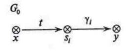

#### Вопрос 01

##### Введение в МБКС. Основные понятия МБКС. Подход к формальному описанию «пользователей». Основная аксиома МБКС.

**Введение в МБКС. Основные понятия МБКС. **

В теории компьютерной безопасности, как правило, используют­ся понятия «сущность» (entity), «объект» (object), «субъект» (subject) и «доступ» (access). Для описания свойств КС, в которых рассматри­ваются сущности, обладающие внутренней структурой, в ряде слу­чаев, кроме понятия «объект», рассматривается понятие «контей­нер» (container).

*Определение.* Объект или контейнер — сущность КС, ко­торая содержит или получает информацию (данные) и над которой субъекты выполняют операции. Субъект — сущность КС, которая инициирует выполнение операций над сущностями. При этом по определению предполагается:

* контейнеры могут состоять из объектов и других контейнеров;
* субъекты КС могут получать доступ к объектам целиком, но не 
  могут получать доступ к частям объекта;
* субъекты КС могут получать доступ к контейнеру и к сущно­стям, из которых состоит контейнер.

Для выполнения операций над сущностями КС субъекты осу­ществляют к ним доступы. В большинстве случаев рассматриваются следующие основные виды доступов:

* read - доступ на чтение сущности;
* write - доступ на запись в сущность;
* append - доступ на запись в конец слова, описывающего со­ стояние сущности;
* execute - доступ на активизацию субъекта из сущности.

Другие виды доступов субъектов к сущностям КС часто могут быть реализованы с использованием рассмотренных видов доступов.

*Определение.* Важную роль в исследовании КС играет аналих информационных потоков, возникающих в реализации субъектами достопов к сущностям. *Информационным потоком* от сущности-источника к сущности-приемнику называется преобразование данных в сущности-приемнике, реализуемое субъектами КС, зависящее от данных, содержащихся в сущности-источнике.

**Подход к формальному описанию «пользователей».**

В современной теории компьютерной безопасности наибольшее развитие в области формального моделирования безопасности КС получил подход, заключающийся в представлении исследуемой КС в виде абстрактной системы (автомата), каждое состояние которой описывается доступами, реализуемыми субъектами к сущностям, а переходы КС из состояния в состояние описываются командами или правилами преобразования состояний, выполнение которых, как пра­вило, инициируются субъектами. В основе данного подхода исполь­зуется *аксиома*, позволяющая выделить элементы КС, необ­ходимые для анализа ее безопасности.

(*Примерное определение "пользователя"*)

Пользователь - лицо, внешний фактор, аутентифицируемый(подтвержденный на подлинность) некоторой информацией и управляющий одним или несколькими субъектами, воспринимающий объекты и получающий информацию о состоянии системы через субъекты, которыми он управляет.

**Основная аксиома МБКС.**

Все вопросы безопасности информации в КС описываются доступами субъектов к сущностям.#### Вопрос 02

##### Введение в МБКС. Модели ценности информации.

При классификации угроз выделяют три основных свойства без­опасности информации в КС.

* Конфиденциальность информации — субъ­ективно определяемая характеристика информации, указывающая на необходимость введения ограничений на множество субъектов, имеющих доступ к данной информации.
* Целостность информации — свойство инфор­мации, заключающееся в ее существовании в неискаженном виде.
* Доступность информации — свойство КС (среды, средств и технологии обработки), в которой циркулирует ин­формация, характеризующееся способностью КС обеспечивать свое­временный доступ субъектов к запрашиваемой ими информации.

В соответствии с тремя основными свойствами безопасности ин­ 
формации различают три классических угрозы безопасности инфор­мации в КС.

* Угроза конфиденциальности информации — состоит в нарушении установленных ограничений на доступ к ин­формации.
* Угроза целостности информации — несанк­ционированное изменение информации, случайное или преднамерен­ное.
* Угроза доступности информации — осу­ществляется, когда несанкционированно блокируется доступ к ин­формации (блокирование может быть постоянным или на некоторое время, достаточное, чтобы информация стала бесполезной).

Кроме перечисленных угроз выделяют еще одну угрозу безопас­ности информации в КС, реализация которой, как правило, предше­ствует осуществлению любой из классических угроз.

* Угроза раскрытия параметров КС — пре­одоление защиты КС, выявления параметров, функций и свойств ее системы безопасности.#### Вопрос 03

##### Виды политик безопасности. Дискреционная политика безопасности. Определение и примеры

**Виды политик безопасности.**

Политика   безопасности КС - совокупно­стью правил, регулирующих управление ресурсами, их защиту и рас­пределение в пределах КС.
Известны три основных   вида   политик   управления   доступом, определяющих  способ  задания  разрешенных  прав  доступа  субъек­тов к сущностям:

* дискреционная политика управления доступом (Discretionary Access Control);
* мандатная (полномочная) политика управления доступом (Man­datory Access Control);
* политика ролевого управления доступом (Role-based Access Con­trol).

Кроме перечисленных политик выделяют *политику безопасности информационных потоков* и *политику изолированной программной среды*.

**Дискреционная политика безопасности.**

Дискреционная    политика    управления доступом  —  политика,  соответствующая  следующим  требованиям  уп­равления доступом в КС:

* все сущности (в том числе субъекты) должны быть идентифици­рованы, т.е. каждой сущности должен быть присвоен уникаль­ный идентификатор;
* задана матрица доступов, каждая строка которой соответствует субъекту КС, столбец — сущности КС, ячейка содержит список прав доступа субъекта к сущности, представляющий собой под­ множество множества прав доступа, реализованных в КС;
* субъект обладает правом доступа к сущности КС в том и только в том случае, когда в ячейке матрицы доступов, соответствующей субъекту и сущности, содержится данное право доступа.

Большинство операционных систем (Windows, Linux) и систем управления базами данных реализует именно дискреционное управление доступом. Главное его преимущество - гибкость. Главные недостатки - рассредоточенность управления и сложность централизованного контроля, а также оторванность прав доступа от данных, что позволяет копировать секретную информацию в общедоступные файлы.

**Преимущества:** простая реализация.

**Недостатки:** статическая модель (не учитывает динамическое изменение состояний КС), при использовании данной политики безопасности перед системой защиты, которая при санкционировании доступа субъекта к сущности руководствуется некоторым набором правил, стоит алгоритмически неразрешимая задача: проверить приведут ли его действия к нарушению безопасности или нет (*простыми словами*, система безопасности может сама себя сломать).

**Пример:** Take-grant, ХРУ.
#### Вопрос 04

##### Виды политик безопасности. Мандатная политика безопасности. Определение и примеры.

**Виды политик безопасности.**

Политика   безопасности КС - совокупно­стью правил, регулирующих управление ресурсами, их защиту и рас­пределение в пределах КС.

Известны три основных   вида   политик   управления   доступом, определяющих  способ  задания  разрешенных  прав  доступа  субъек­тов к сущностям:

* дискреционная политика управления доступом (Discretionary Access Control);
* мандатная (полномочная) политика управления доступом (Man­datory Access Control);
* политика ролевого управления доступом (Role-based Access Con­trol).

Кроме перечисленных политик выделяют *политику безопасности информационных потоков* и *политику изолированной программной среды*.

**Мандатная политика безопасности.**

Мандатная политика управления досту­пом — политика, соответствующая следующим требованиям управ­ления доступом в КС:

* все сущности КС должны быть идентифицированы;
* задана решетка уровней конфиденциальности информации;
* каждой сущности КС присвоен уровень конфиденциальности, за­дающий установленные ограничения на доступ к данной сущ­ности;
* каждому субъекту системы присвоен уровень доступа, задающей уровень полномочий данного субъекта в КС;
* субъект может получить доступ к сущности КС только в случае когда уровень доступа субъекта позволяет предоставить ему данный  доступ  к  сущности  с  заданным уровнем  конфиденциально­сти, и реализация доступа не приведет к возникновению информационных потоков от сущностей с высоким уровнем конфиден­циальности к сущностям с низким уровнем конфиденциальности.

Мандатная политика безопасности используется в SELinux, в SUSE Linux и Ubuntu есть архитектура мандатного контроля доступа под названием AppArmor, а также в ОС Astra Linux.

**Преимущества:** простая для понимания для разработчиков и пользователей системы, решается проблема проверки безопасности система (*простыми словами*, сама себя не сломает)

**Недостатки:** сложная реализация и требует значительных ресурсов КС

**Пример:** Белла-ЛаПадула, OC Astra Linux.
#### Вопрос 05

##### Виды политик безопасности. Политика безопасности информационных потоков. Определение и примеры.

**Виды политик безопасности.**

Политика  безопасности КС - совокупно­стью правил, регулирующих управление ресурсами, их защиту и рас­пределение в пределах КС. Известны три основных  вида  политик  управления  доступом, определяющих способ задания разрешенных прав доступа субъек­тов к сущностям:

- дискреционная политика управления доступом (Discretionary Access Control);
- мандатная (полномочная) политика управления доступом (Man­datory Access Control);
- политика ролевого управления доступом (Role-based Access Con­trol).

Кроме перечисленных политик выделяют *политику безопасности информационных потоков* и *политику изолированной программной среды*.

**Политика безопасности информационных потоков.**

Политика безопасности информационных потоков основана на разделении всех возможных информационных потоков между сущностями КС на два непересекающихся множества:

* множество разре­шенных информационных потоков
* множество запрещенных информационных потоков. 

Цель реализации политики безопасности инфор­мационных потоков состоит в том, чтобы обеспечить невозможность возникновения в КС запрещенных информационных потоков. Политика безопасности информационных потоков в большинстве случаев реализуется в сочетании с политикой другого вида, напри­мер с дискреционной, мандатной или ролевой политикой управления доступом. Реализация политики безопасности информационных по­токов на практике, как правило, является трудной для решения зада­чей, особенно, когда необходимо обеспечить защиту от возникновения запрещенных информационных потоков по времени.

Реализация политики безопасности информационных потоков на практике, как правило, является трудной для решения задачей особенно, когда необходимо обеспечить защиту от возникновения запрещенных информационных потоков по времени.

**Пример**

Пусть $G = (S, Е, R,\cup A \cup F, Н)$ — состояние си­стемы $\sum(G*, OP)$ и недоверенные субъекты $х,у \in N_s \cap S$. В боль­шинстве современных КС, как правило, всегда найдется сущность $root\_dir \in Е$ такая, что все субъекты КС имеют к ней право доступа на чтение. Например, сущность $root\_dir$ может быть корневой каталог жесткого диска компьютера. Таким образом, выполняется условие $(x, root\_dir, read_r) (y, root\_dir, read_r) \in R$. Следовательно, по теоре­ме 2.17 (алгоритмически проверяемые необходи­мые и достаточные условия истинности предиката $can\_write\_time (x, y G_0, L_s)$) истинен предикат $can\_write\_time(x,y, G,L_s)$. Последователь­ность правил преобразований состояний, в результате применения которой реализуется информационный поток по времени от субъекта $х$ к субъекту $y$, приведена рисунке ниже.

#### Вопрос 06

##### Виды политик безопасности. Политика изолированной программной среды

**Виды политик безопасности.**

Политика   безопасности КС - совокупно­стью правил, регулирующих управление ресурсами, их защиту и рас­пределение в пределах КС. Известны три основных   вида   политик   управления   доступом, определяющих  способ  задания  разрешенных  прав  доступа  субъек­тов к сущностям:

- дискреционная политика управления доступом (Discretionary Access Control);
- мандатная (полномочная) политика управления доступом (Man­datory Access Control);
- политика ролевого управления доступом (Role-based Access Con­trol);

Кроме перечисленных политик выделяют *политику безопасности информационных потоков* и *политику изолированной программной среды*.

**Политика изолированной программной среды**

Целью реализации политики ИПС является задание порядка безопасного взаимодействия субъектов КС, обеспечивающего невоз­можность воздействия на систему защиты КС и модификации ее па­раметров или конфигурации, результатом которого могло бы стать изменение заданной для КС политики управления доступом. Политика ИПС реализуется путем изоляции субъектов КС друг от друга и путем контроля порождения новых субъектом таким образом, чтобы в системе могли активизироваться только субъекты из предопределенного списка. При этом должна контролироваться це­лостность сущностей КС, влияющих на функциональность активи­зируемых субъектов.#### Вопрос 07

##### Виды политик безопасности. Политика ролевого разграничения доступа. Определение и примеры

**Виды политик безопасности.**

Политика   безопасности КС - совокупно­стью правил, регулирующих управление ресурсами, их защиту и рас­пределение в пределах КС. Известны три основных   вида   политик   управления   доступом, определяющих  способ  задания  разрешенных  прав  доступа  субъек­тов к сущностям:

- дискреционная политика управления доступом (Discretionary Access Control);
- мандатная (полномочная) политика управления доступом (Man­datory Access Control);
- политика ролевого управления доступом (Role-based Access Con­trol);

Кроме перечисленных политик выделяют *политику безопасности информационных потоков* и *политику изолированной программной среды*.

**Политика ролевого разграничения доступа. Определение и примеры**

Политика ролевого управления доступом — политика, соответствующая следующим требованиям управления до­ступом в КС:

* все сущности должны быть идентифицированы;
* задано множество ролей, каждой из которых ставится в соответ­ствие некоторое множество прав доступа к сущностям;
* каждый субъект обладает некоторым множеством разрешенных (авторизованных) для данного субъекта ролей;
* субъект обладает правом доступа к сущности КС в случае, когда субъект обладает ролью, которой соответствует множество прав доступа, содержащее данное право доступа к данной сущности. 

Ролевое управление доступом является развитием политики дискреционного управления доступом, при этом права доступа субъек­тов системы к сущностям группируются с учетом специфики их при­менения, образуя роли.

Задание ролей позволяет определить более четкие и понят­ные для пользователей КС правила управления доступом. Ролевое управление доступом позволяет реализовать гибкие, изменяющиеся динамически в процессе функционирования КС правила управления доступом. 

Основными элементами базовой модели ролевого управления до­ступом $(RBAC— Role-Based Access Control) [10, 36, 37]$ являются:
$U$ — множество пользователей; 
$R$ — множество ролей;
$P$ — множество прав доступа к объектам КС; 
$S$ — множество сессий пользователей;
$PA: R \rightarrow 2^P$ — функция, задающая для каждой роли множество прав доступа; при этом для каждого права доступа $р \in P$ существует роль $r \in R$ такая что $р \in PA(r)$;
$UA:  U \rightarrow   2^R$ — функция, задающая для каждого пользователя множество ролей, на которые он может быть авторизован;
$user: S \rightarrow U$ — функция, задающая для каждой сессии пользо­вателя, от имени которого она активизирована;
$roles: S \rightarrow 2^R$ — функция, задающая для пользователя множе­ство ролей, на которые он авторизован в данной сессии, при этом в каждый момент времени .для каждой сессии $s \in S$ выполняется условие $roles(s)\subseteq UA(user(s))$.

Политика ролевого разграничения доступа широко используется для управления пользовательскими привилегиями в пределах единой системы или приложения. Список таких систем включает в себя Microsoft, Active Directory, SELinux, FreeBSD, Solaris, СУБД Oracle, PostgreSQL 8.1 и множество других.
#### Вопрос 09

##### Исторические зарубежные нормативные документы по сертификации компьютерных систем. Европейские критерии. (ITSEC)

Функции обеспечения безопасности, выбранные для удовлетворения целей безопасности формы TOE(Target of Evaluation), образуют только один аспект цели безопасности продукта или системы. Не менее важным является обеспечение того, чтобы цели обеспечения безопасности достигались с помощью выбранных функций и механизмов обеспечения безопасности. 

Обеспечение безопасности должно рассматриваться с нескольких различных точек зрения, и в рамках этих согласованных критериев было принято решение проводить различие между уверенностью в корректности осуществления функций и механизмов обеспечения безопасности и уверенностью в их эффективности. 

Оценка эффективности позволяет определить, действительно ли функции и механизмы обеспечения безопасности, предусмотренные в TOE, будут отвечать заявленным целям обеспечения безопасности. TOE оценивается на предмет пригодности функциональности, привязки функциональности (работают ли выбранные функции совместно образуя синергию), последствий известных и обнаруженных уязвимостей (как в конструкции TOE, так и в том, как он будет использоваться в живой эксплуатации), а также простоты использования. 

Кроме того, оценка эффективности оценивает способность защитных механизмов TOE противостоять прямой атаке (прочность механизмов). Определены три уровня прочности - базовый, средний и высокий, которые представляют собой восходящие уровни уверенности в способности защитных механизмов TOE противостоять прямой атаке. 

Оценка корректности определяет, правильно ли реализованы функции и механизмы обеспечения безопасности. Было определено семь уровней оценки, обозначенных от E0 до E6, которые представляют собой восходящие уровни уверенности в правильности. E0 представляет собой недостаточную уверенность. E1 представляет собой точку входа, ниже которой не может быть обеспечено никакого полезного доверия, а E6 представляет собой самый высокий уровень доверия. Остальные уровни представляют собой интерполяцию между ними. Корректность решается с точки зрения построения TOE, охватывающего как процесс разработки, так и саму конструкцию среды разработки, а также точка зрения на работу TOE. 

Уровни оценки определяются в контексте критериев корректности. Требования к эффективности (в том числе к прочности механизмов) не меняются по уровням, а строятся на основе оценки правильности и выполняются с использованием документов, предоставленных спонсором для этой оценки, на практике мероприятия по оценке корректности и эффективности будут чередоваться. 

Если какой-либо из аспектов оценки на определенном уровне не удается выполнить из-за отсутствия информации или по какой-либо другой причине, то этот недостаток должен быть устранен или же этот аспект должен быть снят с оценки на этом уровне. В противном случае TOE будет присвоен результат E0. 

Шесть успешных уровней оценки E1 - E6 охватывают широкий диапазон потенциальной уверенности.

* Уровень E0: этот уровень представляет собой недостаточную степень уверенности.
* Уровень E1: на этом уровне должна быть установлена цель обеспечения безопасности и дано неофициальное описание архитектурного проекта TOE. Функциональное тестирование должно указывать на то, что TOE удовлетворяет своей цели обеспечения безопасности.
* Уровень E2: в дополнение к требованиям, предъявляемым к уровню Е1, должно содержаться неофициальное описание рабочего проекта. Должны оцениваться доказательства проведения функциональных испытаний. Должна быть предусмотрена система управления конфигурацией и утвержденная процедура распределения.
* Уровень E3: в дополнение к требованиям, предъявляемым к уровню Е2, проводится оценка исходного кода и/или чертежей оборудования, 22 соответствующих механизмам обеспечения безопасности. Должна быть проведена оценка доказательств проведения испытаний этих механизмов.
* Уровень E4: в дополнение к требованиям, предъявляемым к уровню E3, должна существовать базовая формальная модель политики обеспечения безопасности, поддерживающая цель обеспечения безопасности. Функции обеспечения безопасности, архитектурный проект и детальный проект должны быть определены в полуформальном стиле.
* Уровень E5: в дополнение к требованиям, предъявляемым к уровню Е4, должно обеспечиваться тесное соответствие между подробной конструкцией и исходным кодом и/или чертежами оборудования.
* Уровень E6: в дополнение к требованиям для уровня E5, функции обеспечения безопасности и архитектурный проект должны быть определены в формальном стиле, соответствующем указанной базовой формальной модели политики безопасности. 
#### Вопрос 10

##### Модели мандатного разграничения доступа. Модель Белла-Ла-Падулы. Классическая модель БЛаП. Основные определения. Виды запросов. Свойства безопасности в модели БЛаП

**Модели мандатного разграничения доступа**

Выделяют следующие модели, основанные на **мандатном разграничении доступа**:

* Классическая модель Белла-ЛаПадула;
* Модель систем военных сообщений;
* Модель целостности Биба;
* Модель безопасности переходов.

**Классическая модель БЛаП. Основные определения**

В классической модели Белла-ЛаПадулы рассматриваются ус­ловия, при выполнении которых в КС невозможно возникновение информационных потоков от объектов с большим уровнем конфи­денциальности к объектам с меньшим уровнем конфиденциальности. Основными элементами классической модели Белла-ЛаПадулы яв­ляются:
$S$ — множество субъектов; 
$O$ — множество объектов;
$R = \{read,  write,  append, execute\}$ — множество видов доступа и видов прав доступа;
$B =  \{b\subseteq S\times О\times R\}$ — множество возможных множеств те­кущих доступов  в  системе;
$(L,\leq)$ — решетка уровней конфиденциальности, например $L = \{U (unclussified), С (confidential), S (secret), TS (top secret)\}$, где $U < С < S < TS$;
$M = \{m_{|S|\times|O|}\}$ — множество возможных матриц доступов, где $m_{|S|\times|O|}$ — матрица доступов, $m[s,o] \subseteq R$ — права доступа субъ­екта $s$ к объекту $o$;
$(f_s, f_o, f_c)\in F = L^S\times L^O\times L^S$ — тройка функций $(f_s, f_o, f_c)$ задающих соответственно: $f_s: S \rightarrow L$ — уровень доступа субъектов; $f_o: O\rightarrow L$ — уровень конфиденциальности объектов; $f_c: S \rightarrow L$ — текущий уровень доступа субъектов, при этом для любого $s \in S$ вы­полняется неравенство $f_c(s) \leq f_s(s)$;
$V = B\times M\times F$ — множество состояний системы; 
$Q$ — множество запросов системе;
$D$ — множество ответов по запросам, например $D =\{yes,no, 
error\}$;
$W \subseteq Q\times D\times V\times V$ — множество действий системы, где чет­верка $(q,d,v^*,v) \in W$ означает, что система по запросу $q$ с ответом $d$ перешла из состояния $v$ в состояние $ѵ^*$;
$N_0  = \{0,1,2,...\}$ — множество значений времени;
$X$ — множество функций $х:  N_0\rightarrow Q$, задающих все возможные последовательности запросов к системе;
$Y$ — множество функций $у:  N_0 \rightarrow  D$, задающих все возможные последовательности ответов системы по запросам;
$Z$ — множество функций $z:  N_0\rightarrow  V$, задающих все возможные последовательности состояний системы.

**Виды запросов модели БЛаП**

В классической модели Белла-ЛаПадулы рассматриваются сле­дующие запросы, входящие во множество $Q$:

* запросы изменения множества текущих доступов $Q$:
  * *получить доступ* (добавить тройку (субъект, объект, вид досту­па) в текущее множество доступов $b$);
  * *отменить доступ* (удалить тройку (субъект, объект, вид досту­па) из текущего множества доступов $b$).
* запросы изменения функций $f$:
  * изменить уровень конфиденциальности объекта;
  * изменить уровень доступа субъекта.
* запросы изменения прав доступа в матрице $m$:
  * дать разрешение на доступ (добавить право доступа в соответ­ствующий элемент матрицы доступов $m$);
  * отменить разрешение на доступ (удалить право доступа из со­ответствующего элемента матрицы доступов $m$).

**Свойства безопасности в модели БЛаП**

Безопасность системы определяется с помощью трех свойств: 

* ss-свойства простой безопасности (simple security) - Субъект с уровнем доступа $x_s$ может читать информацию из объекта с уровнем секретности  $x_o$ лишь тогда, когда $x_s$ преобладает над $x_o$. Это правило также известно под названием «*нет чтения верхнего*» (*NRU*). Например, если субъект, имеющий доступ только к несекретным данным, попытается прочесть объект с уровнем секретности "совершенно секретно", то ему будет отказано в этом.;

*  $*$-свойства «звезда» - Субъект с уровнем секретности $x_s$ может писать информацию в объект с уровнем безопасности $x_o$ только если $x_o$ преобладает над $x_s$. Это правило также известно под названием «*нет записи вниз*» (*NWD*). Например, если субъект, имеющий уровень доступа совершенно секретно, попытается записать в объект с уровнем секретности секретно, то ему будет отказано в этом.;
*  ds-свойства дискреционной безопасности (discretionary secu­rity) - Заключается в том, что права дискреционного доступа субъекта к объекту определяются на основе матрицы доступа.

(прим. Дальше идёт определение каждого свойства и "свойства" этих свойств, не знаю понадобится ли это на экзамене, но пускай будет)

#### Вопрос 11

##### Обзор OS AstraLinux

Astra Linux – российская операционная система на базе ядра Linux. Основана на Debian. Разработана при участии АО "НПО РусБИТех", Академии ФСБ России, Института системного программирования РАН и Минобрнауки. Входит в реестр Минкомсвязи, принята в стандарт Федеральных органов исполнительной власти и госкорпораций. Единственная в России имеет полный набор сертификатов ФСТЭК, Минобороны, ФСБ России вплоть до уровня «совершенно секретно». 

Astra Linux делится на две версии:

1) Astra Linux «Common Edition» . Релиз общего назначения «Орёл», предназначен для обеспечения функциональности современных компьютеров на архитектуре процессора x86-64 и идеально подойдет для настольных компьютеров и ноутбуков, для выполнения повседневных задач. Дистрибутив свободно распространяется для домашнего использования. Ключевые преимущества:
   * Свободное распространение для некоммерческого использования
   * Низкая цена лицензии для коммерческого использования
2) Astra Linux «Special Edition». Релизы входящие в версию «Special Edition» разработаны для создания автоматизированных защищенных систем для внедрения в государственные структуры, основываясь на различных архитектурах процессоров с возможностью работать с информацией уровня «совершенно секретно». Ключевые преимущества:
   * Кроссплатформенность
   * Попадает под программу импортозамещения ОС
   * Имеет все необходимые сертификаты для хранения и работы с секретными документами
   * Защищена от действий злоумышленников 

Pluggable Authentication Modules (PAM, подключаемые модули аутентификации) — это набор разделяемых библиотек, которые позволяют интегрировать различные низкоуровневые методы аутентификации в виде единого высокоуровневого API. Особенности Astra Linux SE

* Идентификация и аутентификация.
* Дискреционное разграничение доступа.
* Мандатное разграничение доступа.
* Модель контроля и управления доступом.
* Защита от эксплуатации уязвимостей. #### Вопрос 12

##### Реализация моделей безопасности КС. Изолированная программная среда.

Для создания гарантированно защищенной КС (в смысле выполнения заданной политики безопасности) достаточно:
1. Убедиться в попарной корректности субъектов, замыкаемых в ИПС, и убедиться в корректности любого субъекта относительно МБО и МБС.
2. Спроектировать и реализовать программно или программно-аппаратно МБС так, чтобы:
  * для любого субъекта и любого объекта производился контроль порождения субъектов, т.е., чтобы реализация МБС соответствовала его определению;
  * порождение любого субъекта происходило с контролем неизменности объекта-источника.
3. Реализовать МБО в рамках априорно сформулированной политики безопасности.

МБО(монитор безопасности объектов) - монитор обращений, который разрешает потоки, относящиеся к множеству разрешенных потоков, и запрещает, относящиеся к множество запрещенных потоков.

Монитор безопасности субъектов (МБС) — МПС(монитор порождения субъектов), который разрешает порождение субъектов только для фиксированного множества пар активизирующих субъектов и объектов-источников.

Практическая реализация всех КС позволяет выделить две фазы их работы: активизация субъектов с ростом уровня представления объектов (фаза загрузки или начальная фаза) и фаза стационарного состояния (когда уровень представления объектов не увеличивается). Тогда реализация ИПС может состоять из двух этапов:
1. Предопределенное выполнение начальной фазы, включающее в себя момент активизации МБС и МБО (ступенчатая загрузка).
2. Работа в стационарной фазе в режиме ИПС с контролем неизменности объектов-источников.#### Вопрос 13

##### Реализация моделей безопасности КС. Модели мандатного разграничения доступа. Модель Белла-Ла-Падулы. Безопасность базовой модели БЛаП. Теоремы А1,А2,А3,БТБ(без док-ва)

**Определение.** Система $\sum(Q,D,W,z_0)$ называется безопасной, если она обладает ss-свойством, *-свойством, ds-свойством.

Проверка безопасности системы по определению в большинстве случаев не может быть реализована на практике в связи с тем, что при этом требуется проверка безопасности всех реализаций систе­мы, а их бесконечно много. Следовательно, необходимо определить и обосновать иные условия безопасности системы, которые можно проверять на практике. В классической модели Белла-ЛаПадулы эти условия задаются для множества действий системы $W$.

$Q$ - множество запросов системе;

$D$ - множество ответов по запросам, например, $D = \{yes, no, error\}$

$W$ - множество действий системы, где четверка $(q, d, v^*, v) \in W$ означает, что система по запросу $q$ и ответу $d$ перешла из состояния $v$ в состояние $v^*$

$z_0$ - начальное состояние системы

**Теорема 4.1 (А1).** Система $\sum(Q,D,W,z_0)$ обладает ss-свойст­вом для любого начального состояния $z_0$, обладающего ss-свойством, тогда и только тогда, когда для каждого действия $(q,d, (b^*, m^*, f^*), (b,m,f)) \in W$ выполняются условия 1, 2.
	*Условие 1.*  Каждый доступ $(s,o, r) \in b^* \backslash b$ обладает ss-свойством относительно $f^*$.
	*Условие 2.*   Если  $(s,o, r)  \in b$  и  не обладает ss-свойством относительно $f^*$, то $(s, о,r)  \notin b^*$.

**Теорема 4.2 (А2).** Система $\sum(Q, D, W, z_0)$ обладает *-свойством  относительно $S' \subseteq S$ для любого начального состояния $z_0$ обладающего *-свойством относительно $S'$, тогда и только тогда, когда для каждого действия $(q,d, (b^\ast,m^\ast,f^\ast), (b,m, f)) \in W$ выполняются условия 1 и 2.
	*Условие 1.* Для $s \in S'$ доступ $(s, o, r) \in b^\ast\backslash b$ обладает $\ast$-свойством относительно  $f^*$.
	*Условие 2.*   Для $s \in   S'$, если доступ $(s,o,r) \in b$  и  не обладает $\ast$-свойством относительно $f^\ast$, то $(s,o,r)\notin b^\ast$.

**Теорема 4.3 (АЗ).** Система $\sum(Q, D, W, z_0)$ обладает ds-свойст­вом для любого начального состояния $z_0$, обладающего ds-свойством, тогда и только тогда, когда для каждого действия $(q,d, (b^*,m^*,f^*), (b,m,f)) \in W$ выполняются условия 1 и 2.
	*Условие  1.* Для каждого $(s,o,r)  \in   b^*\backslash b$,   выполняется усло­вие  $r\in  m^*[s,o]$;
	*Условие 2.* Если доступ $(s,o,r)\in b$ и $r\notin m^*[s,o]$, то $(s,o,r) \notin b^*$.

**Теорема 4.4 (базовая теорема безопасности — БТБ).** Си­стема $\sum(Q,D, W, z_0)$ безопасна для безопасного $z_0$ тогда и только то­гда, когда множество действий системы $W$ удовлетворяет услови­ям теорем 4.1-4.3.#### Вопрос 14

##### Реализация моделей безопасности КС. Модели мандатного разграничения доступа. Модель Белла-Ла-Падулы. Безопасность переходов БЛаП. Теоремы А1-RW, A2-RW, БТБ-RW(без док-ва)

В классической модели Белла-ЛаПадулы не описывается точный порядок действий системы при переходе из состояния в состояние. Частично этот недостаток можно устранить следующим образом: предлагается оригинальное определение свойств безопас­ности модели Белла-ЛаПадулы с использованием вместо множества действий системы функции переходов.

При рассмотрении этого подхода будем считать $R = \{read, write\}$ и для каждого $s \in S$ справедливо равенство $f_s(s) = f_c(s)$. Исклю­чим из рассмотрения матрицу доступов $m$ и множество ответов си­стемы $D$. Вместо множества действий системы $W$ используем функцию  переходов:

$T:  Q \times V\rightarrow V$,  где $T(q, v)  = v^*$  — переход из состояния $v$  по запросу (команде) $q$ в  состояние $v^*$.

В этом случае будем обозначать систему через $\sum(V, T, z_0)$.

Далее переопределим ss-свойство и *-свойство. Так как основные ограничения на доступ $write$ следуют из *-свойства, то в ss-свойстве зададим ограничения только на $read$.

**Определение.** Доступ $(s,o, r)\in b$  обладает ss-свойством относительно $f$, когда выполняется одно из условий:

* $r  =  write$;
* $r =  read$ и $f_s(s)\geq f_o(o)$

**Определение.** Доступ $(s,o, r)\in b$  обладает *-свойством относительно $f$, когда выполняется одно из условий:

- $r = read$ и не существует $y \in O: (s,y,write)\in b$ и $f_o(x) > f_o(y)$
- $r = write$ и не существует $y \in O: (s,y,write)\in b$ и $f_o(y)>f_o(x)$

**Теорема 4.7 (A1-RW).** Система $\sum(V,T,z_0)$ обладает ss-свойст­вом для любого начального состояния $z_0$, обладающего ss-свойством, тогда и только тогда, когда функция переходов $Т(q,v) = v^*$ удовле­творяет условиям 1 и 2.
	*Условие 1.* Если доступ $(s, o, read)\in b^*\backslash b$, то $f_s^*(s)\geq f_o^*(o)­$.
	*Условие 2.* Если  доступ  $(s, o, read)\in b$   и  $f_s^*(s)< f_o^*(o)­$,  то $(s, o, read)\notin b^*$.

**Теорема 4.8 (A2-RW).** Система $\sum(V,T,z_{0})$ обладает $\ast$-свойст­вом для любого начального состояния $z_0$, обладающего $\ast$-свойством, тогда и только тогда, когда функция переходов $Т(q, v) = v^*$ удовле­творяет условиям 1 и 2.
	*Условие  1.* Если  $\{(s,x, read), (s, у, write)\}\cap(b^*\backslash \neq\varnothing$  и $\{(s,х, read), (s, у, write)\}\subseteq b^*$,  то $f_o^*(у) \geq f_o^*(x)­$
	*Условие 2.* Если $\{(s,x, read), (s, у, write)\}\subseteq b$  и $f_o^*(у)< f_o^*(x)­$, то $\{(s,x, read), (s, у, write)\}\not\subset b^*$.

**Теорема 4.9 (БТБ-RW).** Система $\sum(V,Т, z_0)$ безопасна для без­опасного начального состояния $z_0$ тогда и только тогда, когда вы­полнены условия теорем 4.7 и 4.8.#### Вопрос 15

##### Реализация моделей безопасности КС. Модели мандатного разграничения доступа. Модель Белла-Ла-Падулы. Классическая модель БЛаП. Основные определения. Виды запросов. Свойства безопасности в модели БЛаП.

**Модель систем дискреционного разграничения доступа**

Мандатная модель управления доступом основана на правилах секретного документооборота, принятых в государственных и правительственных учреждениях многих стран. Всем объектам и субъектам в системе назначаются метки конфиденциальности. Контроль доступа осуществляется на основании двух правил:  субъект имеет доступ на чтение только тех объектов, чей уровень конфиденциальности не выше его;  субъект имеет доступ на запись только в те объекты, чей уровень конфиденциальности не ниже его. Задача мандатной модели в том, чтобы не допустить информационные потоки от объектов с более высоким уровнем конфиденциальности к объектам с более низким уровнем конфиденциальности. 

Мандатные модели обычно рассматривают на примере классической модели Белла – Ла-Падулы. 

1. Основными элементами классической модель Белла-Ла-Падулы являются:

   1. $S$ - множество субъектов.
   2. $O$ - множество объектов.
   3. $R= (read, write, append, execute)$ - множество возможных видов доступа и видов прав доступа.
   4. $B=(b\subseteq S\times O \times R)$ - множество возможных множеств текущих доступов в системе.
   5. $(L,\leq)$ - решетка уровней конфиденциальности, например $L=\set{U (unclussified), C (confidential), S (secret), TS (top secret)}$, где $U < C< S < TS$.
   6. $M=\set{m_{|S|\times|O|}}$ - множество возможных матриц доступов, где $m_|S|\times|O|$ - матрица доступов, $m[s,o]\subseteq R$ - права доступа субъекта
      $s$ к объекту $о$;
   7. $(f_s,f_o,f_c)\in F=L^S\times L^O\times L^S$ - тройка функций $(f_s,f_o,f_c)$, задающих соответственно: $f_s:S\rightarrow L$ - текущий уровень доступа субъектов, при этом для любого $s\in S$ выполняется неравенство $f_c(s)\le f_s(s)$
   8. $V=B\times M\times F$ - множество состояний системы.
   9. $Q$ - множество запросов системе.
   10. $D$ - множество ответов по запросам, например $D=\set{yes, no, error}$ 
   11. $W\subseteq Q\times D \times V\times V$ - множество действий системы, где четверка $(q, d, v^*,v)\in W$ означает, что система по запросу $q$ с ответом $d$ перешла из состояния $v$ в состояние $v^*$.
   12. $N_0=\set{0,1,2,...}$ - множество значений времени.
   13. $X$​ - множество функций $х: N_0\rightarrow Q$​, задающих все возможные последовательности запросов к системе;
   14. $Y$ - множество функций $у: N_0\rightarrow D$, задающих все возможные последовательности ответов системы по запросам;
   15. $Z$ - множество функций $z: N_0\rightarrow V$​, задающих все возможные последовательности состояний системы.

2. **Определение:** $\sum(Q,D,W,z_0)\subseteq X\times Y\times Z$ называется системой, когда для каждого $(x,y,z)\in \sum(Q,D,W,z_0)$ выполняется условие для $t\in N_0, (x_t,y_t,z_{t+1},z_{t})\in W$, где $z_0$ - начальное состояние системы. При этом каждый набор $(x,y,z)\in \sum(Q,D,W,z_0)$ называется реализацией системы, a $(x_t,y_t,z_{t+1},z_{t})\in W$ - действием системы в момент времени $t\in N_0$.

3. В классической модели Белла-Ла-Падулы рассматриваются следующие запросы, входящие во множество $Q$:

   - запросы изменения множества текущих доступов $b$;
   - запросы изменения функций $f$;
   - запросы изменения прав доступа в матрице $m$.

4. Следующий список описывает изменения каждого элемента состояния системы. Конкретное решение по запросу включает возможность производить следующие изменения в состоянии системы.

   1. Изменение текущих доступов:

      - получить доступ (добавить тройку (субъект, объект, вид доступа) в текущее множество доступов $b$);
      - отменить доступ (удалить тройку (субъект, объект, вид доступа) из текущего множества доступов $b$).

   2. Изменение значений функций уровней конфиденциальности и доступа:

      - изменить уровень конфиденциальности объекта.
      - изменить уровень доступа субъекта.

   3. Изменение прав доступа:

      - дать разрешение на доступ (добавить право доступа в соответствующий элемент матрицы доступов $m$);

      - отменить разрешение на доступ (удалить право доступа из соответствующего элемента матрицы доступов $m$).

        Безопасность системы определяется с помощью трех свойств:

        $ss$ - свойства простой безопасности (simple security);

        $*$ - свойства "звезда".

        $ds$ - свойства дискреционной безопасности (discretionary security).

5. **Короче, там много определений, связанных со свойствами $\set{ss,*,ds}$ и их не то чтобы лень писать, но есть выжимка самого этого автора.**  

   1. Во-первых, из обладания доступом $*$-свойством относительно $f$ следует обладание этим доступом ss-свойством относительно $f$.
   2. Во-вторых, из обладания системой $ss$-свойством следует, что в модели Белла-Ла-Падулы выполняется запрет на чтение вверх, требуемый мандатной политикой безопасности. Кроме того, $ss$-свойство не допускает модификацию с использованием доступа $write$, когда $f_s(s)<f_o(o)$. Таким образом, функция $f_s(s)$ задает для субъекта $s$​ верхний уровень конфиденциальности объектов, к которым он потенциально может получить доступ $read$ или $write$.
   3. В-третьих, поясним $*$-свойство. Если субъект $s$ может понизить свой текущий уровень доступа до $f_c(s) = f_o(o)$, то он может получить
      доступ $write$ к объекту $о$, но не доступ $read$ к объектам $о'$, чей уровень $f_o(o^{'})>f_c(s)$. Хотя при этом, возможно, справедливо неравенство $f_o(o^{'})\le f_c(s)$ и в каких-то других состояниях системы субъект $s$ может получить доступ $read$ к объекту $о'$. Таким образом, $*$-свойство исключает появление в системе запрещенного информационного потока «сверху вниз» и соответствует требованиям мандатной политики безопасности.#### Вопрос 16

##### Реализация моделей безопасности КС. Модели мандатного разграничения доступа. Модель Белла-Ла-Падулы. Пример некорректного определения свойств безопасности

При использовании классической модели Белла-ЛаПадулы важ­но учитывать тот факт, что в ней отсутствует логическая увязка условий выполнения системой свойств безопасности, данных в их определениях, с заложенными в модель условиями их проверки, необ­ходимость и достаточность которых доказывается в теореме 4.4.(Теорема БТБ - вопрос 13) Ни­же приводится пример некорректного определения основного свой­ства безопасности в модели Белла-ЛаПадулы. Вместо *-свойства используется абсурдное с точки зрения здравого смысла **-свойство. 
Однако при этом не возникает никаких противоречий в логике до­казательства теорем, определяющих условия проверки безопасности системы.

**Определение 4.12** Доступ $(s,o,r)\in S\times O\times R$ обладает **-свойством относительно $f =(f_s, f_o, f_c)\in F$, когда выполняется 
одно из условий:

* $r\in\{read, append, execute\}$
* $r = write$  и  $f_c(s)\geq f_o(o).$

**Определение 4.13** Состояние системы $(b,m,f) \in V$ обладает $\ast\ast$-свойством, когда каждый доступ $(s, o, r)\in b$ обладает $\ast\ast$-свойством относительно $f$.

**Определение 4.14.** Состояние системы $(b, m, f)\in V$ называ­ется $\ast\ast$-безопасным, когда обладает ss-свойством, $\ast\ast$-свойством, ds-свойством одновременно.

**Определение 4.15.** Реализация $(х,у, z)$ системы $\sum(Q,D, W, z_0) $ обладает $\ast\ast$-свойством, когда в последовательности $(z_0,z_1,\dots)$ каж­дое состояние обладает $\ast\ast$-свойством.

**Определение 4.16.** Система $\sum(Q, D, W, z_0)$  обладает $\ast\ast$-свойст­вом, когда каждая ее реализация обладает $\ast\ast$-свойством.

**Определение 4.17.** Система $\sum(Q, D, W, z_0)$ называется $\ast\ast$-бе­зопасной, когда она обладает ss-свойством, $\ast\ast$-свойством, ds-свойством одновременно.

**Теорема 4.5** ($A2^{\ast\ast}$). Система $\sum(Q,D,W,z_0)$ обладает $\ast\ast$-свой­ством для любого начального состояния $z_0$, обладающего $\ast\ast$-свойст­вом, тогда и только тогда, когда для каждого действия $(q, d, (b^*,m^*, f^*),(b,m,f))\in W$ выполняются условия 1 и 2.
	*Условие 1.*  Каждый доступ $(s,o,r)\in b^*\backslash b$ обладает $\ast\ast$-свойством относительно  $f^*$.
	*Условие 2.*   Если доступ $(s,o, r)\in b$  и не обладает $\ast\ast$-свойством относительно $f^*$, то  $(s,o,r)\not\in b^*$.

**Теорема 4.6** ($БТБ^{\ast\ast}$). Система $\sum(Q, D, W, z_0)$ $\ast\ast$-безопасна для $z_0$ $\ast\ast$-безопасного состояния тогда и только тогда, множество действий системы *W* удовлетворяет условиям теорем 4.1, 4.3 и 4.5.#### Вопрос 17

##### Реализация моделей безопасности КС. Модели на основе дискреционного разграничения доступа. Модель take-grant Классическая модель take-grant. Основные понятия и правила. Предикат «возможен доступ». Частный случай эквивалентных условий. Теорема 1(без док-ва)

**Модели на основе дискреционного разграничения доступа.**

Выделяют следующие модели с дискреционным доступом:

* Модель Харрисона-Руззо-Ульмана (ХРУ);
* Модель типизированных матриц доступа;
* Классическая модель Take-Grant;
* Расширенная модель Take-Grant.

**Модель take-grant Классическая модель take-grant. Основные понятия и правила.**

Классическая модель Take-Grant ориентирована на анализ путей распространения прав доступа в системах дискреционного управле­ния доступом.

Основными элементами модели  Take-Grant являются: 

$O$ — множество объектов;
$S\subseteq O$ — множество субъектов;
$R = \{r_1,r_2,\dots,r_m\} \cup \{t,g\}$ — множество видов прав доступа, 
где $t(take)$ — право брать права доступа, $g(grant)$ — право давать 
права доступа;
$G = (S, O,E)$ — конечный помеченный ориентированный без пе­тель граф доступов, описывающий  состояние системы. Элементы множеств $S$ и $O$ являются вершинами графа, которые будем обо­значать $\otimes$ — объекты (элементы множества $O \backslash S$ )и $\bullet$ — субъек­ты (элементы множества $S$) соответственно. Элементы множества  $E\subseteq O\times O\times R$ являются ребрами графа. Каждое ребро помечено непустым подмножеством множества видов прав доступа $R$.

Основная цель классической модели Take-Grant — определение и обоснование алгоритмически проверяемых условий проверки воз­можности утечки права доступа по исходному графу доступов, соот­ветствующего некоторому состоянию системы.

Порядок перехода системы модели Take- Grant из состояния в состояние определяется правилами преобразования графа доступов, которые в классической модели носят название *де-юре правил*. Пре­образование графа $G$ в граф $G'$ в результате выполнения правила $op$ обозначим через
$$
G\vdash_{op}G'
$$
В классической модели Take-Grant рассматриваются четыре де-юре правила преобразования графа, выполнение каждого из которых может быть инициировано только субъектом, являющимся активной компонентой системы (рис. 2.1-2.4):
*take* — брать права доступа; 
*grant* — давать права доступа;
*create* — создавать новый объект или субъект, при этом субъ­ект создатель может взять на созданный субъект любые права доступа (по умолчанию предполагается, что при выполнение правила *create* создается объект, случаи, когда создается субъект, оговари­ваются особо);
*remove* — удалять права доступа.

Начальные условия: 

| Правила                | Исходное состояние                                           | Результирующие состояние                                     |
| :--------------------- | :----------------------------------------------------------- | ------------------------------------------------------------ |
| take($\alpha,x,y,z$)   | x - субъект, y,z - объект, $(x,y,\{t\})\sub E$, $(y,z,\beta)\sub E$, $x \neq z$, $\alpha \sube \beta$ | добавляется $(x,z,\alpha)$ к *E*                             |
| grant($\alpha,x,y,z$)  | x - субъект, y,z - объект, $(x,y,\{g\})\sub E$, $(x,z,\beta)\sub E$, $y \neq z$, $\alpha \sube \beta$ | добавляется $(y,z,\alpha)$ к *E*                             |
| create($\alpha,x,y,z$) | x - субъект, y - не существует (ни об., ни суб.), $\beta \neq \empty$ | создается $y \in O$, если *y* - субъект, то создается $y \in S$, добавляется $(x, y, \beta)$ к *E* |
| remove($\alpha, x, y$) | x - субъект, y - объект, $(x, y, \beta) \sub E$, $\alpha \sube \beta$ | удаляется $(x, y, \alpha)$                                   |

**Предикат «возможен доступ».Частный случай эквивалентных условий. Теорема 1(без док-ва)**

Пусть $x,y\in O_o, x\neq y$ — различные объ­екты графа доступов $G_0 = (S_0,O_0, E_0),\alpha\subseteq R$. Определим предикат $can\_share(a, х,у, G_0)$, который будет истинным тогда и только тогда, когда существуют графы $G_1 = (S_1, O_1, Е_1),\dots,G_N = (S_N,O_N,E_N)$ и правила $op_1,\dots, op_N$, где $N\geq0$, такие, что $G_0\vdash_{op_1} G_1\vdash_{op_2} \dots\vdash_{on_N} G_N$ и $(x, у,\alpha)\subset E_N$.

(прим. "Теоремы 1" в Девянине нет, скорее всего имелась в виду следующая теорема)

**Определение.** Пусть $G=(S, S, E)$ - граф доступа, в котором все вершины являются субъектами. Говорят, что вершины графа доступов является *tg-связными*, когда, без учета направлений ребер, существует между ними существует путь такой, что каждое из ребер помечено *t(take)* и *g(grant)*.

**Теорема 2.5.** Пусть $G_0 = (S_0, S_0, E_0)$ — граф доступов, содер­жащий только вершины субъекты, $x,y\in S_0, x\neq y$. Тогда предикат $can\_share(a,x,y,G_0)$ истинен тогда и только тогда, когда выполня­ются условия 1 и 2.

​	*Условие 1.*   Существуют субъекты $s_1,\dots,s_m\in S_0:$
$$
(s_і,y,\gamma_i)\subset E_0,
$$
где $i = 1,\dots,m$ и  $а =\gamma_1 \cup\dots\cup\gamma_m.$

​	*Условие 2.*   Субъекты $x$ и $s_i$  являются tg-связными в графе $G_0$, где  $i =  1,\dots,m$.#### Вопрос 18

##### Реализация моделей безопасности КС. Модели на основе дискреционного разграничения доступа. Модель take-grant. Вопрос похищения прав доступа

Похищение прав доступа является примером случая, когда передача прав доступа к объекту осуществляется без содействия субъек­та изначально обладавшего передаваемыми правами, таким образом, не все субъекты системы кооперируют друг с другом.

**Определение 2.19.** Пусть $x,y\in O_0,x\neq y$ — различные объ­екты графа доступов $G_0 = (S_0,O_0,E_0), \alpha\subseteq R$. Определим преди­кат $can\_steal(\alpha, x,y,G_0)$, который будет истинным тогда и только то­гда, когда $(x,y,\alpha)\cap Е_0 = \varnothing$, существуют графы $G_1 = (S_1,O_1,E_1),\dots, Gn = (S_n,O_n,E_n)$ и правила $op_1,\dots, op_N$, где $N\geq 1$, такие, что $G_0\vdash_{op_1} G_1\vdash_{op_2} \dots\vdash_{op_N} G_N$ и $(x,y,\alpha)\subset E_N$, при этом, если существует $(s,y,\gamma)\subset E_0$, где $\gamma\subseteq\alpha$, то справедливо неравенство  $op_K\neq grant(\gamma,s,z,y),$ где $z\in O_{K-1}, K=1,\dots,N$.

**Теорема 2.7.** Пусть $G_0 = (S_0,O_0,E_0)$ — произвольный граф доступов, $x,y\in О_0, x\neq y$. Предикат $can\_steal(\alpha,x,y,G_0)$ истинен тогда и только тогда, когда выполняются условия 1-4.

​	*Условие  1.* $(х,у,\alpha)\cap Е_0=\varnothing$.

​	*Условие 2.*  Существуют объекты $s_1,\dots ,s_m\in O_0: (s_i,y,\gamma_i) \subset Е_0$ для $i  = 1,\dots,т$ и $\alpha =\gamma_1\cup\dots\cup\gamma_m$.

​	*Условие 3.*  Являются истинными предикаты $can\_share(\{t\},x,s_i,G_0)$, где $i=1,\dots,m$

​	*Условие 4.* Для $і = 1,\dots, m$ граф доступов $G_0$ не является графом вида, приведенного на рисунке ниже

#### Вопрос 19

##### Реализация моделей безопасности КС. Модели на основе дискреционного разграничения доступа. Модель take-grant. Классическая модель take-grant. Определение моста, острова, конечного и начального пролетов моста. Теорема 2. (без док-ва)

**Определение 2.15.** Островом в произвольном графе доступов $G_0$ называется его максимальный tg-связный подграф, состоящий только из вершин субъектов.

**Определение 2.16.** Мостом в графе доступов $G_0$ называется tg-путь, концами которого являются вершины субъекты, проходя­щий через вершины объекты, словарная запись которого имеет вид $\overrightarrow{t^*},\overleftarrow{t^*}, \overrightarrow{t^*}\;\overrightarrow{g}\;\overleftarrow{t^*},\overrightarrow{t^*}\;\overleftarrow{g}\;\overleftarrow{t^*}$, где символ $'*'$ означает многократное (в том числе нулевое) повторение.

**Определение  2.17.** Начальным пролетом моста в графе доступов $G_0$  называется tg-путь, началом которого является вершина субъект, концом — объект, проходящий через вершины объекты, сло­варная запись которого имеет вид $\overrightarrow{t^*}\;\overrightarrow{g}$.

**Определение 2.18.** Конечным пролетом моста в графе досту­пов $G_0$ называется tg-путь, началом которого является вершина субъ­ект концом — объект, проходящий через вершины объекты, словар­ная запись которого имеет вид $\overrightarrow{t^*}$.

**Теорема 2.6.** Пусть $G_0= (S_0,O_0,E_0)$ — произвольный граф доступов, $x,y\in O_0, x\neq y$. Предикат $can\_share(\alpha,x,y,G_0)$ исти­нен тогда и только тогда, когда или $(x,y,\alpha)\subset E_0$, или выполня­ются условия 1-3.

​	*Условие 1.* Существуют объекты $s_1,\dots,s_m\in O_0$: 
​	$(s_i,y,\gamma_i)\subset E_0$ для $і = 1,\dots,m$ и $\alpha = \gamma_i\cup\dots\cup\gamma_m$.

​	*Условие 2.* Существуют субъекты $x_1',\dots,x_m',s_1',\dots,s_m'\in S_0$: 
​	а) $x = x_i'$ или $x_i'$  соединен с $x$ начальным пролетом моста в гра­фе $G_0$, где  $і = 1,\dots,m$;
​	б)$s_i = s_i'$ или $s_i'$ соединен с $s_i$, конечным пролетом моста в гра­фе  $G_0$,  где  $і  =  1,\dots,m$.

​	*Условие 3.* В графе $G_0$ для каждой пары $(x_i',s_i'),і = 1,\dots,m$, существуют острова $I_{i,1},\dots,I_{i,u_i}$ где $u_i\geq 1$, такие, что $x_i'\in I_{i,1}, s_i'\in I_{i,u_i}$, и существуют мосты между островами $I_{i,j}$ и $I_{i,j+1}, j = 1,\dots,u_i-1$.#### Вопрос 20

##### Реализация моделей безопасности КС. Модели на основе дискреционного разграничения доступа. Модель take-grant. Модель Харрисона-Руззо-Ульмана(ХРУ). Анализ безопасности систем ХРУ. Вопрос утечки прав доступа в конкретную ячейку

Модель Харрисона-Руззо-Ульмана (ХРУ) используется для анализа систем защиты, реализующих дискреционную полити­ку  управления доступом.

В модели ХРУ используются следующие обозначения:
$O$ — множество объектов системы (сущности-контейнеры в мо­дели ХРУ  не рассматриваются);
$S$ — множество субъектов системы $(S\subseteq O)$;
$R$ — множество видов прав доступа субъектов к объектам, на­ пример права на чтение (read), на запись (write), владения (own);
$M$ — матрица доступов, строки которой соответствуют субъек­там, а столбцы соответствуют объектам. $M[s,o]\subseteq R$ — права до­ступа субъекта $s$ к объекту $o$.

Функционирование системы рассматривается только с точки зре­ния изменений в матрице доступа. Возможные изменения опреде­ляются шестью видами примитивных операторов, представленных в таблице ниже

В результате выполнения примитивного оператора $\alpha$ осуществ­ляется переход из состояния $q = (S, O,M)$ в результирующее состоя­ние $q' = (S',O',M')$. Данный переход обозначим через $q\vdash_{\alpha} q'$.

Из примитивных операторов составляется конечное число ко­манд системы ХРУ. Каждая команда включает две части: 

1) усло­вия, при которых выполняется команда; 
2) последовательность при­митивных операторов.

**Анализ безопасности систем ХРУ. Вопрос утечки прав доступа в конкретную ячейку**

Как показывают результаты анализа модели ХРУ, задача построения алгоритма проверки безопасности КС не может быть решена в общем случае. Дадим определения.

*Определение 2.2.* Будем считать, что в состоянии $q$ системы ХРУ возможна утечка права доступа $r\in R$ в результате выпол­нения команды $c(x_i,\dots ,x_k)$ в случае, когда при переходе системы $q\vdash_{c(x_1,...,x_k)} q'$ выполняется примитивный оператор, вносящий право доступа $r$ в ячейку матрицы доступов $M$, до этого $r$ не содержавшую.

*Определение 2.3.* Начальное состояние $q_0$ системы ХРУ на­зывается безопасным относительно некоторого права доступа $r\in R$ в случае, когда невозможен переход системы в такое состояние $q$, в котором возможна утечка права $r$. Иными словами, начальное состо­яние $q_0$ системы ХРУ называется безопасным относительно некоторого права доступа $r$, когда невозможен переход системы в состояние, в котором право доступа $r$ появилось в ячейке матрицы доступов $M$, до этого $r$ не содержавшей.

*Теорема 2.1.* Существует алгоритм, проверяющий является ли начальное состояние произвольной монооперационной системы ХРУ безопасным относительно некоторого права доступа $r\in R$.

*Теорема 2.2.* Задача проверки безопасности произвольных систем  ХРУ алгоритмически неразрешима.

(прим. алгоритмы анализа безопасности рассматриваются в **Вопросе 21**)

**Единый ответ:**

Системы ХРУ называются монооперационными, когда каждая команда содержит только один примитивный оператор. Так вот. Существует алгоритм, проверяющий является ли начальное состояние безопасным относительного некоторого $r \in R$. Такой алгоритм имеет экспоненциольную сложность. Но в общем случае, такого алгоритма, имеющего конечное число шагов, не существует, т.е. *задача проверки безопасности произвольных систем алогритмически неразрешима*.#### Вопрос 21

##### Реализация моделей безопасности КС. Модели на основе дискреционного разграничения доступа. Модель Харрисона-Руззо-Ульмана(ХРУ). Анализ безопасности систем ХРУ. Алгоритмическая проверка безопасности монооперационной системы ХРУ.

*Определение 2.2.* Будем считать, что в состоянии $q$ системы ХРУ возможна утечка права доступа $r \in R$ в результате выполнения команды $с(x_1, \dots ,x_k)$ в случае, когда при переходе системы $q \vdash _{c(x_1, \dots, x_k)} q'$ выполняется примитивный оператор, вносящий право доступа $r$ в ячейку матрицы доступов $M$, до этого $r$ не содержавшую.

*Определение 2.3.* Начальное состояние $q_0$ системы ХРУ называется безопасным относительно некоторого права доступа $r \in R$ в случае, когда невозможен переход системы в такое состояние $q$, в котором возможна утечка права $r$. Иными словами, начальное состояние $q_0$ системы ХРУ называется безопасным относительно некоторого права доступа $r$, когда невозможен переход системы в состояние, в котором право доступа $r$ появилось в ячейке матрицы доступов $M$, до этого $r$ не содержавшей.

*Определение 2.4.* Система ХРУ называется монооперационной, когда каждая команда системы содержит один примитивный оператор.

*Теорема 2.1.* Существует алгоритм, проверяющий является ли начальное состояние произвольной монооперационной системы ХРУ безопасным относительно некоторого права доступа $r \in R$.

*Доказательство.* Для доказательства достаточно показать, что является конечной максимальная длина последовательности команд монооперационной системы, каждая из которых вносит новые права доступа в матрицу доступов. В этом случае алгоритм проверки безопасности будет заключаться в применении к начальному состоянию данной последовательности команд и в проверке конечного состояния на отсутствие утечки права доступа $r$.

Заметим, что нет необходимости строить последовательность с командами, содержащими примитивные операторы вида «удалить»$\dots$ и «уничтожить»$\dots$, так как в условиях команд при реализации утечки проверяется наличие прав доступа, а не их отсутствие. 

**Возможны три случая.**

**Первый случай:** в начальном состоянии системы $q_0 = (S_0, O_0, M_0)$ выполняются следующие условия:

- множество субъектов $S_0 \neq \varnothing$;
- существуют $(s,o) \in S_0 \times O_0$ такие, что $r \notin M_0[s,o].$ 

Тогда нет необходимости включать в последовательность команды, содержащие примитивный оператор вида «создать».... Это обусловлено тем, что все последовательности команд, которые вносят права доступа в новые ячейки матрицы доступов, могут быть заменой параметров в командах представлены последовательностями, которые действуют с существующими субъектами и объектами. Число различных примитивных операторов вида «внести»...

$$ n = |R| |S_0| |O_0|.$$

В каждой команде возможна проверка не более п различных условий на наличие в некоторой ячейке матрицы доступов некоторого права доступа. Следовательно, максимальное число различных команд, содержащих примитивный оператор вида «внести»..., с различными наборами параметров не превосходит $n2^n$.

Алгоритм построения последовательности команд, позволяющей для первого случая проверить возможность утечки права доступа $r$, состоит из выполнения следующих шагов.

Шаг 1. Проверить выполнение условий первого случая.

Шаг 2. Построить список $L$ всех команд, содержащих примитивный оператор вида «внести»... с различными наборами параметров $(|L| \leqslant n2^n).$ 

Шаг 3. Перейти к началу списка $L.$

Шаг 4. Если список $L$ пройден или пуст, то утечка права доступа $r$ невозможна. В этом случае закончить выполнение алгоритма. Иначе выбрать из списка $L$ очередную команду. Если условие команды выполнено, то перейти на шаг 5, иначе перейти на шаг 4.

Шаг 5. Удалить выбранную на шаге 4 команду из списка $L$ и применить ее. Если в результате этого произошла утечка права доступа $r$, то закончить выполнение алгоритма. Иначе перейти на шаг 3.

Данный алгоритм выполняется за конечное число шагов, в результате чего, начиная с начального состояния системы, реализуется конечная последовательность команд, позволяющая в первом случае проверить возможность утечки права доступа $r$.

**Второй случай:** в начальном состоянии системы $q_0 = (S_0, O_0, М_0) $выполняется условие $S_0 = \varnothing $. Тогда необходимо применить одну команду, содержащую примитивный оператор вида «создать» субъект, и перейти к первому случаю.

Алгоритм построения последовательности команд, позволяющей для второго случая проверить возможность утечки права доступа $r$ состоит из выполнения следующих шагов. 

Шаг 1. Проверить выполнение условий второго случая.

Шаг 2. Рассмотреть все команды системы (их конечное число), содержащие примитивный оператор вида «создать» субъект. Если все такие команды содержат проверку условий, то их применение невозможно, следовательно, невозможна утечка права доступа $r$. В этом случае закончить выполнение алгоритма. Если существует команда без условий, содержащая примитивный оператор вида «создать» субъект, то применить ее.

Шаг 3. Выполнить алгоритм, построенный для первого случая. При этом справедливо равенство $n = |R|(|O_0| + 1).$

Данный алгоритм выполняется за конечное число шагов, в результате чего, начиная с начального состояния системы, реализуется конечная последовательность команд, позволяющая во втором случае проверить возможность утечки права доступа $r$.

**Третий случай:** в начальном состоянии системы $q_0 = (S_0, O_0,M_0)$ выполняются следующие условия:

- множество субъектов $S_0 \neq \varnothing$;

- для всех $(s,o) \in S_0 \times O_0$ выполняется условие $r \in M_0[s,o]. $

Так как нет необходимости включать в последовательность более одной команды, содержащей примитивный оператор вида «создать»... следует на основе алгоритма для первого случая с использованием команд, содержащих примитивный оператор вида «внести»..., обеспечить (если это возможно) применение одной команды, содержащей примитивный оператор вида «создать»..., после чего перейти первому случаю. Заметим, что максимальное число различных команд, содержащих примитивный оператор вида «создать»... («создать» субъект или «создать» объект), с различными наборами параметров не превосходит $2 \cdot 2^m$, где $ m = |R| |S_0| |О_0|.$

Алгоритм построения последовательности команд, позволяющей для третьего случая проверить возможность утечки права доступа $r$, состоит из выполнения следующих шагов.

Шаг 1. Проверить выполнение условий третьего случая.

Шаг 2. Построить список $L_1$ всех команд системы, содержащих примитивный оператор вида «внести»... с различными наборами параметров $(|L_1| \leqslant m \cdot 2^m)$. Построить список $L_2$ всех команд системы, содержащих примитивный оператор вида «создать»..., с различными наборами параметров $(|L_2| \leqslant 2^{m+1}).$

Шаг 3. Перейти к началу списка $L_1$.

Шаг 4. Если список $L_1$ пройден или пуст, то утечка права доступа $r$ невозможна. В этом случае закончить выполнение алгоритма. Иначе выбрать из списка $L_1$ очередную команду. Если условие команды выполнено, то перейти на шаг 5, иначе перейти на шаг 4.

Шаг 5. Удалить выбранную на шаге 4 команду из списка $L_1$ и применить ее. Последовательно по списку $L_2$ проверить возможность применения хотя бы одной команды, содержащей примитивный оператор вида «создать».... Если такая команда найдена, то применить ее и перейти на шаг 6. Иначе перейти на шаг 3.

Шаг 6. Выполнить алгоритм, построенный для первого случая. При этом выполняются условия:

- если на шаге 5 применена команда, содержащая примитивный оператор вида «создать» субъект, то выполняется равенство $$ n = |R| (|S_0| + 1)(|O_0|+1);$$

- если на шаге 5 применена команда, содержащая примитивный оператор вида «создать» объект, то выполняется равенство $$ n = |R||S_0|(|O_0|+1)$$.

Таким образом, для каждого из трех случаев описаны алгоритмы, позволяющие за конечное число шагов построить последовательность команд конечной длины. В результате применения последовательности, начиная с начального состояния, система переходит в состояние, которое назовем конечным. Если в конечном состоянии произошла утечка права доступа $r$, то начальное состояние системы не является безопасным относительно права доступа $r$, в противном случае начальное состояние системы является безопасным относительно права доступа $r$.

Теорема доказана.

*Следствие 2.1.* Алгоритм проверки безопасности монооперационных систем имеет экспоненциальную сложность.

*Теорема 2.2.* Задача проверки безопасности произвольных систем ХРУ алгоритмически неразрешима.#### Вопрос 22

##### Реализация моделей безопасности КС. Модели на основе дискреционного разграничения доступа. Модель Харрисона-Руззо-Ульмана(ХРУ). Анализ безопасности систем ХРУ. Вопрос утечки прав доступа в конкретную ячейку.

**(см.Девянин стр.34)** 

*Определение 2.2.* Будем считать, что в состоянии $q$ системы ХРУ возможна утечка права доступа $r \in R$ в результате выполнения команды $с(x_1, \dots ,x_k)$ в случае, когда при переходе системы $q \vdash _{c(x_1, \dots, x_k)} q'$ выполняется примитивный оператор, вносящий право доступа $r$ в ячейку матрицы доступов $M$, до этого $r$ не содержавшую.

*Определение 2.3.* Начальное состояние $q_0$ системы ХРУ называется безопасным относительно некоторого права доступа $r \in R$ в случае, когда невозможен переход системы в такое состояние $q$, в котором возможна утечка права $r$. Иными словами, начальное состояние $q_0$ системы ХРУ называется безопасным относительно некоторого права доступа $r$, когда невозможен переход системы в состояние, в котором право доступа $r$ появилось в ячейке матрицы доступов $M$, до этого $r$ не содержавшей.

Воспользуемся фактом, обоснованным в теории машин Тьюринга [19]: не существует алгоритма проверки для произвольной машины Тьюринга и произвольного начального слова остановится ли машина Тьюринга в конечном состоянии или нет.

Под машиной Тьюринга понимается способ переработки слов в конечных алфавитах. Слова записываются на бесконечную в обе стороны ленту, разбитую на ячейки.

Если машина Тьюринга останавливается в своем конечном состоянии $q_0$, то в соответствующей системе ХРУ происходит утечка права доступа $q_0$. Из алгоритмической неразрешимости задачи проверки, остановится ли машина Тьюринга в конечном состоянии, следует аналогичный вывод для задачи проверки безопасности соответствующей ей системе ХРУ. Таким образом, в общем случае для систем дискреционного управления доступом, построенных на основе модели ХРУ, задача проверки безопасности алгоритмически неразрешима.#### Вопрос 23

##### Реализация моделей безопасности КС. Модели на основе дискреционного разграничения доступа. Модель Харрисона-Руззо-Ульмана(ХРУ). Анализ безопасности систем ХРУ. Гомоморфизм Машины Тьюринга в ХРУ.

**Гомоморфизм Машины Тьюринга в ХРУ (см.Девянин стр.33)** 

Под машиной Тьюринга понимается способ переработки слов в конечных алфавитах. Слова записываются на бесконечную в обе стороны ленту, разбитую на ячейки.

Каждой ячейке ленты поставим в соответствие субъекта системы ХРУ, при этом 6удем считать, что $O = S =\{s_1,...,s_n\}$. Зададим матрицу доступов $М$для текущего состояния. Пусть множество прав доступа $R = Q \cup A \cup  \{own, left,right\}$ и в матрицу доступов внесены права: 

$a_{s_J} \in M[s_j,s_j], j= 1, \dots , n,-$ заполнение ленты;

$own \in M[s_j,s_{j+1}], j = 1,\dots,n-1,-$ упорядочивание субъектов, соответствующих ячейкам ленты;

$q_{i_j} \in M[s_i,s_i] -$   считывающая головка указывает на ячейку с номером i;

$left \in M[s_1,s_1] -$ признак крайней левой из пройденных ячеек на ленте;

$right \in M[s_n,s_n]-$ признак крайне правой из пройденных ячеек на ленте.

Таким образом, текущему состоянию машины Тьюринга соответствует матрица доступов $M$ системы ХРУ следующего вида:

Построим **гомоморфизм** машины Тьюринга в систему ХРУ. Для каждой команды машины Тьюринга $C(q_{q_j},a_{i_t})=(q_{i_{j^\prime}}, a_{i_{t^\prime}},d)$ зададим соответствующую ей команду модели ХРУ: если $d = e$, то 

​	$command \space E q_{i_j}, a_{i_t}, q_{i_{j^\prime}}, a_{i_{t^\prime}}(s)$

​			if $(q_{i_j} \in M[s,s]) and (a_{i_i} \in M[s,s])$ then

​					$\ll$ удалить $\gg$ право $q_{i_j}$ из $M[s,s]$;

​					$\ll$ удалить $\gg$ право $a_{i_t}$ из $M[s,s]$;

​					$\ll$ внести $\gg$ право $q_{i_{j^\prime}}$ в $M[s,s]$;

​					$\ll$ внести $\gg$ право $a_{i_{t^\prime}}$ в $M[s,s]$;

​			endif

​	end;

если $ d =r$, то необходимо задать две команды для случаев, когда считывающая головка указывает или не указывает на самую правую ячейку ленты:

$command \space R1 q_{i_j}, a_{i_t}, q_{i_{j^\prime}}, a_{i_{t^\prime}}(s,s^\prime)$ 

​			if $(q_{i_j} \in M[s,s]) \space and (a_{i_t} \in M[s,s])\space  and(own \in M[s,s^\prime]) $ then

​					$\ll$ удалить $\gg$ право $q_{i_j}$ из $M[s,s]$;

​					$\ll$ удалить $\gg$ право $a_{i_t}$ из $M[s,s]$;

​					$\ll$ внести $\gg$ право $q_{i_{j^\prime}}$ в $M[s,s]$;

​					$\ll$ внести $\gg$ право $a_{i_{t^\prime}}$ в $M[s,s]$;

​			endif

​	end;

$command \space R2 q_{i_j}, a_{i_t}, q_{i_{j^\prime}}, a_{i_{t^\prime}}(s,s^\prime)$ 

​			if $(q_{i_j} \in M[s,s]) \space and (a_{i_t} \in M[s,s])\space  and(right \in M[s,s^\prime]) $ then

​					$\ll$ удалить $\gg$ право $q_{i_j}$ из $M[s,s]$;

​					$\ll$ удалить $\gg$ право $a_{i_t}$ из $M[s,s]$;

​				    $\ll$ удалить $\gg$ право $right$ из $M[s,s]$;

​					$\ll$ внести $\gg$ право $a_{i_{t^\prime}}$ в $M[s,s]$;

​					$\ll$ создать $\gg$ субъект $s^\prime$;

​					$\ll$ внести $\gg$ право $own$ в $M[s,s^\prime]$;

​					$\ll$ внести $\gg$ право $a_0$ в $M[s^\prime,s^\prime]$;

​					$\ll$ внести $\gg$ право $q_{i_{j^\prime}}$ в $M[s^\prime,s^\prime]$;

​					$\ll$ внести $\gg$ право $right$ в $M[s^\prime,s^\prime]$;

​			endif

​	end;

если $d=l$, то две команды для этого случая задаются аналогично командам для случая $d=r$.#### Вопрос 24

##### Реализация моделей безопасности КС. Модели на основе дискреционного разграничения доступа. Модель Харрисона-Руззо-Ульмана(ХРУ). Анализ безопасности систем ХРУ. Представление модели take-grant через систему ХРУ

*Представление с некоторыми неточностями*

Пусть состояние системы *Take-Grant* описывается графом $G=(S_{tg},O_{tg},E)$, а $R_{tg}$ - множество прав доступа системы *Take-Grant*.

Для системы ХРУ:
- $R=R_{tg} \cup \{own\}$ - множество прав доступа;
- $S=O=O_{tg}$ - множество субъектов и объектов системы ХРУ. Т.к. в *Take-Grant* объекты могут обладать правами, но не могут ими пользоваться;
- $M_{|S|\times |S|}$ - матрица доступов, где для $x,y\in O_{tg}$, если $(x,y,r)\in E$, то $r\in M[x,y]$, и для $s\in S_{tg}$ выполняется условие $own \in M[s,s]$ *(то есть own обозначает, что объект - это субъект)*;

Пусть $\alpha= \{r_1,...,r_k\} \subseteq R_{tg}$, тогда:

1. Команде $take(\alpha, x, y, z)$ соответствует:

2. Команде $grant(\alpha, x, y, z)$ соответствует:

3. Команде $create(\alpha, x, y)$ соответствует *(создаём объект)*:

4. Команде $create(\alpha, x, y)$ соответствует *(создаём субъект)*:

5. Команде $remove(\alpha, x, y)$ соответствует:

**Неточности**
1. При создании не проверяется наличие (для субъектов это легко проверяется);
2. Не проверяется отсутствие петель (в т.ч. не проверяется, что наши действия создают петлю);
3. При удалении прав в ХРУ объект/субъект не удаляется автоматически.#### Вопрос 25

##### Реализация моделей безопасности КС. Модели на основе дискреционного разграничения доступа. Модель Харрисона-Руззо-Ульмана(ХРУ). Основные понятия, примитивные операторы и команды

**Элементы модели ХРУ:**

$O$ - множество объектов;

$S$ - множество субъектов, $S \subseteq O$;

$R$ - множество видов прав доступа;

$M$ - матрица доступа размером $|S|\times|O|$. Для $s \in S$, $o \in O$ верно $M[s;o] \subseteq R$.

Автоматная модель. Её функционирование сводится к изменению матрицы $M$. В ячейках записываются права доступа. Автомат, построенный в соответствии с положениями модели ХРУ называется *системой ХРУ*.

**Примитивные операторы** (используются в составе команд):

- "Внести" право $r \in R$ в $M[s;o]$;
- "Удалить" право $r \in R$ из $M[s;o]$;
- "Создать" субъект $s'$;
- "Создать" объект $o'$;
- "Удалить" субъект $s'$;
- "Удалить" объект $o'$.

**Базовые правила в модели ХРУ**

Из примитивных операторов составляются команды, каждая из которых состоит из двух частей:
 1) Условие, при котором выполняется команда;
 2) Последовательность примитивных операторов.

**Вид команды ХРУ:**

*Некоторые замечания*

- $x_i \in O$ - все встречающиеся объекты и субъекты должны быть указаны;
- $r_1, ..., r_m \in R$ - права доступа;
- $\alpha_1,...,\alpha_n$ - последовательность примитивных операторов;
- Наличие условия в теле команды не является обязательным.

При выполнении команды *$c(x_1,...x_k)$* система осуществляет переход из состояния $q$ в новое состояние $q'$. Такой переход обозначается так:

При этом если одно из условий команды не выполнено, то $q'=q$, то есть никакой из примитивных операторов не выполняется.

**Примеры создания команд:**

#### Вопрос 26

##### Реализация моделей безопасности КС. Модели на основе дискреционного разграничения доступа. Расширенная модель take-grant. Де-факто и де-юре правила. Предикат «возможна запись». Теорема 4 (без док-ва)

Расширенная модель *Take-Grant* строится на основе классической модели.

**Основные элементы:**

- $O$ - множество объектов;
- $S$ - множество субъектов;
- $R= \{r_1,...r_m\} \cup \{t,g\} \cup \{r,w\}$ - множество видов прав доступа и видов информационных потоков, где $r(read)$ - право на чтение или информационный поток на чтение, $w(write)$ - право на запись или информационный поток на запись;
- $G=(S,O,E \cup F)$ - граф доступов и информационныз потоков (ориентированный, без петель), описывающий состояние системы. Элементы множества $E \subseteq O \times O \times R$ - "реальные" рёбра графа, соответствующие правам доступа, обозначаются сплошными линиями. Элементы множества $F \subseteq O \times O \times \{r,w\}$ - "мнимые" рёбра графа, соответствующие информационным потокам, обозначаются пунктирными линиями. Возникают в результате имеющихся в системе прав доступов.

Порядок перехода системы в расширенной модели *Take-Grant* из состояния в состояние определяется де-юре и де-факто правилами преобразования графа доступов и информационных потоков.

**Де-юре правила**

Определение де-юре правил $take, grant, create, remove$ совпадает с определением этих правил в классической модели. Де-юре правила применяются только к "реальным" рёбрам (элементам множества $E$).

**Де-факто правила**

Де-факто правила применяются к "реальным" или "мнимым" рёбрам (элементам множества $E \cup F$), помеченным $r$ или $w$. Результатом применения де-факто правил является добавление новых "мнимых" рёбер во множество $F$.

Введём де-факто правила:

1. Первое правило де-факто

(Субъект получает возможность записи информации, осуществляя доступ $r$ к объекту)

2. Второе правило де-факто

(Субъект получает возможность чтения информации, осуществляя доступ $w$ к объекту)

3. $Post(x,y,z)$

(Субъект $x$ получает возможность чтения информации от другого субъекта $z$, осуществляя доступ $r$ к объекту $y$, к которому субъект $z$ осуществляет доступ $w$, а субъект $z$, в свою очередь, получает возможность записи своей информации в субъект $x$)

4. $Spy(x,y,z)$

(Субъект $x$ получает возможность чтения информации из объекта $z$, осуществляя доступ $r$ к субъекту $y$, который в свою очередь, осуществляет доступ $r$ к объекту $z$, при этом также у субъекта $x$ возникает возможность записи к себе информации из объекта $z$)

5. $Find(x,y,z)$

(Субъект $x$ получает возможность чтения информации из объекта $z$, осуществляя доступ $w$ к субъекту $y$, который в свою очередь, осуществляет доступ $w$ к объекту $z$, при этом также у субъекта $x$ возникает возможность записи к себе информации из объекта $z$)

6. $Pass(x,y,z)$

(При осуществлении субъектом $y$ доступа $r$ к объекту $z$ возникает возможность внесения из него информации в другой объект $x$, к которому субъект $y$ осуществляет доступ $w$, и, кроме того, возникает возможность получения информации в объекте $x$ из объекта $z$)

**Предикат «возможна запись»**

Пусть $x,y \in O_0$, $x\ne y$, - различные объекты графа доступов и информационных потоков $G_0 = (S_0,O_0,E_0 \cup F_0)$. Определим предикат *"возможна запись"*$(x,y,G_0)$ или *can_write*$(x,y,G_0)$, который будет истинным тогда и только тогда, когда существуют графы $G_1 = (S_1,O_1,E_1 \cup F_1), ..., G_N = (S_N,O_N,E_N \cup F_N)$ и де-юре и де-факто правила $op_1,...,op_N$ такие, что $G_0 \vdash_{op_1} G_1 \vdash_{op_2} \dotsb \vdash_{op_N} G_N$ и $(x,y,w) \in F_N$.

**Теорема 4**

#### Вопрос №27

##### Реализация моделей безопасности КС. Модели на основе дискреционного разграничения доступа. Расширенная модель take-grant. Построение замыкания графа доступов и информационных потоков. Вопрос «стоимости» или вероятности использования путей для передачи прав доступа или реализации информационных потоков

**Определение:** Пусть  - граф доступов и информационных потоков такой, что для каждого субъекта $s\in S$ существует объект $o\in O$ такой, что выполняется условие $(s,o,(t,g,r,w))\subset E$. Тогда замыканием (или де-факто замыканием) графа $G$ называется граф доступов и информационных потоков $G^*=(S,O,E^*\cup F^*)$, полученный из $G$ применением последовательности правил take, grant и де-факто правил. При этом применение этих правил к $G^*$ не приводит к появлению новых ребер.

**Алгоритм построения замыкания графа доступов состоит их трех этапов:**

1. Построение tg-замыкания.
2. Построение де-юре-замыкания.
3. Построение замыкания.

1. **Алгоритм построения tg-замыкания графа доступов и информационных потоков:**
   1. Для каждого $s\in S$ выполнить правило $create((t,g,r,w), s, o)$; при этом создаваемые объекты занести в множество $O$, создаваемые ребра занести в множество вершин.
   2. Инициализировать: $L=((x,y,\alpha)\in E,\alpha\in(t,g))$ - список ребер графа доступов и информационных потоков и $N=\varnothing$ - множество вершин.
   3. Выбрать из списка $L$ первое ребро $(x,y,\alpha)$. Занести $x$ и $y$ во множество $N$. Удалить ребро $(x,y,\alpha)$ из списка $L$.
   4. Для всех вершин $z\in N$ проверить возможность применения правил take или grant на троке вершин $x,y,z$  с использованием ребра $(x,y,\alpha)$, выбранного в шаге 3.  Если в результате  применения правил take или grant появляются новые ребра вида $(a,b,\beta)$, где $(a,b)\subset (x,y,z)$ и $\beta\in (t,g)$, занести их в конце списка $L$ и множество $E$.
   5. Пока список $L$ не пуст, перейти на шаг 3.
   6. Доп. сведения: вычислительная сложность алгоритма пропорциональная $|O|^3$.

2. **Алгоритм построения де-юре-замыкания графа доступов и информационных потоков:**
   1. Выполнить алгоритм построения tg-замыкания.
   2. Для каждой пары ребер вида $(x,y,t),(y,z,\alpha)\in E^{tg}$, где $x\in S$, применить правило $take(\alpha,x,y,z)$ и, если полученное ребро $(x,z,\alpha)\notin E^{tg}$, то занести его во множество $E^{tg}$.
   3. Для каждой пары ребер вида $(x,y,g),(x,z,\alpha)\in E^{tg}$, где $x\in S$, применить правило $grant(\alpha,x,y,z)$ и, если полученное ребро $(y,z,\alpha)\notin E^{tg}$, то занести его во множество $E^{tg}$.
   4. Для каждой пары ребер вида $(x,y,t),(y,z,\alpha)\in E^{tg}$, где $x\in S$, применить правило $take(\alpha,x,y,z)$ и, если полученное ребро $(x,z,\alpha)\notin E^{tg}$, то занести его во множество $E^{tg}$.
   5. Доп. сведения: вычислительная сложность алгоритма пропорциональная $|O|^3$.

3. **Алгоритм построения де-факто-замыкания графа доступов и информационных потоков:**
   1. Выполнить алгоритм построения де-юре-замыкания.
   2. Для всех ребер $(x,y,\alpha)\in E^{де-юре}\cup F$, где $x\in S, \alpha\in (w,r)$, применить первые два де-факто правила. Если будут получены новые ребра, то занести их во множество $F$.
   3. Инициализировать:$L=((x,y,\alpha)\in E^{де-юре}\cup F: \alpha\in (w,r))$ - список ребер графа доступов и информационных потоков и $N=\varnothing$ - множество вершин.
   4. Выбрать из списка $L$ первое ребро $(x,y,\alpha)$. Занести $x,y$ во множество $N$. Удалить ребро $(x,y,\alpha)$ из списка $L$.
   5. Для всех вершин $z\in N$ проверить возможность применения де-факто правил на тройке вершин $x,y,z$ с использованием ребра $(х,у,\alpha)$. Если в результате применения де-факто правил spy, find, post, pass появляются новые ребра вида $(a, b,\beta)$, где $(а, b)\subset (х, у, z)$ и $\beta\in (r,w)$, то занести их в конец списка $L$ и множество $F$.
   6. Пока список $L$ не пуст, перейти на шаг 4.
   7. Доп. сведения: вычислительная сложность алгоритма пропорциональная $|O|^3$.

**Анализ путей передачи прав доступа и создания информационнх потоков**

Допустим, факт нежелательной передачи прав или информации уже состоялся. Каков наиболее вероятный путь его осуществлдения? В классической модели Take-Grant не дается прямого ответа на этот вопрос. Можно говорить, что есть возможность передачи прав доступа или возникновения информационного потока, но нельзя определить, какой из путей при этом использовался.

Рассмотрим подходы к решению задачи определения возможных путей передачи прав доступа или возникновения информационных потоков. 

Предположим, что чем больше узлов на пути между вершинами, по которому произошла передача прав доступа или возник информационный поток, тем меньше вероятность использования этого пути. 

Интуитивно ясно, что наиболее вероятный путь передачи информации от субъекта *z* к субъекту *х* лежит через объект *у*. В то же время нарушитель для большей скрытности может специально использовать более длинный путь через *а*, *b*, *с*. Особенно, когда предположить, что информация в объекте у контролируется администратором безопасности системы,

Рассмотрим другой пример. Какой из двух путей возникновения информационного потока более вероятный?

Путь, представленный на рисунке(в), реализуется за счет активных действий субъекта *х*, заинтересованного в возникновении информационного потока. По этой причине наиболее вероятным, как правило, будет именно этот путь.

Таким образом, в расширенную модель Take-Grant можно включить понятие **вероятности или стоимости пути передачи прав доступа или информации**. Путям меньшей стоимости соответствует наивысшая вероятность, и их надо исследовать в первую очередь. Есть основных подхода к определению стоимости путей.

Первый подход основан на присваивании стоимости ребрам графа доступов, находящимся на пути передачи прав доступа или возникновения информационного потока. В этом случае стоимость ребра определяется в зависимости от прав доступа, которыми оно помечено, а стоимость пути есть сумма стоимостей пройденных ребер.

Второй подход основан на присваивании стоимости каждому используемому де-юре или де-факто правилу. Стоимость правила при этом может быть выбрана, исходя из условий функционирования системы Take-Grant и может: 

- являтся константой

- зависеть от специфики правила
- зависеть от числа правил и состава участников при применении правила
- зависеть от степени требуемого взаимодействия субъектов

Стоимость пути в этом случае определяется как сумма стоимостей примененных правил.#### Вопрос 28

##### Реализация моделей безопасности КС. Модель ролевого разграничения и управления доступом. Модель административного ролевого управления доступом

В базовой модели ролевого управления доступом предполагается, что множества U,R,P и функции РА, UA не изменяются с течением времени, или существует единственная роль — офицер безопасности, которая предоставляет возможность изменять эти множества и функции. В реальных КС, в которых одновременно могут работать сотни и тысячи пользователей, а структура ролей и прав доступа может быть очень сложной, задача администрирования является чрезвычайно важной. Для ее решения рассматривается построенная на основе базовой модели модель администрирования ролевого управления доступом.

В дополнение к используемым элементам базовой модели *(Подробно рассмотрено в вопросе 29)* в модели админимтрирования ролевого управления доступом рассматриваются следующие элементы:

- $AR$ - множество административных ролей $(AR\cap R = \varnothing)$;

- $AP$ - множество административных прав доступа $(AP\cap P = \varnothing)$;

- $APA: AR\rightarrow 2^{AP}$ - функция, задающая для каждой административной роли множество административных прав доступа. (При этом для каждого права доступа $p\in AP$ существует роль $r \in AR$ такая, что $p \in APA(r)$);

- $AUA: U\rightarrow 2^{AR}$ - функция, задающая для каждого пользователя множество административных ролей, на которые он может быть авторизован;

*Переопределяется функция roles:*
- $roles: S \rightarrow 2^R \cup 2^{AR}$ - функция, задающая для пользователя множество ролей, на которые он авторизован в данной сессии. (При этом для каждой сессии $s \in S$ выполняется условие $roles(s) \subseteq UA(user(s)) \cup AUA(user(s))$).

*Определение.* **Иерархией административных ролей** в модели РРД называется заданное на множестве ролей $AR$ отношение частичного порядка "$\leq$". При этом для $u \in U$, если $r,r' \in AR, r \in AUA(u), r' \leq r$, то $r' \in AUA(u)$.

**Структура элементов модели администрирования РРД**

#### Вопрос 29

##### Реализация моделей безопасности КС. Модель ролевого разграничения и управления доступом. Основные понятия и определения

В основе лежит модель дискреционного разграничения доступа. В дальнейшем на основе ролевой модели была реализована мандатная.

Основное отличие от рассматривавшихся ранее моделей состоит в том, что права даются пользователям только через управление ролями.

**Основные элементы модели:**

- $U$ - множество пользователей;
- $R$ - множество ролей;
- $P$ - множество прав доступа (в РРД право доступа - пара (вид доступа; объект));
- $S$ - множество сессий пользователей.

**Функции:**

- $PA:R \rightarrow 2^P$ - функция прав доступа ролей. Определяет для каждой роли множество прав доступа; при этом для каждого права доступа $p\in P$ существует роль $r \in R$ такая, что $p \in PA(r)$;
- $UA: U \rightarrow 2^R$ - функция авторизованных ролей пользователей. Определяет для каждого пользователя множество ролей, на которые он может быть авторизован;
- $user: S \rightarrow U$ - функция сессий пользователя. Определяет для каждой сессии пользователя, от имени которого она активизирована. Сессия (сеанс) - один вход пользователя в систему до его выхода. Пользователя в системе представляют его сессии. Сессия может быть активирована только пользователем;
- $roles: S \rightarrow 2^R$ - функция ролей сессий пользователя. Определяет для пользователя множество ролей, на которые он авторизован в данной сессии, при этом для каждой сессии $s \in S$ выполняется условие $roles(s) \subseteq UA(user(s))$.

**Определение**. *Иерархией ролей* в базовой модели РРД называется заданное на $R$ отношение частичного порядка "$\le$". При этом для любого пользователя $u \in U$, если роли $r,r'\in R$, $r\in UA(u)$ и $r' \le r$, то $r' \in UA(u)$.

То есть наряду с данной ролью пользователь должен быть авторизован на все роли, в иерархии её меньше.

*Замечание*. Отношение частичного порядка "$\le$" не обязательно задаёт на нём решетку.

*Пример иерархии ролей*

#### Вопрос 01

##### Введение в МБКС. Основные понятия МБКС. Подход к формальному описанию «пользователей». Основная аксиома МБКС.

**Введение в МБКС. Основные понятия МБКС. **

В теории компьютерной безопасности, как правило, используют­ся понятия «сущность» (entity), «объект» (object), «субъект» (subject) и «доступ» (access). Для описания свойств КС, в которых рассматри­ваются сущности, обладающие внутренней структурой, в ряде слу­чаев, кроме понятия «объект», рассматривается понятие «контей­нер» (container).

*Определение.* Объект или контейнер — сущность КС, ко­торая содержит или получает информацию (данные) и над которой субъекты выполняют операции. Субъект — сущность КС, которая инициирует выполнение операций над сущностями. При этом по определению предполагается:

* контейнеры могут состоять из объектов и других контейнеров;
* субъекты КС могут получать доступ к объектам целиком, но не 
  могут получать доступ к частям объекта;
* субъекты КС могут получать доступ к контейнеру и к сущно­стям, из которых состоит контейнер.

Для выполнения операций над сущностями КС субъекты осу­ществляют к ним доступы. В большинстве случаев рассматриваются следующие основные виды доступов:

* read - доступ на чтение сущности;
* write - доступ на запись в сущность;
* append - доступ на запись в конец слова, описывающего со­ стояние сущности;
* execute - доступ на активизацию субъекта из сущности.

Другие виды доступов субъектов к сущностям КС часто могут быть реализованы с использованием рассмотренных видов доступов.

*Определение.* Важную роль в исследовании КС играет аналих информационных потоков, возникающих в реализации субъектами достопов к сущностям. *Информационным потоком* от сущности-источника к сущности-приемнику называется преобразование данных в сущности-приемнике, реализуемое субъектами КС, зависящее от данных, содержащихся в сущности-источнике.

**Подход к формальному описанию «пользователей».**

В современной теории компьютерной безопасности наибольшее развитие в области формального моделирования безопасности КС получил подход, заключающийся в представлении исследуемой КС в виде абстрактной системы (автомата), каждое состояние которой описывается доступами, реализуемыми субъектами к сущностям, а переходы КС из состояния в состояние описываются командами или правилами преобразования состояний, выполнение которых, как пра­вило, инициируются субъектами. В основе данного подхода исполь­зуется *аксиома*, позволяющая выделить элементы КС, необ­ходимые для анализа ее безопасности.

(*Примерное определение "пользователя"*)

Пользователь - лицо, внешний фактор, аутентифицируемый(подтвержденный на подлинность) некоторой информацией и управляющий одним или несколькими субъектами, воспринимающий объекты и получающий информацию о состоянии системы через субъекты, которыми он управляет.

**Основная аксиома МБКС.**

Все вопросы безопасности информации в КС описываются доступами субъектов к сущностям.#### Вопрос 02

##### Введение в МБКС. Модели ценности информации.

При классификации угроз выделяют три основных свойства без­опасности информации в КС.

* Конфиденциальность информации — субъ­ективно определяемая характеристика информации, указывающая на необходимость введения ограничений на множество субъектов, имеющих доступ к данной информации.
* Целостность информации — свойство инфор­мации, заключающееся в ее существовании в неискаженном виде.
* Доступность информации — свойство КС (среды, средств и технологии обработки), в которой циркулирует ин­формация, характеризующееся способностью КС обеспечивать свое­временный доступ субъектов к запрашиваемой ими информации.

В соответствии с тремя основными свойствами безопасности ин­ 
формации различают три классических угрозы безопасности инфор­мации в КС.

* Угроза конфиденциальности информации — состоит в нарушении установленных ограничений на доступ к ин­формации.
* Угроза целостности информации — несанк­ционированное изменение информации, случайное или преднамерен­ное.
* Угроза доступности информации — осу­ществляется, когда несанкционированно блокируется доступ к ин­формации (блокирование может быть постоянным или на некоторое время, достаточное, чтобы информация стала бесполезной).

Кроме перечисленных угроз выделяют еще одну угрозу безопас­ности информации в КС, реализация которой, как правило, предше­ствует осуществлению любой из классических угроз.

* Угроза раскрытия параметров КС — пре­одоление защиты КС, выявления параметров, функций и свойств ее системы безопасности.#### Вопрос 03

##### Виды политик безопасности. Дискреционная политика безопасности. Определение и примеры

**Виды политик безопасности.**

Политика   безопасности КС - совокупно­стью правил, регулирующих управление ресурсами, их защиту и рас­пределение в пределах КС.
Известны три основных   вида   политик   управления   доступом, определяющих  способ  задания  разрешенных  прав  доступа  субъек­тов к сущностям:

* дискреционная политика управления доступом (Discretionary Access Control);
* мандатная (полномочная) политика управления доступом (Man­datory Access Control);
* политика ролевого управления доступом (Role-based Access Con­trol).

Кроме перечисленных политик выделяют *политику безопасности информационных потоков* и *политику изолированной программной среды*.

**Дискреционная политика безопасности.**

Дискреционная    политика    управления доступом  —  политика,  соответствующая  следующим  требованиям  уп­равления доступом в КС:

* все сущности (в том числе субъекты) должны быть идентифици­рованы, т.е. каждой сущности должен быть присвоен уникаль­ный идентификатор;
* задана матрица доступов, каждая строка которой соответствует субъекту КС, столбец — сущности КС, ячейка содержит список прав доступа субъекта к сущности, представляющий собой под­ множество множества прав доступа, реализованных в КС;
* субъект обладает правом доступа к сущности КС в том и только в том случае, когда в ячейке матрицы доступов, соответствующей субъекту и сущности, содержится данное право доступа.

Большинство операционных систем (Windows, Linux) и систем управления базами данных реализует именно дискреционное управление доступом. Главное его преимущество - гибкость. Главные недостатки - рассредоточенность управления и сложность централизованного контроля, а также оторванность прав доступа от данных, что позволяет копировать секретную информацию в общедоступные файлы.

**Преимущества:** простая реализация.

**Недостатки:** статическая модель (не учитывает динамическое изменение состояний КС), при использовании данной политики безопасности перед системой защиты, которая при санкционировании доступа субъекта к сущности руководствуется некоторым набором правил, стоит алгоритмически неразрешимая задача: проверить приведут ли его действия к нарушению безопасности или нет (*простыми словами*, система безопасности может сама себя сломать).

**Пример:** Take-grant, ХРУ.
#### Вопрос 04

##### Виды политик безопасности. Мандатная политика безопасности. Определение и примеры.

**Виды политик безопасности.**

Политика   безопасности КС - совокупно­стью правил, регулирующих управление ресурсами, их защиту и рас­пределение в пределах КС.

Известны три основных   вида   политик   управления   доступом, определяющих  способ  задания  разрешенных  прав  доступа  субъек­тов к сущностям:

* дискреционная политика управления доступом (Discretionary Access Control);
* мандатная (полномочная) политика управления доступом (Man­datory Access Control);
* политика ролевого управления доступом (Role-based Access Con­trol).

Кроме перечисленных политик выделяют *политику безопасности информационных потоков* и *политику изолированной программной среды*.

**Мандатная политика безопасности.**

Мандатная политика управления досту­пом — политика, соответствующая следующим требованиям управ­ления доступом в КС:

* все сущности КС должны быть идентифицированы;
* задана решетка уровней конфиденциальности информации;
* каждой сущности КС присвоен уровень конфиденциальности, за­дающий установленные ограничения на доступ к данной сущ­ности;
* каждому субъекту системы присвоен уровень доступа, задающей уровень полномочий данного субъекта в КС;
* субъект может получить доступ к сущности КС только в случае когда уровень доступа субъекта позволяет предоставить ему данный  доступ  к  сущности  с  заданным уровнем  конфиденциально­сти, и реализация доступа не приведет к возникновению информационных потоков от сущностей с высоким уровнем конфиден­циальности к сущностям с низким уровнем конфиденциальности.

Мандатная политика безопасности используется в SELinux, в SUSE Linux и Ubuntu есть архитектура мандатного контроля доступа под названием AppArmor, а также в ОС Astra Linux.

**Преимущества:** простая для понимания для разработчиков и пользователей системы, решается проблема проверки безопасности система (*простыми словами*, сама себя не сломает)

**Недостатки:** сложная реализация и требует значительных ресурсов КС

**Пример:** Белла-ЛаПадула, OC Astra Linux.
#### Вопрос 05

##### Виды политик безопасности. Политика безопасности информационных потоков. Определение и примеры.

**Виды политик безопасности.**

Политика  безопасности КС - совокупно­стью правил, регулирующих управление ресурсами, их защиту и рас­пределение в пределах КС. Известны три основных  вида  политик  управления  доступом, определяющих способ задания разрешенных прав доступа субъек­тов к сущностям:

- дискреционная политика управления доступом (Discretionary Access Control);
- мандатная (полномочная) политика управления доступом (Man­datory Access Control);
- политика ролевого управления доступом (Role-based Access Con­trol).

Кроме перечисленных политик выделяют *политику безопасности информационных потоков* и *политику изолированной программной среды*.

**Политика безопасности информационных потоков.**

Политика безопасности информационных потоков основана на разделении всех возможных информационных потоков между сущностями КС на два непересекающихся множества:

* множество разре­шенных информационных потоков
* множество запрещенных информационных потоков. 

Цель реализации политики безопасности инфор­мационных потоков состоит в том, чтобы обеспечить невозможность возникновения в КС запрещенных информационных потоков. Политика безопасности информационных потоков в большинстве случаев реализуется в сочетании с политикой другого вида, напри­мер с дискреционной, мандатной или ролевой политикой управления доступом. Реализация политики безопасности информационных по­токов на практике, как правило, является трудной для решения зада­чей, особенно, когда необходимо обеспечить защиту от возникновения запрещенных информационных потоков по времени.

Реализация политики безопасности информационных потоков на практике, как правило, является трудной для решения задачей особенно, когда необходимо обеспечить защиту от возникновения запрещенных информационных потоков по времени.

**Пример**

Пусть $G = (S, Е, R,\cup A \cup F, Н)$ — состояние си­стемы $\sum(G*, OP)$ и недоверенные субъекты $х,у \in N_s \cap S$. В боль­шинстве современных КС, как правило, всегда найдется сущность $root\_dir \in Е$ такая, что все субъекты КС имеют к ней право доступа на чтение. Например, сущность $root\_dir$ может быть корневой каталог жесткого диска компьютера. Таким образом, выполняется условие $(x, root\_dir, read_r) (y, root\_dir, read_r) \in R$. Следовательно, по теоре­ме 2.17 (алгоритмически проверяемые необходи­мые и достаточные условия истинности предиката $can\_write\_time (x, y G_0, L_s)$) истинен предикат $can\_write\_time(x,y, G,L_s)$. Последователь­ность правил преобразований состояний, в результате применения которой реализуется информационный поток по времени от субъекта $х$ к субъекту $y$, приведена рисунке ниже.

#### Вопрос 06

##### Виды политик безопасности. Политика изолированной программной среды

**Виды политик безопасности.**

Политика   безопасности КС - совокупно­стью правил, регулирующих управление ресурсами, их защиту и рас­пределение в пределах КС. Известны три основных   вида   политик   управления   доступом, определяющих  способ  задания  разрешенных  прав  доступа  субъек­тов к сущностям:

- дискреционная политика управления доступом (Discretionary Access Control);
- мандатная (полномочная) политика управления доступом (Man­datory Access Control);
- политика ролевого управления доступом (Role-based Access Con­trol);

Кроме перечисленных политик выделяют *политику безопасности информационных потоков* и *политику изолированной программной среды*.

**Политика изолированной программной среды**

Целью реализации политики ИПС является задание порядка безопасного взаимодействия субъектов КС, обеспечивающего невоз­можность воздействия на систему защиты КС и модификации ее па­раметров или конфигурации, результатом которого могло бы стать изменение заданной для КС политики управления доступом. Политика ИПС реализуется путем изоляции субъектов КС друг от друга и путем контроля порождения новых субъектом таким образом, чтобы в системе могли активизироваться только субъекты из предопределенного списка. При этом должна контролироваться це­лостность сущностей КС, влияющих на функциональность активи­зируемых субъектов.#### Вопрос 07

##### Виды политик безопасности. Политика ролевого разграничения доступа. Определение и примеры

**Виды политик безопасности.**

Политика   безопасности КС - совокупно­стью правил, регулирующих управление ресурсами, их защиту и рас­пределение в пределах КС. Известны три основных   вида   политик   управления   доступом, определяющих  способ  задания  разрешенных  прав  доступа  субъек­тов к сущностям:

- дискреционная политика управления доступом (Discretionary Access Control);
- мандатная (полномочная) политика управления доступом (Man­datory Access Control);
- политика ролевого управления доступом (Role-based Access Con­trol);

Кроме перечисленных политик выделяют *политику безопасности информационных потоков* и *политику изолированной программной среды*.

**Политика ролевого разграничения доступа. Определение и примеры**

Политика ролевого управления доступом — политика, соответствующая следующим требованиям управления до­ступом в КС:

* все сущности должны быть идентифицированы;
* задано множество ролей, каждой из которых ставится в соответ­ствие некоторое множество прав доступа к сущностям;
* каждый субъект обладает некоторым множеством разрешенных (авторизованных) для данного субъекта ролей;
* субъект обладает правом доступа к сущности КС в случае, когда субъект обладает ролью, которой соответствует множество прав доступа, содержащее данное право доступа к данной сущности. 

Ролевое управление доступом является развитием политики дискреционного управления доступом, при этом права доступа субъек­тов системы к сущностям группируются с учетом специфики их при­менения, образуя роли.

Задание ролей позволяет определить более четкие и понят­ные для пользователей КС правила управления доступом. Ролевое управление доступом позволяет реализовать гибкие, изменяющиеся динамически в процессе функционирования КС правила управления доступом. 

Основными элементами базовой модели ролевого управления до­ступом $(RBAC— Role-Based Access Control) [10, 36, 37]$ являются:
$U$ — множество пользователей; 
$R$ — множество ролей;
$P$ — множество прав доступа к объектам КС; 
$S$ — множество сессий пользователей;
$PA: R \rightarrow 2^P$ — функция, задающая для каждой роли множество прав доступа; при этом для каждого права доступа $р \in P$ существует роль $r \in R$ такая что $р \in PA(r)$;
$UA:  U \rightarrow   2^R$ — функция, задающая для каждого пользователя множество ролей, на которые он может быть авторизован;
$user: S \rightarrow U$ — функция, задающая для каждой сессии пользо­вателя, от имени которого она активизирована;
$roles: S \rightarrow 2^R$ — функция, задающая для пользователя множе­ство ролей, на которые он авторизован в данной сессии, при этом в каждый момент времени .для каждой сессии $s \in S$ выполняется условие $roles(s)\subseteq UA(user(s))$.

Политика ролевого разграничения доступа широко используется для управления пользовательскими привилегиями в пределах единой системы или приложения. Список таких систем включает в себя Microsoft, Active Directory, SELinux, FreeBSD, Solaris, СУБД Oracle, PostgreSQL 8.1 и множество других.
#### Вопрос 09

##### Исторические зарубежные нормативные документы по сертификации компьютерных систем. Европейские критерии. (ITSEC)

Функции обеспечения безопасности, выбранные для удовлетворения целей безопасности формы TOE(Target of Evaluation), образуют только один аспект цели безопасности продукта или системы. Не менее важным является обеспечение того, чтобы цели обеспечения безопасности достигались с помощью выбранных функций и механизмов обеспечения безопасности. 

Обеспечение безопасности должно рассматриваться с нескольких различных точек зрения, и в рамках этих согласованных критериев было принято решение проводить различие между уверенностью в корректности осуществления функций и механизмов обеспечения безопасности и уверенностью в их эффективности. 

Оценка эффективности позволяет определить, действительно ли функции и механизмы обеспечения безопасности, предусмотренные в TOE, будут отвечать заявленным целям обеспечения безопасности. TOE оценивается на предмет пригодности функциональности, привязки функциональности (работают ли выбранные функции совместно образуя синергию), последствий известных и обнаруженных уязвимостей (как в конструкции TOE, так и в том, как он будет использоваться в живой эксплуатации), а также простоты использования. 

Кроме того, оценка эффективности оценивает способность защитных механизмов TOE противостоять прямой атаке (прочность механизмов). Определены три уровня прочности - базовый, средний и высокий, которые представляют собой восходящие уровни уверенности в способности защитных механизмов TOE противостоять прямой атаке. 

Оценка корректности определяет, правильно ли реализованы функции и механизмы обеспечения безопасности. Было определено семь уровней оценки, обозначенных от E0 до E6, которые представляют собой восходящие уровни уверенности в правильности. E0 представляет собой недостаточную уверенность. E1 представляет собой точку входа, ниже которой не может быть обеспечено никакого полезного доверия, а E6 представляет собой самый высокий уровень доверия. Остальные уровни представляют собой интерполяцию между ними. Корректность решается с точки зрения построения TOE, охватывающего как процесс разработки, так и саму конструкцию среды разработки, а также точка зрения на работу TOE. 

Уровни оценки определяются в контексте критериев корректности. Требования к эффективности (в том числе к прочности механизмов) не меняются по уровням, а строятся на основе оценки правильности и выполняются с использованием документов, предоставленных спонсором для этой оценки, на практике мероприятия по оценке корректности и эффективности будут чередоваться. 

Если какой-либо из аспектов оценки на определенном уровне не удается выполнить из-за отсутствия информации или по какой-либо другой причине, то этот недостаток должен быть устранен или же этот аспект должен быть снят с оценки на этом уровне. В противном случае TOE будет присвоен результат E0. 

Шесть успешных уровней оценки E1 - E6 охватывают широкий диапазон потенциальной уверенности.

* Уровень E0: этот уровень представляет собой недостаточную степень уверенности.
* Уровень E1: на этом уровне должна быть установлена цель обеспечения безопасности и дано неофициальное описание архитектурного проекта TOE. Функциональное тестирование должно указывать на то, что TOE удовлетворяет своей цели обеспечения безопасности.
* Уровень E2: в дополнение к требованиям, предъявляемым к уровню Е1, должно содержаться неофициальное описание рабочего проекта. Должны оцениваться доказательства проведения функциональных испытаний. Должна быть предусмотрена система управления конфигурацией и утвержденная процедура распределения.
* Уровень E3: в дополнение к требованиям, предъявляемым к уровню Е2, проводится оценка исходного кода и/или чертежей оборудования, 22 соответствующих механизмам обеспечения безопасности. Должна быть проведена оценка доказательств проведения испытаний этих механизмов.
* Уровень E4: в дополнение к требованиям, предъявляемым к уровню E3, должна существовать базовая формальная модель политики обеспечения безопасности, поддерживающая цель обеспечения безопасности. Функции обеспечения безопасности, архитектурный проект и детальный проект должны быть определены в полуформальном стиле.
* Уровень E5: в дополнение к требованиям, предъявляемым к уровню Е4, должно обеспечиваться тесное соответствие между подробной конструкцией и исходным кодом и/или чертежами оборудования.
* Уровень E6: в дополнение к требованиям для уровня E5, функции обеспечения безопасности и архитектурный проект должны быть определены в формальном стиле, соответствующем указанной базовой формальной модели политики безопасности. 
#### Вопрос 10

##### Модели мандатного разграничения доступа. Модель Белла-Ла-Падулы. Классическая модель БЛаП. Основные определения. Виды запросов. Свойства безопасности в модели БЛаП

**Модели мандатного разграничения доступа**

Выделяют следующие модели, основанные на **мандатном разграничении доступа**:

* Классическая модель Белла-ЛаПадула;
* Модель систем военных сообщений;
* Модель целостности Биба;
* Модель безопасности переходов.

**Классическая модель БЛаП. Основные определения**

В классической модели Белла-ЛаПадулы рассматриваются ус­ловия, при выполнении которых в КС невозможно возникновение информационных потоков от объектов с большим уровнем конфи­денциальности к объектам с меньшим уровнем конфиденциальности. Основными элементами классической модели Белла-ЛаПадулы яв­ляются:
$S$ — множество субъектов; 
$O$ — множество объектов;
$R = \{read,  write,  append, execute\}$ — множество видов доступа и видов прав доступа;
$B =  \{b\subseteq S\times О\times R\}$ — множество возможных множеств те­кущих доступов  в  системе;
$(L,\leq)$ — решетка уровней конфиденциальности, например $L = \{U (unclussified), С (confidential), S (secret), TS (top secret)\}$, где $U < С < S < TS$;
$M = \{m_{|S|\times|O|}\}$ — множество возможных матриц доступов, где $m_{|S|\times|O|}$ — матрица доступов, $m[s,o] \subseteq R$ — права доступа субъ­екта $s$ к объекту $o$;
$(f_s, f_o, f_c)\in F = L^S\times L^O\times L^S$ — тройка функций $(f_s, f_o, f_c)$ задающих соответственно: $f_s: S \rightarrow L$ — уровень доступа субъектов; $f_o: O\rightarrow L$ — уровень конфиденциальности объектов; $f_c: S \rightarrow L$ — текущий уровень доступа субъектов, при этом для любого $s \in S$ вы­полняется неравенство $f_c(s) \leq f_s(s)$;
$V = B\times M\times F$ — множество состояний системы; 
$Q$ — множество запросов системе;
$D$ — множество ответов по запросам, например $D =\{yes,no, 
error\}$;
$W \subseteq Q\times D\times V\times V$ — множество действий системы, где чет­верка $(q,d,v^*,v) \in W$ означает, что система по запросу $q$ с ответом $d$ перешла из состояния $v$ в состояние $ѵ^*$;
$N_0  = \{0,1,2,...\}$ — множество значений времени;
$X$ — множество функций $х:  N_0\rightarrow Q$, задающих все возможные последовательности запросов к системе;
$Y$ — множество функций $у:  N_0 \rightarrow  D$, задающих все возможные последовательности ответов системы по запросам;
$Z$ — множество функций $z:  N_0\rightarrow  V$, задающих все возможные последовательности состояний системы.

**Виды запросов модели БЛаП**

В классической модели Белла-ЛаПадулы рассматриваются сле­дующие запросы, входящие во множество $Q$:

* запросы изменения множества текущих доступов $Q$:
  * *получить доступ* (добавить тройку (субъект, объект, вид досту­па) в текущее множество доступов $b$);
  * *отменить доступ* (удалить тройку (субъект, объект, вид досту­па) из текущего множества доступов $b$).
* запросы изменения функций $f$:
  * изменить уровень конфиденциальности объекта;
  * изменить уровень доступа субъекта.
* запросы изменения прав доступа в матрице $m$:
  * дать разрешение на доступ (добавить право доступа в соответ­ствующий элемент матрицы доступов $m$);
  * отменить разрешение на доступ (удалить право доступа из со­ответствующего элемента матрицы доступов $m$).

**Свойства безопасности в модели БЛаП**

Безопасность системы определяется с помощью трех свойств: 

* ss-свойства простой безопасности (simple security) - Субъект с уровнем доступа $x_s$ может читать информацию из объекта с уровнем секретности  $x_o$ лишь тогда, когда $x_s$ преобладает над $x_o$. Это правило также известно под названием «*нет чтения верхнего*» (*NRU*). Например, если субъект, имеющий доступ только к несекретным данным, попытается прочесть объект с уровнем секретности "совершенно секретно", то ему будет отказано в этом.;

*  $*$-свойства «звезда» - Субъект с уровнем секретности $x_s$ может писать информацию в объект с уровнем безопасности $x_o$ только если $x_o$ преобладает над $x_s$. Это правило также известно под названием «*нет записи вниз*» (*NWD*). Например, если субъект, имеющий уровень доступа совершенно секретно, попытается записать в объект с уровнем секретности секретно, то ему будет отказано в этом.;
*  ds-свойства дискреционной безопасности (discretionary secu­rity) - Заключается в том, что права дискреционного доступа субъекта к объекту определяются на основе матрицы доступа.

(прим. Дальше идёт определение каждого свойства и "свойства" этих свойств, не знаю понадобится ли это на экзамене, но пускай будет)

#### Вопрос 11

##### Обзор OS AstraLinux

Astra Linux – российская операционная система на базе ядра Linux. Основана на Debian. Разработана при участии АО "НПО РусБИТех", Академии ФСБ России, Института системного программирования РАН и Минобрнауки. Входит в реестр Минкомсвязи, принята в стандарт Федеральных органов исполнительной власти и госкорпораций. Единственная в России имеет полный набор сертификатов ФСТЭК, Минобороны, ФСБ России вплоть до уровня «совершенно секретно». 

Astra Linux делится на две версии:

1) Astra Linux «Common Edition» . Релиз общего назначения «Орёл», предназначен для обеспечения функциональности современных компьютеров на архитектуре процессора x86-64 и идеально подойдет для настольных компьютеров и ноутбуков, для выполнения повседневных задач. Дистрибутив свободно распространяется для домашнего использования. Ключевые преимущества:
   * Свободное распространение для некоммерческого использования
   * Низкая цена лицензии для коммерческого использования
2) Astra Linux «Special Edition». Релизы входящие в версию «Special Edition» разработаны для создания автоматизированных защищенных систем для внедрения в государственные структуры, основываясь на различных архитектурах процессоров с возможностью работать с информацией уровня «совершенно секретно». Ключевые преимущества:
   * Кроссплатформенность
   * Попадает под программу импортозамещения ОС
   * Имеет все необходимые сертификаты для хранения и работы с секретными документами
   * Защищена от действий злоумышленников 

Pluggable Authentication Modules (PAM, подключаемые модули аутентификации) — это набор разделяемых библиотек, которые позволяют интегрировать различные низкоуровневые методы аутентификации в виде единого высокоуровневого API. Особенности Astra Linux SE

* Идентификация и аутентификация.
* Дискреционное разграничение доступа.
* Мандатное разграничение доступа.
* Модель контроля и управления доступом.
* Защита от эксплуатации уязвимостей. #### Вопрос 12

##### Реализация моделей безопасности КС. Изолированная программная среда.

Для создания гарантированно защищенной КС (в смысле выполнения заданной политики безопасности) достаточно:
1. Убедиться в попарной корректности субъектов, замыкаемых в ИПС, и убедиться в корректности любого субъекта относительно МБО и МБС.
2. Спроектировать и реализовать программно или программно-аппаратно МБС так, чтобы:
  * для любого субъекта и любого объекта производился контроль порождения субъектов, т.е., чтобы реализация МБС соответствовала его определению;
  * порождение любого субъекта происходило с контролем неизменности объекта-источника.
3. Реализовать МБО в рамках априорно сформулированной политики безопасности.

МБО(монитор безопасности объектов) - монитор обращений, который разрешает потоки, относящиеся к множеству разрешенных потоков, и запрещает, относящиеся к множество запрещенных потоков.

Монитор безопасности субъектов (МБС) — МПС(монитор порождения субъектов), который разрешает порождение субъектов только для фиксированного множества пар активизирующих субъектов и объектов-источников.

Практическая реализация всех КС позволяет выделить две фазы их работы: активизация субъектов с ростом уровня представления объектов (фаза загрузки или начальная фаза) и фаза стационарного состояния (когда уровень представления объектов не увеличивается). Тогда реализация ИПС может состоять из двух этапов:
1. Предопределенное выполнение начальной фазы, включающее в себя момент активизации МБС и МБО (ступенчатая загрузка).
2. Работа в стационарной фазе в режиме ИПС с контролем неизменности объектов-источников.#### Вопрос 13

##### Реализация моделей безопасности КС. Модели мандатного разграничения доступа. Модель Белла-Ла-Падулы. Безопасность базовой модели БЛаП. Теоремы А1,А2,А3,БТБ(без док-ва)

**Определение.** Система $\sum(Q,D,W,z_0)$ называется безопасной, если она обладает ss-свойством, *-свойством, ds-свойством.

Проверка безопасности системы по определению в большинстве случаев не может быть реализована на практике в связи с тем, что при этом требуется проверка безопасности всех реализаций систе­мы, а их бесконечно много. Следовательно, необходимо определить и обосновать иные условия безопасности системы, которые можно проверять на практике. В классической модели Белла-ЛаПадулы эти условия задаются для множества действий системы $W$.

$Q$ - множество запросов системе;

$D$ - множество ответов по запросам, например, $D = \{yes, no, error\}$

$W$ - множество действий системы, где четверка $(q, d, v^*, v) \in W$ означает, что система по запросу $q$ и ответу $d$ перешла из состояния $v$ в состояние $v^*$

$z_0$ - начальное состояние системы

**Теорема 4.1 (А1).** Система $\sum(Q,D,W,z_0)$ обладает ss-свойст­вом для любого начального состояния $z_0$, обладающего ss-свойством, тогда и только тогда, когда для каждого действия $(q,d, (b^*, m^*, f^*), (b,m,f)) \in W$ выполняются условия 1, 2.
	*Условие 1.*  Каждый доступ $(s,o, r) \in b^* \backslash b$ обладает ss-свойством относительно $f^*$.
	*Условие 2.*   Если  $(s,o, r)  \in b$  и  не обладает ss-свойством относительно $f^*$, то $(s, о,r)  \notin b^*$.

**Теорема 4.2 (А2).** Система $\sum(Q, D, W, z_0)$ обладает *-свойством  относительно $S' \subseteq S$ для любого начального состояния $z_0$ обладающего *-свойством относительно $S'$, тогда и только тогда, когда для каждого действия $(q,d, (b^\ast,m^\ast,f^\ast), (b,m, f)) \in W$ выполняются условия 1 и 2.
	*Условие 1.* Для $s \in S'$ доступ $(s, o, r) \in b^\ast\backslash b$ обладает $\ast$-свойством относительно  $f^*$.
	*Условие 2.*   Для $s \in   S'$, если доступ $(s,o,r) \in b$  и  не обладает $\ast$-свойством относительно $f^\ast$, то $(s,o,r)\notin b^\ast$.

**Теорема 4.3 (АЗ).** Система $\sum(Q, D, W, z_0)$ обладает ds-свойст­вом для любого начального состояния $z_0$, обладающего ds-свойством, тогда и только тогда, когда для каждого действия $(q,d, (b^*,m^*,f^*), (b,m,f)) \in W$ выполняются условия 1 и 2.
	*Условие  1.* Для каждого $(s,o,r)  \in   b^*\backslash b$,   выполняется усло­вие  $r\in  m^*[s,o]$;
	*Условие 2.* Если доступ $(s,o,r)\in b$ и $r\notin m^*[s,o]$, то $(s,o,r) \notin b^*$.

**Теорема 4.4 (базовая теорема безопасности — БТБ).** Си­стема $\sum(Q,D, W, z_0)$ безопасна для безопасного $z_0$ тогда и только то­гда, когда множество действий системы $W$ удовлетворяет услови­ям теорем 4.1-4.3.#### Вопрос 14

##### Реализация моделей безопасности КС. Модели мандатного разграничения доступа. Модель Белла-Ла-Падулы. Безопасность переходов БЛаП. Теоремы А1-RW, A2-RW, БТБ-RW(без док-ва)

В классической модели Белла-ЛаПадулы не описывается точный порядок действий системы при переходе из состояния в состояние. Частично этот недостаток можно устранить следующим образом: предлагается оригинальное определение свойств безопас­ности модели Белла-ЛаПадулы с использованием вместо множества действий системы функции переходов.

При рассмотрении этого подхода будем считать $R = \{read, write\}$ и для каждого $s \in S$ справедливо равенство $f_s(s) = f_c(s)$. Исклю­чим из рассмотрения матрицу доступов $m$ и множество ответов си­стемы $D$. Вместо множества действий системы $W$ используем функцию  переходов:

$T:  Q \times V\rightarrow V$,  где $T(q, v)  = v^*$  — переход из состояния $v$  по запросу (команде) $q$ в  состояние $v^*$.

В этом случае будем обозначать систему через $\sum(V, T, z_0)$.

Далее переопределим ss-свойство и *-свойство. Так как основные ограничения на доступ $write$ следуют из *-свойства, то в ss-свойстве зададим ограничения только на $read$.

**Определение.** Доступ $(s,o, r)\in b$  обладает ss-свойством относительно $f$, когда выполняется одно из условий:

* $r  =  write$;
* $r =  read$ и $f_s(s)\geq f_o(o)$

**Определение.** Доступ $(s,o, r)\in b$  обладает *-свойством относительно $f$, когда выполняется одно из условий:

- $r = read$ и не существует $y \in O: (s,y,write)\in b$ и $f_o(x) > f_o(y)$
- $r = write$ и не существует $y \in O: (s,y,write)\in b$ и $f_o(y)>f_o(x)$

**Теорема 4.7 (A1-RW).** Система $\sum(V,T,z_0)$ обладает ss-свойст­вом для любого начального состояния $z_0$, обладающего ss-свойством, тогда и только тогда, когда функция переходов $Т(q,v) = v^*$ удовле­творяет условиям 1 и 2.
	*Условие 1.* Если доступ $(s, o, read)\in b^*\backslash b$, то $f_s^*(s)\geq f_o^*(o)­$.
	*Условие 2.* Если  доступ  $(s, o, read)\in b$   и  $f_s^*(s)< f_o^*(o)­$,  то $(s, o, read)\notin b^*$.

**Теорема 4.8 (A2-RW).** Система $\sum(V,T,z_{0})$ обладает $\ast$-свойст­вом для любого начального состояния $z_0$, обладающего $\ast$-свойством, тогда и только тогда, когда функция переходов $Т(q, v) = v^*$ удовле­творяет условиям 1 и 2.
	*Условие  1.* Если  $\{(s,x, read), (s, у, write)\}\cap(b^*\backslash \neq\varnothing$  и $\{(s,х, read), (s, у, write)\}\subseteq b^*$,  то $f_o^*(у) \geq f_o^*(x)­$
	*Условие 2.* Если $\{(s,x, read), (s, у, write)\}\subseteq b$  и $f_o^*(у)< f_o^*(x)­$, то $\{(s,x, read), (s, у, write)\}\not\subset b^*$.

**Теорема 4.9 (БТБ-RW).** Система $\sum(V,Т, z_0)$ безопасна для без­опасного начального состояния $z_0$ тогда и только тогда, когда вы­полнены условия теорем 4.7 и 4.8.#### Вопрос 15

##### Реализация моделей безопасности КС. Модели мандатного разграничения доступа. Модель Белла-Ла-Падулы. Классическая модель БЛаП. Основные определения. Виды запросов. Свойства безопасности в модели БЛаП.

**Модель систем дискреционного разграничения доступа**

Мандатная модель управления доступом основана на правилах секретного документооборота, принятых в государственных и правительственных учреждениях многих стран. Всем объектам и субъектам в системе назначаются метки конфиденциальности. Контроль доступа осуществляется на основании двух правил:  субъект имеет доступ на чтение только тех объектов, чей уровень конфиденциальности не выше его;  субъект имеет доступ на запись только в те объекты, чей уровень конфиденциальности не ниже его. Задача мандатной модели в том, чтобы не допустить информационные потоки от объектов с более высоким уровнем конфиденциальности к объектам с более низким уровнем конфиденциальности. 

Мандатные модели обычно рассматривают на примере классической модели Белла – Ла-Падулы. 

1. Основными элементами классической модель Белла-Ла-Падулы являются:

   1. $S$ - множество субъектов.
   2. $O$ - множество объектов.
   3. $R= (read, write, append, execute)$ - множество возможных видов доступа и видов прав доступа.
   4. $B=(b\subseteq S\times O \times R)$ - множество возможных множеств текущих доступов в системе.
   5. $(L,\leq)$ - решетка уровней конфиденциальности, например $L=\set{U (unclussified), C (confidential), S (secret), TS (top secret)}$, где $U < C< S < TS$.
   6. $M=\set{m_{|S|\times|O|}}$ - множество возможных матриц доступов, где $m_|S|\times|O|$ - матрица доступов, $m[s,o]\subseteq R$ - права доступа субъекта
      $s$ к объекту $о$;
   7. $(f_s,f_o,f_c)\in F=L^S\times L^O\times L^S$ - тройка функций $(f_s,f_o,f_c)$, задающих соответственно: $f_s:S\rightarrow L$ - текущий уровень доступа субъектов, при этом для любого $s\in S$ выполняется неравенство $f_c(s)\le f_s(s)$
   8. $V=B\times M\times F$ - множество состояний системы.
   9. $Q$ - множество запросов системе.
   10. $D$ - множество ответов по запросам, например $D=\set{yes, no, error}$ 
   11. $W\subseteq Q\times D \times V\times V$ - множество действий системы, где четверка $(q, d, v^*,v)\in W$ означает, что система по запросу $q$ с ответом $d$ перешла из состояния $v$ в состояние $v^*$.
   12. $N_0=\set{0,1,2,...}$ - множество значений времени.
   13. $X$​ - множество функций $х: N_0\rightarrow Q$​, задающих все возможные последовательности запросов к системе;
   14. $Y$ - множество функций $у: N_0\rightarrow D$, задающих все возможные последовательности ответов системы по запросам;
   15. $Z$ - множество функций $z: N_0\rightarrow V$​, задающих все возможные последовательности состояний системы.

2. **Определение:** $\sum(Q,D,W,z_0)\subseteq X\times Y\times Z$ называется системой, когда для каждого $(x,y,z)\in \sum(Q,D,W,z_0)$ выполняется условие для $t\in N_0, (x_t,y_t,z_{t+1},z_{t})\in W$, где $z_0$ - начальное состояние системы. При этом каждый набор $(x,y,z)\in \sum(Q,D,W,z_0)$ называется реализацией системы, a $(x_t,y_t,z_{t+1},z_{t})\in W$ - действием системы в момент времени $t\in N_0$.

3. В классической модели Белла-Ла-Падулы рассматриваются следующие запросы, входящие во множество $Q$:

   - запросы изменения множества текущих доступов $b$;
   - запросы изменения функций $f$;
   - запросы изменения прав доступа в матрице $m$.

4. Следующий список описывает изменения каждого элемента состояния системы. Конкретное решение по запросу включает возможность производить следующие изменения в состоянии системы.

   1. Изменение текущих доступов:

      - получить доступ (добавить тройку (субъект, объект, вид доступа) в текущее множество доступов $b$);
      - отменить доступ (удалить тройку (субъект, объект, вид доступа) из текущего множества доступов $b$).

   2. Изменение значений функций уровней конфиденциальности и доступа:

      - изменить уровень конфиденциальности объекта.
      - изменить уровень доступа субъекта.

   3. Изменение прав доступа:

      - дать разрешение на доступ (добавить право доступа в соответствующий элемент матрицы доступов $m$);

      - отменить разрешение на доступ (удалить право доступа из соответствующего элемента матрицы доступов $m$).

        Безопасность системы определяется с помощью трех свойств:

        $ss$ - свойства простой безопасности (simple security);

        $*$ - свойства "звезда".

        $ds$ - свойства дискреционной безопасности (discretionary security).

5. **Короче, там много определений, связанных со свойствами $\set{ss,*,ds}$ и их не то чтобы лень писать, но есть выжимка самого этого автора.**  

   1. Во-первых, из обладания доступом $*$-свойством относительно $f$ следует обладание этим доступом ss-свойством относительно $f$.
   2. Во-вторых, из обладания системой $ss$-свойством следует, что в модели Белла-Ла-Падулы выполняется запрет на чтение вверх, требуемый мандатной политикой безопасности. Кроме того, $ss$-свойство не допускает модификацию с использованием доступа $write$, когда $f_s(s)<f_o(o)$. Таким образом, функция $f_s(s)$ задает для субъекта $s$​ верхний уровень конфиденциальности объектов, к которым он потенциально может получить доступ $read$ или $write$.
   3. В-третьих, поясним $*$-свойство. Если субъект $s$ может понизить свой текущий уровень доступа до $f_c(s) = f_o(o)$, то он может получить
      доступ $write$ к объекту $о$, но не доступ $read$ к объектам $о'$, чей уровень $f_o(o^{'})>f_c(s)$. Хотя при этом, возможно, справедливо неравенство $f_o(o^{'})\le f_c(s)$ и в каких-то других состояниях системы субъект $s$ может получить доступ $read$ к объекту $о'$. Таким образом, $*$-свойство исключает появление в системе запрещенного информационного потока «сверху вниз» и соответствует требованиям мандатной политики безопасности.#### Вопрос 16

##### Реализация моделей безопасности КС. Модели мандатного разграничения доступа. Модель Белла-Ла-Падулы. Пример некорректного определения свойств безопасности

При использовании классической модели Белла-ЛаПадулы важ­но учитывать тот факт, что в ней отсутствует логическая увязка условий выполнения системой свойств безопасности, данных в их определениях, с заложенными в модель условиями их проверки, необ­ходимость и достаточность которых доказывается в теореме 4.4.(Теорема БТБ - вопрос 13) Ни­же приводится пример некорректного определения основного свой­ства безопасности в модели Белла-ЛаПадулы. Вместо *-свойства используется абсурдное с точки зрения здравого смысла **-свойство. 
Однако при этом не возникает никаких противоречий в логике до­казательства теорем, определяющих условия проверки безопасности системы.

**Определение 4.12** Доступ $(s,o,r)\in S\times O\times R$ обладает **-свойством относительно $f =(f_s, f_o, f_c)\in F$, когда выполняется 
одно из условий:

* $r\in\{read, append, execute\}$
* $r = write$  и  $f_c(s)\geq f_o(o).$

**Определение 4.13** Состояние системы $(b,m,f) \in V$ обладает $\ast\ast$-свойством, когда каждый доступ $(s, o, r)\in b$ обладает $\ast\ast$-свойством относительно $f$.

**Определение 4.14.** Состояние системы $(b, m, f)\in V$ называ­ется $\ast\ast$-безопасным, когда обладает ss-свойством, $\ast\ast$-свойством, ds-свойством одновременно.

**Определение 4.15.** Реализация $(х,у, z)$ системы $\sum(Q,D, W, z_0) $ обладает $\ast\ast$-свойством, когда в последовательности $(z_0,z_1,\dots)$ каж­дое состояние обладает $\ast\ast$-свойством.

**Определение 4.16.** Система $\sum(Q, D, W, z_0)$  обладает $\ast\ast$-свойст­вом, когда каждая ее реализация обладает $\ast\ast$-свойством.

**Определение 4.17.** Система $\sum(Q, D, W, z_0)$ называется $\ast\ast$-бе­зопасной, когда она обладает ss-свойством, $\ast\ast$-свойством, ds-свойством одновременно.

**Теорема 4.5** ($A2^{\ast\ast}$). Система $\sum(Q,D,W,z_0)$ обладает $\ast\ast$-свой­ством для любого начального состояния $z_0$, обладающего $\ast\ast$-свойст­вом, тогда и только тогда, когда для каждого действия $(q, d, (b^*,m^*, f^*),(b,m,f))\in W$ выполняются условия 1 и 2.
	*Условие 1.*  Каждый доступ $(s,o,r)\in b^*\backslash b$ обладает $\ast\ast$-свойством относительно  $f^*$.
	*Условие 2.*   Если доступ $(s,o, r)\in b$  и не обладает $\ast\ast$-свойством относительно $f^*$, то  $(s,o,r)\not\in b^*$.

**Теорема 4.6** ($БТБ^{\ast\ast}$). Система $\sum(Q, D, W, z_0)$ $\ast\ast$-безопасна для $z_0$ $\ast\ast$-безопасного состояния тогда и только тогда, множество действий системы *W* удовлетворяет условиям теорем 4.1, 4.3 и 4.5.#### Вопрос 17

##### Реализация моделей безопасности КС. Модели на основе дискреционного разграничения доступа. Модель take-grant Классическая модель take-grant. Основные понятия и правила. Предикат «возможен доступ». Частный случай эквивалентных условий. Теорема 1(без док-ва)

**Модели на основе дискреционного разграничения доступа.**

Выделяют следующие модели с дискреционным доступом:

* Модель Харрисона-Руззо-Ульмана (ХРУ);
* Модель типизированных матриц доступа;
* Классическая модель Take-Grant;
* Расширенная модель Take-Grant.

**Модель take-grant Классическая модель take-grant. Основные понятия и правила.**

Классическая модель Take-Grant ориентирована на анализ путей распространения прав доступа в системах дискреционного управле­ния доступом.

Основными элементами модели  Take-Grant являются: 

$O$ — множество объектов;
$S\subseteq O$ — множество субъектов;
$R = \{r_1,r_2,\dots,r_m\} \cup \{t,g\}$ — множество видов прав доступа, 
где $t(take)$ — право брать права доступа, $g(grant)$ — право давать 
права доступа;
$G = (S, O,E)$ — конечный помеченный ориентированный без пе­тель граф доступов, описывающий  состояние системы. Элементы множеств $S$ и $O$ являются вершинами графа, которые будем обо­значать $\otimes$ — объекты (элементы множества $O \backslash S$ )и $\bullet$ — субъек­ты (элементы множества $S$) соответственно. Элементы множества  $E\subseteq O\times O\times R$ являются ребрами графа. Каждое ребро помечено непустым подмножеством множества видов прав доступа $R$.

Основная цель классической модели Take-Grant — определение и обоснование алгоритмически проверяемых условий проверки воз­можности утечки права доступа по исходному графу доступов, соот­ветствующего некоторому состоянию системы.

Порядок перехода системы модели Take- Grant из состояния в состояние определяется правилами преобразования графа доступов, которые в классической модели носят название *де-юре правил*. Пре­образование графа $G$ в граф $G'$ в результате выполнения правила $op$ обозначим через
$$
G\vdash_{op}G'
$$
В классической модели Take-Grant рассматриваются четыре де-юре правила преобразования графа, выполнение каждого из которых может быть инициировано только субъектом, являющимся активной компонентой системы (рис. 2.1-2.4):
*take* — брать права доступа; 
*grant* — давать права доступа;
*create* — создавать новый объект или субъект, при этом субъ­ект создатель может взять на созданный субъект любые права доступа (по умолчанию предполагается, что при выполнение правила *create* создается объект, случаи, когда создается субъект, оговари­ваются особо);
*remove* — удалять права доступа.

Начальные условия: 

| Правила                | Исходное состояние                                           | Результирующие состояние                                     |
| :--------------------- | :----------------------------------------------------------- | ------------------------------------------------------------ |
| take($\alpha,x,y,z$)   | x - субъект, y,z - объект, $(x,y,\{t\})\sub E$, $(y,z,\beta)\sub E$, $x \neq z$, $\alpha \sube \beta$ | добавляется $(x,z,\alpha)$ к *E*                             |
| grant($\alpha,x,y,z$)  | x - субъект, y,z - объект, $(x,y,\{g\})\sub E$, $(x,z,\beta)\sub E$, $y \neq z$, $\alpha \sube \beta$ | добавляется $(y,z,\alpha)$ к *E*                             |
| create($\alpha,x,y,z$) | x - субъект, y - не существует (ни об., ни суб.), $\beta \neq \empty$ | создается $y \in O$, если *y* - субъект, то создается $y \in S$, добавляется $(x, y, \beta)$ к *E* |
| remove($\alpha, x, y$) | x - субъект, y - объект, $(x, y, \beta) \sub E$, $\alpha \sube \beta$ | удаляется $(x, y, \alpha)$                                   |

**Предикат «возможен доступ».Частный случай эквивалентных условий. Теорема 1(без док-ва)**

Пусть $x,y\in O_o, x\neq y$ — различные объ­екты графа доступов $G_0 = (S_0,O_0, E_0),\alpha\subseteq R$. Определим предикат $can\_share(a, х,у, G_0)$, который будет истинным тогда и только тогда, когда существуют графы $G_1 = (S_1, O_1, Е_1),\dots,G_N = (S_N,O_N,E_N)$ и правила $op_1,\dots, op_N$, где $N\geq0$, такие, что $G_0\vdash_{op_1} G_1\vdash_{op_2} \dots\vdash_{on_N} G_N$ и $(x, у,\alpha)\subset E_N$.

(прим. "Теоремы 1" в Девянине нет, скорее всего имелась в виду следующая теорема)

**Определение.** Пусть $G=(S, S, E)$ - граф доступа, в котором все вершины являются субъектами. Говорят, что вершины графа доступов является *tg-связными*, когда, без учета направлений ребер, существует между ними существует путь такой, что каждое из ребер помечено *t(take)* и *g(grant)*.

**Теорема 2.5.** Пусть $G_0 = (S_0, S_0, E_0)$ — граф доступов, содер­жащий только вершины субъекты, $x,y\in S_0, x\neq y$. Тогда предикат $can\_share(a,x,y,G_0)$ истинен тогда и только тогда, когда выполня­ются условия 1 и 2.

​	*Условие 1.*   Существуют субъекты $s_1,\dots,s_m\in S_0:$
$$
(s_і,y,\gamma_i)\subset E_0,
$$
где $i = 1,\dots,m$ и  $а =\gamma_1 \cup\dots\cup\gamma_m.$

​	*Условие 2.*   Субъекты $x$ и $s_i$  являются tg-связными в графе $G_0$, где  $i =  1,\dots,m$.#### Вопрос 18

##### Реализация моделей безопасности КС. Модели на основе дискреционного разграничения доступа. Модель take-grant. Вопрос похищения прав доступа

Похищение прав доступа является примером случая, когда передача прав доступа к объекту осуществляется без содействия субъек­та изначально обладавшего передаваемыми правами, таким образом, не все субъекты системы кооперируют друг с другом.

**Определение 2.19.** Пусть $x,y\in O_0,x\neq y$ — различные объ­екты графа доступов $G_0 = (S_0,O_0,E_0), \alpha\subseteq R$. Определим преди­кат $can\_steal(\alpha, x,y,G_0)$, который будет истинным тогда и только то­гда, когда $(x,y,\alpha)\cap Е_0 = \varnothing$, существуют графы $G_1 = (S_1,O_1,E_1),\dots, Gn = (S_n,O_n,E_n)$ и правила $op_1,\dots, op_N$, где $N\geq 1$, такие, что $G_0\vdash_{op_1} G_1\vdash_{op_2} \dots\vdash_{op_N} G_N$ и $(x,y,\alpha)\subset E_N$, при этом, если существует $(s,y,\gamma)\subset E_0$, где $\gamma\subseteq\alpha$, то справедливо неравенство  $op_K\neq grant(\gamma,s,z,y),$ где $z\in O_{K-1}, K=1,\dots,N$.

**Теорема 2.7.** Пусть $G_0 = (S_0,O_0,E_0)$ — произвольный граф доступов, $x,y\in О_0, x\neq y$. Предикат $can\_steal(\alpha,x,y,G_0)$ истинен тогда и только тогда, когда выполняются условия 1-4.

​	*Условие  1.* $(х,у,\alpha)\cap Е_0=\varnothing$.

​	*Условие 2.*  Существуют объекты $s_1,\dots ,s_m\in O_0: (s_i,y,\gamma_i) \subset Е_0$ для $i  = 1,\dots,т$ и $\alpha =\gamma_1\cup\dots\cup\gamma_m$.

​	*Условие 3.*  Являются истинными предикаты $can\_share(\{t\},x,s_i,G_0)$, где $i=1,\dots,m$

​	*Условие 4.* Для $і = 1,\dots, m$ граф доступов $G_0$ не является графом вида, приведенного на рисунке ниже

#### Вопрос 19

##### Реализация моделей безопасности КС. Модели на основе дискреционного разграничения доступа. Модель take-grant. Классическая модель take-grant. Определение моста, острова, конечного и начального пролетов моста. Теорема 2. (без док-ва)

**Определение 2.15.** Островом в произвольном графе доступов $G_0$ называется его максимальный tg-связный подграф, состоящий только из вершин субъектов.

**Определение 2.16.** Мостом в графе доступов $G_0$ называется tg-путь, концами которого являются вершины субъекты, проходя­щий через вершины объекты, словарная запись которого имеет вид $\overrightarrow{t^*},\overleftarrow{t^*}, \overrightarrow{t^*}\;\overrightarrow{g}\;\overleftarrow{t^*},\overrightarrow{t^*}\;\overleftarrow{g}\;\overleftarrow{t^*}$, где символ $'*'$ означает многократное (в том числе нулевое) повторение.

**Определение  2.17.** Начальным пролетом моста в графе доступов $G_0$  называется tg-путь, началом которого является вершина субъект, концом — объект, проходящий через вершины объекты, сло­варная запись которого имеет вид $\overrightarrow{t^*}\;\overrightarrow{g}$.

**Определение 2.18.** Конечным пролетом моста в графе досту­пов $G_0$ называется tg-путь, началом которого является вершина субъ­ект концом — объект, проходящий через вершины объекты, словар­ная запись которого имеет вид $\overrightarrow{t^*}$.

**Теорема 2.6.** Пусть $G_0= (S_0,O_0,E_0)$ — произвольный граф доступов, $x,y\in O_0, x\neq y$. Предикат $can\_share(\alpha,x,y,G_0)$ исти­нен тогда и только тогда, когда или $(x,y,\alpha)\subset E_0$, или выполня­ются условия 1-3.

​	*Условие 1.* Существуют объекты $s_1,\dots,s_m\in O_0$: 
​	$(s_i,y,\gamma_i)\subset E_0$ для $і = 1,\dots,m$ и $\alpha = \gamma_i\cup\dots\cup\gamma_m$.

​	*Условие 2.* Существуют субъекты $x_1',\dots,x_m',s_1',\dots,s_m'\in S_0$: 
​	а) $x = x_i'$ или $x_i'$  соединен с $x$ начальным пролетом моста в гра­фе $G_0$, где  $і = 1,\dots,m$;
​	б)$s_i = s_i'$ или $s_i'$ соединен с $s_i$, конечным пролетом моста в гра­фе  $G_0$,  где  $і  =  1,\dots,m$.

​	*Условие 3.* В графе $G_0$ для каждой пары $(x_i',s_i'),і = 1,\dots,m$, существуют острова $I_{i,1},\dots,I_{i,u_i}$ где $u_i\geq 1$, такие, что $x_i'\in I_{i,1}, s_i'\in I_{i,u_i}$, и существуют мосты между островами $I_{i,j}$ и $I_{i,j+1}, j = 1,\dots,u_i-1$.#### Вопрос 20

##### Реализация моделей безопасности КС. Модели на основе дискреционного разграничения доступа. Модель take-grant. Модель Харрисона-Руззо-Ульмана(ХРУ). Анализ безопасности систем ХРУ. Вопрос утечки прав доступа в конкретную ячейку

Модель Харрисона-Руззо-Ульмана (ХРУ) используется для анализа систем защиты, реализующих дискреционную полити­ку  управления доступом.

В модели ХРУ используются следующие обозначения:
$O$ — множество объектов системы (сущности-контейнеры в мо­дели ХРУ  не рассматриваются);
$S$ — множество субъектов системы $(S\subseteq O)$;
$R$ — множество видов прав доступа субъектов к объектам, на­ пример права на чтение (read), на запись (write), владения (own);
$M$ — матрица доступов, строки которой соответствуют субъек­там, а столбцы соответствуют объектам. $M[s,o]\subseteq R$ — права до­ступа субъекта $s$ к объекту $o$.

Функционирование системы рассматривается только с точки зре­ния изменений в матрице доступа. Возможные изменения опреде­ляются шестью видами примитивных операторов, представленных в таблице ниже

В результате выполнения примитивного оператора $\alpha$ осуществ­ляется переход из состояния $q = (S, O,M)$ в результирующее состоя­ние $q' = (S',O',M')$. Данный переход обозначим через $q\vdash_{\alpha} q'$.

Из примитивных операторов составляется конечное число ко­манд системы ХРУ. Каждая команда включает две части: 

1) усло­вия, при которых выполняется команда; 
2) последовательность при­митивных операторов.

**Анализ безопасности систем ХРУ. Вопрос утечки прав доступа в конкретную ячейку**

Как показывают результаты анализа модели ХРУ, задача построения алгоритма проверки безопасности КС не может быть решена в общем случае. Дадим определения.

*Определение 2.2.* Будем считать, что в состоянии $q$ системы ХРУ возможна утечка права доступа $r\in R$ в результате выпол­нения команды $c(x_i,\dots ,x_k)$ в случае, когда при переходе системы $q\vdash_{c(x_1,...,x_k)} q'$ выполняется примитивный оператор, вносящий право доступа $r$ в ячейку матрицы доступов $M$, до этого $r$ не содержавшую.

*Определение 2.3.* Начальное состояние $q_0$ системы ХРУ на­зывается безопасным относительно некоторого права доступа $r\in R$ в случае, когда невозможен переход системы в такое состояние $q$, в котором возможна утечка права $r$. Иными словами, начальное состо­яние $q_0$ системы ХРУ называется безопасным относительно некоторого права доступа $r$, когда невозможен переход системы в состояние, в котором право доступа $r$ появилось в ячейке матрицы доступов $M$, до этого $r$ не содержавшей.

*Теорема 2.1.* Существует алгоритм, проверяющий является ли начальное состояние произвольной монооперационной системы ХРУ безопасным относительно некоторого права доступа $r\in R$.

*Теорема 2.2.* Задача проверки безопасности произвольных систем  ХРУ алгоритмически неразрешима.

(прим. алгоритмы анализа безопасности рассматриваются в **Вопросе 21**)

**Единый ответ:**

Системы ХРУ называются монооперационными, когда каждая команда содержит только один примитивный оператор. Так вот. Существует алгоритм, проверяющий является ли начальное состояние безопасным относительного некоторого $r \in R$. Такой алгоритм имеет экспоненциольную сложность. Но в общем случае, такого алгоритма, имеющего конечное число шагов, не существует, т.е. *задача проверки безопасности произвольных систем алогритмически неразрешима*.#### Вопрос 21

##### Реализация моделей безопасности КС. Модели на основе дискреционного разграничения доступа. Модель Харрисона-Руззо-Ульмана(ХРУ). Анализ безопасности систем ХРУ. Алгоритмическая проверка безопасности монооперационной системы ХРУ.

*Определение 2.2.* Будем считать, что в состоянии $q$ системы ХРУ возможна утечка права доступа $r \in R$ в результате выполнения команды $с(x_1, \dots ,x_k)$ в случае, когда при переходе системы $q \vdash _{c(x_1, \dots, x_k)} q'$ выполняется примитивный оператор, вносящий право доступа $r$ в ячейку матрицы доступов $M$, до этого $r$ не содержавшую.

*Определение 2.3.* Начальное состояние $q_0$ системы ХРУ называется безопасным относительно некоторого права доступа $r \in R$ в случае, когда невозможен переход системы в такое состояние $q$, в котором возможна утечка права $r$. Иными словами, начальное состояние $q_0$ системы ХРУ называется безопасным относительно некоторого права доступа $r$, когда невозможен переход системы в состояние, в котором право доступа $r$ появилось в ячейке матрицы доступов $M$, до этого $r$ не содержавшей.

*Определение 2.4.* Система ХРУ называется монооперационной, когда каждая команда системы содержит один примитивный оператор.

*Теорема 2.1.* Существует алгоритм, проверяющий является ли начальное состояние произвольной монооперационной системы ХРУ безопасным относительно некоторого права доступа $r \in R$.

*Доказательство.* Для доказательства достаточно показать, что является конечной максимальная длина последовательности команд монооперационной системы, каждая из которых вносит новые права доступа в матрицу доступов. В этом случае алгоритм проверки безопасности будет заключаться в применении к начальному состоянию данной последовательности команд и в проверке конечного состояния на отсутствие утечки права доступа $r$.

Заметим, что нет необходимости строить последовательность с командами, содержащими примитивные операторы вида «удалить»$\dots$ и «уничтожить»$\dots$, так как в условиях команд при реализации утечки проверяется наличие прав доступа, а не их отсутствие. 

**Возможны три случая.**

**Первый случай:** в начальном состоянии системы $q_0 = (S_0, O_0, M_0)$ выполняются следующие условия:

- множество субъектов $S_0 \neq \varnothing$;
- существуют $(s,o) \in S_0 \times O_0$ такие, что $r \notin M_0[s,o].$ 

Тогда нет необходимости включать в последовательность команды, содержащие примитивный оператор вида «создать».... Это обусловлено тем, что все последовательности команд, которые вносят права доступа в новые ячейки матрицы доступов, могут быть заменой параметров в командах представлены последовательностями, которые действуют с существующими субъектами и объектами. Число различных примитивных операторов вида «внести»...

$$ n = |R| |S_0| |O_0|.$$

В каждой команде возможна проверка не более п различных условий на наличие в некоторой ячейке матрицы доступов некоторого права доступа. Следовательно, максимальное число различных команд, содержащих примитивный оператор вида «внести»..., с различными наборами параметров не превосходит $n2^n$.

Алгоритм построения последовательности команд, позволяющей для первого случая проверить возможность утечки права доступа $r$, состоит из выполнения следующих шагов.

Шаг 1. Проверить выполнение условий первого случая.

Шаг 2. Построить список $L$ всех команд, содержащих примитивный оператор вида «внести»... с различными наборами параметров $(|L| \leqslant n2^n).$ 

Шаг 3. Перейти к началу списка $L.$

Шаг 4. Если список $L$ пройден или пуст, то утечка права доступа $r$ невозможна. В этом случае закончить выполнение алгоритма. Иначе выбрать из списка $L$ очередную команду. Если условие команды выполнено, то перейти на шаг 5, иначе перейти на шаг 4.

Шаг 5. Удалить выбранную на шаге 4 команду из списка $L$ и применить ее. Если в результате этого произошла утечка права доступа $r$, то закончить выполнение алгоритма. Иначе перейти на шаг 3.

Данный алгоритм выполняется за конечное число шагов, в результате чего, начиная с начального состояния системы, реализуется конечная последовательность команд, позволяющая в первом случае проверить возможность утечки права доступа $r$.

**Второй случай:** в начальном состоянии системы $q_0 = (S_0, O_0, М_0) $выполняется условие $S_0 = \varnothing $. Тогда необходимо применить одну команду, содержащую примитивный оператор вида «создать» субъект, и перейти к первому случаю.

Алгоритм построения последовательности команд, позволяющей для второго случая проверить возможность утечки права доступа $r$ состоит из выполнения следующих шагов. 

Шаг 1. Проверить выполнение условий второго случая.

Шаг 2. Рассмотреть все команды системы (их конечное число), содержащие примитивный оператор вида «создать» субъект. Если все такие команды содержат проверку условий, то их применение невозможно, следовательно, невозможна утечка права доступа $r$. В этом случае закончить выполнение алгоритма. Если существует команда без условий, содержащая примитивный оператор вида «создать» субъект, то применить ее.

Шаг 3. Выполнить алгоритм, построенный для первого случая. При этом справедливо равенство $n = |R|(|O_0| + 1).$

Данный алгоритм выполняется за конечное число шагов, в результате чего, начиная с начального состояния системы, реализуется конечная последовательность команд, позволяющая во втором случае проверить возможность утечки права доступа $r$.

**Третий случай:** в начальном состоянии системы $q_0 = (S_0, O_0,M_0)$ выполняются следующие условия:

- множество субъектов $S_0 \neq \varnothing$;

- для всех $(s,o) \in S_0 \times O_0$ выполняется условие $r \in M_0[s,o]. $

Так как нет необходимости включать в последовательность более одной команды, содержащей примитивный оператор вида «создать»... следует на основе алгоритма для первого случая с использованием команд, содержащих примитивный оператор вида «внести»..., обеспечить (если это возможно) применение одной команды, содержащей примитивный оператор вида «создать»..., после чего перейти первому случаю. Заметим, что максимальное число различных команд, содержащих примитивный оператор вида «создать»... («создать» субъект или «создать» объект), с различными наборами параметров не превосходит $2 \cdot 2^m$, где $ m = |R| |S_0| |О_0|.$

Алгоритм построения последовательности команд, позволяющей для третьего случая проверить возможность утечки права доступа $r$, состоит из выполнения следующих шагов.

Шаг 1. Проверить выполнение условий третьего случая.

Шаг 2. Построить список $L_1$ всех команд системы, содержащих примитивный оператор вида «внести»... с различными наборами параметров $(|L_1| \leqslant m \cdot 2^m)$. Построить список $L_2$ всех команд системы, содержащих примитивный оператор вида «создать»..., с различными наборами параметров $(|L_2| \leqslant 2^{m+1}).$

Шаг 3. Перейти к началу списка $L_1$.

Шаг 4. Если список $L_1$ пройден или пуст, то утечка права доступа $r$ невозможна. В этом случае закончить выполнение алгоритма. Иначе выбрать из списка $L_1$ очередную команду. Если условие команды выполнено, то перейти на шаг 5, иначе перейти на шаг 4.

Шаг 5. Удалить выбранную на шаге 4 команду из списка $L_1$ и применить ее. Последовательно по списку $L_2$ проверить возможность применения хотя бы одной команды, содержащей примитивный оператор вида «создать».... Если такая команда найдена, то применить ее и перейти на шаг 6. Иначе перейти на шаг 3.

Шаг 6. Выполнить алгоритм, построенный для первого случая. При этом выполняются условия:

- если на шаге 5 применена команда, содержащая примитивный оператор вида «создать» субъект, то выполняется равенство $$ n = |R| (|S_0| + 1)(|O_0|+1);$$

- если на шаге 5 применена команда, содержащая примитивный оператор вида «создать» объект, то выполняется равенство $$ n = |R||S_0|(|O_0|+1)$$.

Таким образом, для каждого из трех случаев описаны алгоритмы, позволяющие за конечное число шагов построить последовательность команд конечной длины. В результате применения последовательности, начиная с начального состояния, система переходит в состояние, которое назовем конечным. Если в конечном состоянии произошла утечка права доступа $r$, то начальное состояние системы не является безопасным относительно права доступа $r$, в противном случае начальное состояние системы является безопасным относительно права доступа $r$.

Теорема доказана.

*Следствие 2.1.* Алгоритм проверки безопасности монооперационных систем имеет экспоненциальную сложность.

*Теорема 2.2.* Задача проверки безопасности произвольных систем ХРУ алгоритмически неразрешима.#### Вопрос 22

##### Реализация моделей безопасности КС. Модели на основе дискреционного разграничения доступа. Модель Харрисона-Руззо-Ульмана(ХРУ). Анализ безопасности систем ХРУ. Вопрос утечки прав доступа в конкретную ячейку.

**(см.Девянин стр.34)** 

*Определение 2.2.* Будем считать, что в состоянии $q$ системы ХРУ возможна утечка права доступа $r \in R$ в результате выполнения команды $с(x_1, \dots ,x_k)$ в случае, когда при переходе системы $q \vdash _{c(x_1, \dots, x_k)} q'$ выполняется примитивный оператор, вносящий право доступа $r$ в ячейку матрицы доступов $M$, до этого $r$ не содержавшую.

*Определение 2.3.* Начальное состояние $q_0$ системы ХРУ называется безопасным относительно некоторого права доступа $r \in R$ в случае, когда невозможен переход системы в такое состояние $q$, в котором возможна утечка права $r$. Иными словами, начальное состояние $q_0$ системы ХРУ называется безопасным относительно некоторого права доступа $r$, когда невозможен переход системы в состояние, в котором право доступа $r$ появилось в ячейке матрицы доступов $M$, до этого $r$ не содержавшей.

Воспользуемся фактом, обоснованным в теории машин Тьюринга [19]: не существует алгоритма проверки для произвольной машины Тьюринга и произвольного начального слова остановится ли машина Тьюринга в конечном состоянии или нет.

Под машиной Тьюринга понимается способ переработки слов в конечных алфавитах. Слова записываются на бесконечную в обе стороны ленту, разбитую на ячейки.

Если машина Тьюринга останавливается в своем конечном состоянии $q_0$, то в соответствующей системе ХРУ происходит утечка права доступа $q_0$. Из алгоритмической неразрешимости задачи проверки, остановится ли машина Тьюринга в конечном состоянии, следует аналогичный вывод для задачи проверки безопасности соответствующей ей системе ХРУ. Таким образом, в общем случае для систем дискреционного управления доступом, построенных на основе модели ХРУ, задача проверки безопасности алгоритмически неразрешима.#### Вопрос 23

##### Реализация моделей безопасности КС. Модели на основе дискреционного разграничения доступа. Модель Харрисона-Руззо-Ульмана(ХРУ). Анализ безопасности систем ХРУ. Гомоморфизм Машины Тьюринга в ХРУ.

**Гомоморфизм Машины Тьюринга в ХРУ (см.Девянин стр.33)** 

Под машиной Тьюринга понимается способ переработки слов в конечных алфавитах. Слова записываются на бесконечную в обе стороны ленту, разбитую на ячейки.

Каждой ячейке ленты поставим в соответствие субъекта системы ХРУ, при этом 6удем считать, что $O = S =\{s_1,...,s_n\}$. Зададим матрицу доступов $М$для текущего состояния. Пусть множество прав доступа $R = Q \cup A \cup  \{own, left,right\}$ и в матрицу доступов внесены права: 

$a_{s_J} \in M[s_j,s_j], j= 1, \dots , n,-$ заполнение ленты;

$own \in M[s_j,s_{j+1}], j = 1,\dots,n-1,-$ упорядочивание субъектов, соответствующих ячейкам ленты;

$q_{i_j} \in M[s_i,s_i] -$   считывающая головка указывает на ячейку с номером i;

$left \in M[s_1,s_1] -$ признак крайней левой из пройденных ячеек на ленте;

$right \in M[s_n,s_n]-$ признак крайне правой из пройденных ячеек на ленте.

Таким образом, текущему состоянию машины Тьюринга соответствует матрица доступов $M$ системы ХРУ следующего вида:

Построим **гомоморфизм** машины Тьюринга в систему ХРУ. Для каждой команды машины Тьюринга $C(q_{q_j},a_{i_t})=(q_{i_{j^\prime}}, a_{i_{t^\prime}},d)$ зададим соответствующую ей команду модели ХРУ: если $d = e$, то 

​	$command \space E q_{i_j}, a_{i_t}, q_{i_{j^\prime}}, a_{i_{t^\prime}}(s)$

​			if $(q_{i_j} \in M[s,s]) and (a_{i_i} \in M[s,s])$ then

​					$\ll$ удалить $\gg$ право $q_{i_j}$ из $M[s,s]$;

​					$\ll$ удалить $\gg$ право $a_{i_t}$ из $M[s,s]$;

​					$\ll$ внести $\gg$ право $q_{i_{j^\prime}}$ в $M[s,s]$;

​					$\ll$ внести $\gg$ право $a_{i_{t^\prime}}$ в $M[s,s]$;

​			endif

​	end;

если $ d =r$, то необходимо задать две команды для случаев, когда считывающая головка указывает или не указывает на самую правую ячейку ленты:

$command \space R1 q_{i_j}, a_{i_t}, q_{i_{j^\prime}}, a_{i_{t^\prime}}(s,s^\prime)$ 

​			if $(q_{i_j} \in M[s,s]) \space and (a_{i_t} \in M[s,s])\space  and(own \in M[s,s^\prime]) $ then

​					$\ll$ удалить $\gg$ право $q_{i_j}$ из $M[s,s]$;

​					$\ll$ удалить $\gg$ право $a_{i_t}$ из $M[s,s]$;

​					$\ll$ внести $\gg$ право $q_{i_{j^\prime}}$ в $M[s,s]$;

​					$\ll$ внести $\gg$ право $a_{i_{t^\prime}}$ в $M[s,s]$;

​			endif

​	end;

$command \space R2 q_{i_j}, a_{i_t}, q_{i_{j^\prime}}, a_{i_{t^\prime}}(s,s^\prime)$ 

​			if $(q_{i_j} \in M[s,s]) \space and (a_{i_t} \in M[s,s])\space  and(right \in M[s,s^\prime]) $ then

​					$\ll$ удалить $\gg$ право $q_{i_j}$ из $M[s,s]$;

​					$\ll$ удалить $\gg$ право $a_{i_t}$ из $M[s,s]$;

​				    $\ll$ удалить $\gg$ право $right$ из $M[s,s]$;

​					$\ll$ внести $\gg$ право $a_{i_{t^\prime}}$ в $M[s,s]$;

​					$\ll$ создать $\gg$ субъект $s^\prime$;

​					$\ll$ внести $\gg$ право $own$ в $M[s,s^\prime]$;

​					$\ll$ внести $\gg$ право $a_0$ в $M[s^\prime,s^\prime]$;

​					$\ll$ внести $\gg$ право $q_{i_{j^\prime}}$ в $M[s^\prime,s^\prime]$;

​					$\ll$ внести $\gg$ право $right$ в $M[s^\prime,s^\prime]$;

​			endif

​	end;

если $d=l$, то две команды для этого случая задаются аналогично командам для случая $d=r$.#### Вопрос 24

##### Реализация моделей безопасности КС. Модели на основе дискреционного разграничения доступа. Модель Харрисона-Руззо-Ульмана(ХРУ). Анализ безопасности систем ХРУ. Представление модели take-grant через систему ХРУ

*Представление с некоторыми неточностями*

Пусть состояние системы *Take-Grant* описывается графом $G=(S_{tg},O_{tg},E)$, а $R_{tg}$ - множество прав доступа системы *Take-Grant*.

Для системы ХРУ:
- $R=R_{tg} \cup \{own\}$ - множество прав доступа;
- $S=O=O_{tg}$ - множество субъектов и объектов системы ХРУ. Т.к. в *Take-Grant* объекты могут обладать правами, но не могут ими пользоваться;
- $M_{|S|\times |S|}$ - матрица доступов, где для $x,y\in O_{tg}$, если $(x,y,r)\in E$, то $r\in M[x,y]$, и для $s\in S_{tg}$ выполняется условие $own \in M[s,s]$ *(то есть own обозначает, что объект - это субъект)*;

Пусть $\alpha= \{r_1,...,r_k\} \subseteq R_{tg}$, тогда:

1. Команде $take(\alpha, x, y, z)$ соответствует:

2. Команде $grant(\alpha, x, y, z)$ соответствует:

3. Команде $create(\alpha, x, y)$ соответствует *(создаём объект)*:

4. Команде $create(\alpha, x, y)$ соответствует *(создаём субъект)*:

5. Команде $remove(\alpha, x, y)$ соответствует:

**Неточности**
1. При создании не проверяется наличие (для субъектов это легко проверяется);
2. Не проверяется отсутствие петель (в т.ч. не проверяется, что наши действия создают петлю);
3. При удалении прав в ХРУ объект/субъект не удаляется автоматически.#### Вопрос 25

##### Реализация моделей безопасности КС. Модели на основе дискреционного разграничения доступа. Модель Харрисона-Руззо-Ульмана(ХРУ). Основные понятия, примитивные операторы и команды

**Элементы модели ХРУ:**

$O$ - множество объектов;

$S$ - множество субъектов, $S \subseteq O$;

$R$ - множество видов прав доступа;

$M$ - матрица доступа размером $|S|\times|O|$. Для $s \in S$, $o \in O$ верно $M[s;o] \subseteq R$.

Автоматная модель. Её функционирование сводится к изменению матрицы $M$. В ячейках записываются права доступа. Автомат, построенный в соответствии с положениями модели ХРУ называется *системой ХРУ*.

**Примитивные операторы** (используются в составе команд):

- "Внести" право $r \in R$ в $M[s;o]$;
- "Удалить" право $r \in R$ из $M[s;o]$;
- "Создать" субъект $s'$;
- "Создать" объект $o'$;
- "Удалить" субъект $s'$;
- "Удалить" объект $o'$.

**Базовые правила в модели ХРУ**

Из примитивных операторов составляются команды, каждая из которых состоит из двух частей:
 1) Условие, при котором выполняется команда;
 2) Последовательность примитивных операторов.

**Вид команды ХРУ:**

*Некоторые замечания*

- $x_i \in O$ - все встречающиеся объекты и субъекты должны быть указаны;
- $r_1, ..., r_m \in R$ - права доступа;
- $\alpha_1,...,\alpha_n$ - последовательность примитивных операторов;
- Наличие условия в теле команды не является обязательным.

При выполнении команды *$c(x_1,...x_k)$* система осуществляет переход из состояния $q$ в новое состояние $q'$. Такой переход обозначается так:

При этом если одно из условий команды не выполнено, то $q'=q$, то есть никакой из примитивных операторов не выполняется.

**Примеры создания команд:**

#### Вопрос 26

##### Реализация моделей безопасности КС. Модели на основе дискреционного разграничения доступа. Расширенная модель take-grant. Де-факто и де-юре правила. Предикат «возможна запись». Теорема 4 (без док-ва)

Расширенная модель *Take-Grant* строится на основе классической модели.

**Основные элементы:**

- $O$ - множество объектов;
- $S$ - множество субъектов;
- $R= \{r_1,...r_m\} \cup \{t,g\} \cup \{r,w\}$ - множество видов прав доступа и видов информационных потоков, где $r(read)$ - право на чтение или информационный поток на чтение, $w(write)$ - право на запись или информационный поток на запись;
- $G=(S,O,E \cup F)$ - граф доступов и информационныз потоков (ориентированный, без петель), описывающий состояние системы. Элементы множества $E \subseteq O \times O \times R$ - "реальные" рёбра графа, соответствующие правам доступа, обозначаются сплошными линиями. Элементы множества $F \subseteq O \times O \times \{r,w\}$ - "мнимые" рёбра графа, соответствующие информационным потокам, обозначаются пунктирными линиями. Возникают в результате имеющихся в системе прав доступов.

Порядок перехода системы в расширенной модели *Take-Grant* из состояния в состояние определяется де-юре и де-факто правилами преобразования графа доступов и информационных потоков.

**Де-юре правила**

Определение де-юре правил $take, grant, create, remove$ совпадает с определением этих правил в классической модели. Де-юре правила применяются только к "реальным" рёбрам (элементам множества $E$).

**Де-факто правила**

Де-факто правила применяются к "реальным" или "мнимым" рёбрам (элементам множества $E \cup F$), помеченным $r$ или $w$. Результатом применения де-факто правил является добавление новых "мнимых" рёбер во множество $F$.

Введём де-факто правила:

1. Первое правило де-факто

(Субъект получает возможность записи информации, осуществляя доступ $r$ к объекту)

2. Второе правило де-факто

(Субъект получает возможность чтения информации, осуществляя доступ $w$ к объекту)

3. $Post(x,y,z)$

(Субъект $x$ получает возможность чтения информации от другого субъекта $z$, осуществляя доступ $r$ к объекту $y$, к которому субъект $z$ осуществляет доступ $w$, а субъект $z$, в свою очередь, получает возможность записи своей информации в субъект $x$)

4. $Spy(x,y,z)$

(Субъект $x$ получает возможность чтения информации из объекта $z$, осуществляя доступ $r$ к субъекту $y$, который в свою очередь, осуществляет доступ $r$ к объекту $z$, при этом также у субъекта $x$ возникает возможность записи к себе информации из объекта $z$)

5. $Find(x,y,z)$

(Субъект $x$ получает возможность чтения информации из объекта $z$, осуществляя доступ $w$ к субъекту $y$, который в свою очередь, осуществляет доступ $w$ к объекту $z$, при этом также у субъекта $x$ возникает возможность записи к себе информации из объекта $z$)

6. $Pass(x,y,z)$

(При осуществлении субъектом $y$ доступа $r$ к объекту $z$ возникает возможность внесения из него информации в другой объект $x$, к которому субъект $y$ осуществляет доступ $w$, и, кроме того, возникает возможность получения информации в объекте $x$ из объекта $z$)

**Предикат «возможна запись»**

Пусть $x,y \in O_0$, $x\ne y$, - различные объекты графа доступов и информационных потоков $G_0 = (S_0,O_0,E_0 \cup F_0)$. Определим предикат *"возможна запись"*$(x,y,G_0)$ или *can_write*$(x,y,G_0)$, который будет истинным тогда и только тогда, когда существуют графы $G_1 = (S_1,O_1,E_1 \cup F_1), ..., G_N = (S_N,O_N,E_N \cup F_N)$ и де-юре и де-факто правила $op_1,...,op_N$ такие, что $G_0 \vdash_{op_1} G_1 \vdash_{op_2} \dotsb \vdash_{op_N} G_N$ и $(x,y,w) \in F_N$.

**Теорема 4**

#### Вопрос №27

##### Реализация моделей безопасности КС. Модели на основе дискреционного разграничения доступа. Расширенная модель take-grant. Построение замыкания графа доступов и информационных потоков. Вопрос «стоимости» или вероятности использования путей для передачи прав доступа или реализации информационных потоков

**Определение:** Пусть  - граф доступов и информационных потоков такой, что для каждого субъекта $s\in S$ существует объект $o\in O$ такой, что выполняется условие $(s,o,(t,g,r,w))\subset E$. Тогда замыканием (или де-факто замыканием) графа $G$ называется граф доступов и информационных потоков $G^*=(S,O,E^*\cup F^*)$, полученный из $G$ применением последовательности правил take, grant и де-факто правил. При этом применение этих правил к $G^*$ не приводит к появлению новых ребер.

**Алгоритм построения замыкания графа доступов состоит их трех этапов:**

1. Построение tg-замыкания.
2. Построение де-юре-замыкания.
3. Построение замыкания.

1. **Алгоритм построения tg-замыкания графа доступов и информационных потоков:**
   1. Для каждого $s\in S$ выполнить правило $create((t,g,r,w), s, o)$; при этом создаваемые объекты занести в множество $O$, создаваемые ребра занести в множество вершин.
   2. Инициализировать: $L=((x,y,\alpha)\in E,\alpha\in(t,g))$ - список ребер графа доступов и информационных потоков и $N=\varnothing$ - множество вершин.
   3. Выбрать из списка $L$ первое ребро $(x,y,\alpha)$. Занести $x$ и $y$ во множество $N$. Удалить ребро $(x,y,\alpha)$ из списка $L$.
   4. Для всех вершин $z\in N$ проверить возможность применения правил take или grant на троке вершин $x,y,z$  с использованием ребра $(x,y,\alpha)$, выбранного в шаге 3.  Если в результате  применения правил take или grant появляются новые ребра вида $(a,b,\beta)$, где $(a,b)\subset (x,y,z)$ и $\beta\in (t,g)$, занести их в конце списка $L$ и множество $E$.
   5. Пока список $L$ не пуст, перейти на шаг 3.
   6. Доп. сведения: вычислительная сложность алгоритма пропорциональная $|O|^3$.

2. **Алгоритм построения де-юре-замыкания графа доступов и информационных потоков:**
   1. Выполнить алгоритм построения tg-замыкания.
   2. Для каждой пары ребер вида $(x,y,t),(y,z,\alpha)\in E^{tg}$, где $x\in S$, применить правило $take(\alpha,x,y,z)$ и, если полученное ребро $(x,z,\alpha)\notin E^{tg}$, то занести его во множество $E^{tg}$.
   3. Для каждой пары ребер вида $(x,y,g),(x,z,\alpha)\in E^{tg}$, где $x\in S$, применить правило $grant(\alpha,x,y,z)$ и, если полученное ребро $(y,z,\alpha)\notin E^{tg}$, то занести его во множество $E^{tg}$.
   4. Для каждой пары ребер вида $(x,y,t),(y,z,\alpha)\in E^{tg}$, где $x\in S$, применить правило $take(\alpha,x,y,z)$ и, если полученное ребро $(x,z,\alpha)\notin E^{tg}$, то занести его во множество $E^{tg}$.
   5. Доп. сведения: вычислительная сложность алгоритма пропорциональная $|O|^3$.

3. **Алгоритм построения де-факто-замыкания графа доступов и информационных потоков:**
   1. Выполнить алгоритм построения де-юре-замыкания.
   2. Для всех ребер $(x,y,\alpha)\in E^{де-юре}\cup F$, где $x\in S, \alpha\in (w,r)$, применить первые два де-факто правила. Если будут получены новые ребра, то занести их во множество $F$.
   3. Инициализировать:$L=((x,y,\alpha)\in E^{де-юре}\cup F: \alpha\in (w,r))$ - список ребер графа доступов и информационных потоков и $N=\varnothing$ - множество вершин.
   4. Выбрать из списка $L$ первое ребро $(x,y,\alpha)$. Занести $x,y$ во множество $N$. Удалить ребро $(x,y,\alpha)$ из списка $L$.
   5. Для всех вершин $z\in N$ проверить возможность применения де-факто правил на тройке вершин $x,y,z$ с использованием ребра $(х,у,\alpha)$. Если в результате применения де-факто правил spy, find, post, pass появляются новые ребра вида $(a, b,\beta)$, где $(а, b)\subset (х, у, z)$ и $\beta\in (r,w)$, то занести их в конец списка $L$ и множество $F$.
   6. Пока список $L$ не пуст, перейти на шаг 4.
   7. Доп. сведения: вычислительная сложность алгоритма пропорциональная $|O|^3$.

**Анализ путей передачи прав доступа и создания информационнх потоков**

Допустим, факт нежелательной передачи прав или информации уже состоялся. Каков наиболее вероятный путь его осуществлдения? В классической модели Take-Grant не дается прямого ответа на этот вопрос. Можно говорить, что есть возможность передачи прав доступа или возникновения информационного потока, но нельзя определить, какой из путей при этом использовался.

Рассмотрим подходы к решению задачи определения возможных путей передачи прав доступа или возникновения информационных потоков. 

Предположим, что чем больше узлов на пути между вершинами, по которому произошла передача прав доступа или возник информационный поток, тем меньше вероятность использования этого пути. 

Интуитивно ясно, что наиболее вероятный путь передачи информации от субъекта *z* к субъекту *х* лежит через объект *у*. В то же время нарушитель для большей скрытности может специально использовать более длинный путь через *а*, *b*, *с*. Особенно, когда предположить, что информация в объекте у контролируется администратором безопасности системы,

Рассмотрим другой пример. Какой из двух путей возникновения информационного потока более вероятный?

Путь, представленный на рисунке(в), реализуется за счет активных действий субъекта *х*, заинтересованного в возникновении информационного потока. По этой причине наиболее вероятным, как правило, будет именно этот путь.

Таким образом, в расширенную модель Take-Grant можно включить понятие **вероятности или стоимости пути передачи прав доступа или информации**. Путям меньшей стоимости соответствует наивысшая вероятность, и их надо исследовать в первую очередь. Есть основных подхода к определению стоимости путей.

Первый подход основан на присваивании стоимости ребрам графа доступов, находящимся на пути передачи прав доступа или возникновения информационного потока. В этом случае стоимость ребра определяется в зависимости от прав доступа, которыми оно помечено, а стоимость пути есть сумма стоимостей пройденных ребер.

Второй подход основан на присваивании стоимости каждому используемому де-юре или де-факто правилу. Стоимость правила при этом может быть выбрана, исходя из условий функционирования системы Take-Grant и может: 

- являтся константой

- зависеть от специфики правила
- зависеть от числа правил и состава участников при применении правила
- зависеть от степени требуемого взаимодействия субъектов

Стоимость пути в этом случае определяется как сумма стоимостей примененных правил.#### Вопрос 28

##### Реализация моделей безопасности КС. Модель ролевого разграничения и управления доступом. Модель административного ролевого управления доступом

В базовой модели ролевого управления доступом предполагается, что множества U,R,P и функции РА, UA не изменяются с течением времени, или существует единственная роль — офицер безопасности, которая предоставляет возможность изменять эти множества и функции. В реальных КС, в которых одновременно могут работать сотни и тысячи пользователей, а структура ролей и прав доступа может быть очень сложной, задача администрирования является чрезвычайно важной. Для ее решения рассматривается построенная на основе базовой модели модель администрирования ролевого управления доступом.

В дополнение к используемым элементам базовой модели *(Подробно рассмотрено в вопросе 29)* в модели админимтрирования ролевого управления доступом рассматриваются следующие элементы:

- $AR$ - множество административных ролей $(AR\cap R = \varnothing)$;

- $AP$ - множество административных прав доступа $(AP\cap P = \varnothing)$;

- $APA: AR\rightarrow 2^{AP}$ - функция, задающая для каждой административной роли множество административных прав доступа. (При этом для каждого права доступа $p\in AP$ существует роль $r \in AR$ такая, что $p \in APA(r)$);

- $AUA: U\rightarrow 2^{AR}$ - функция, задающая для каждого пользователя множество административных ролей, на которые он может быть авторизован;

*Переопределяется функция roles:*
- $roles: S \rightarrow 2^R \cup 2^{AR}$ - функция, задающая для пользователя множество ролей, на которые он авторизован в данной сессии. (При этом для каждой сессии $s \in S$ выполняется условие $roles(s) \subseteq UA(user(s)) \cup AUA(user(s))$).

*Определение.* **Иерархией административных ролей** в модели РРД называется заданное на множестве ролей $AR$ отношение частичного порядка "$\leq$". При этом для $u \in U$, если $r,r' \in AR, r \in AUA(u), r' \leq r$, то $r' \in AUA(u)$.

**Структура элементов модели администрирования РРД**

#### Вопрос 29

##### Реализация моделей безопасности КС. Модель ролевого разграничения и управления доступом. Основные понятия и определения

В основе лежит модель дискреционного разграничения доступа. В дальнейшем на основе ролевой модели была реализована мандатная.

Основное отличие от рассматривавшихся ранее моделей состоит в том, что права даются пользователям только через управление ролями.

**Основные элементы модели:**

- $U$ - множество пользователей;
- $R$ - множество ролей;
- $P$ - множество прав доступа (в РРД право доступа - пара (вид доступа; объект));
- $S$ - множество сессий пользователей.

**Функции:**

- $PA:R \rightarrow 2^P$ - функция прав доступа ролей. Определяет для каждой роли множество прав доступа; при этом для каждого права доступа $p\in P$ существует роль $r \in R$ такая, что $p \in PA(r)$;
- $UA: U \rightarrow 2^R$ - функция авторизованных ролей пользователей. Определяет для каждого пользователя множество ролей, на которые он может быть авторизован;
- $user: S \rightarrow U$ - функция сессий пользователя. Определяет для каждой сессии пользователя, от имени которого она активизирована. Сессия (сеанс) - один вход пользователя в систему до его выхода. Пользователя в системе представляют его сессии. Сессия может быть активирована только пользователем;
- $roles: S \rightarrow 2^R$ - функция ролей сессий пользователя. Определяет для пользователя множество ролей, на которые он авторизован в данной сессии, при этом для каждой сессии $s \in S$ выполняется условие $roles(s) \subseteq UA(user(s))$.

**Определение**. *Иерархией ролей* в базовой модели РРД называется заданное на $R$ отношение частичного порядка "$\le$". При этом для любого пользователя $u \in U$, если роли $r,r'\in R$, $r\in UA(u)$ и $r' \le r$, то $r' \in UA(u)$.

То есть наряду с данной ролью пользователь должен быть авторизован на все роли, в иерархии её меньше.

*Замечание*. Отношение частичного порядка "$\le$" не обязательно задаёт на нём решетку.

*Пример иерархии ролей*

