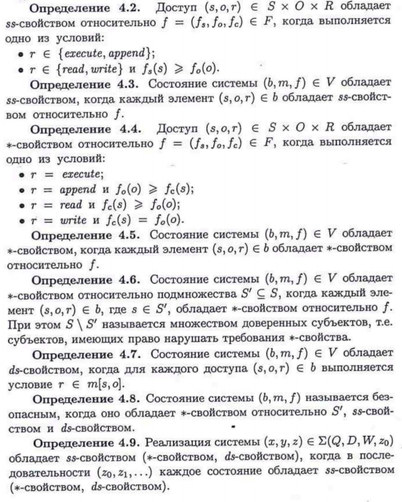

#### Вопрос 10

##### Модели мандатного разграничения доступа. Модель Белла-Ла-Падулы. Классическая модель БЛаП. Основные определения. Виды запросов. Свойства безопасности в модели БЛаП

**Модели мандатного разграничения доступа**

Выделяют следующие модели, основанные на **мандатном разграничении доступа**:

* Классическая модель Белла-ЛаПадула;
* Модель систем военных сообщений;
* Модель целостности Биба;
* Модель безопасности переходов.

**Классическая модель БЛаП. Основные определения**

В классической модели Белла-ЛаПадулы рассматриваются ус­ловия, при выполнении которых в КС невозможно возникновение информационных потоков от объектов с большим уровнем конфи­денциальности к объектам с меньшим уровнем конфиденциальности. Основными элементами классической модели Белла-ЛаПадулы яв­ляются:
$S$ — множество субъектов; 
$O$ — множество объектов;
$R = \{read,  write,  append, execute\}$ — множество видов доступа и видов прав доступа;
$B =  \{b\subseteq S\times О\times R\}$ — множество возможных множеств те­кущих доступов  в  системе;
$(L,\leq)$ — решетка уровней конфиденциальности, например $L = \{U (unclussified), С (confidential), S (secret), TS (top secret)\}$, где $U < С < S < TS$;
$M = \{m_{|S|\times|O|}\}$ — множество возможных матриц доступов, где $m_{|S|\times|O|}$ — матрица доступов, $m[s,o] \subseteq R$ — права доступа субъ­екта $s$ к объекту $o$;
$(f_s, f_o, f_c)\in F = L^S\times L^O\times L^S$ — тройка функций $(f_s, f_o, f_c)$ задающих соответственно: $f_s: S \rightarrow L$ — уровень доступа субъектов; $f_o: O\rightarrow L$ — уровень конфиденциальности объектов; $f_c: S \rightarrow L$ — текущий уровень доступа субъектов, при этом для любого $s \in S$ вы­полняется неравенство $f_c(s) \leq f_s(s)$;
$V = B\times M\times F$ — множество состояний системы; 
$Q$ — множество запросов системе;
$D$ — множество ответов по запросам, например $D =\{yes,no, 
error\}$;
$W \subseteq Q\times D\times V\times V$ — множество действий системы, где чет­верка $(q,d,v^*,v) \in W$ означает, что система по запросу $q$ с ответом $d$ перешла из состояния $v$ в состояние $ѵ^*$;
$N_0  = \{0,1,2,...\}$ — множество значений времени;
$X$ — множество функций $х:  N_0\rightarrow Q$, задающих все возможные последовательности запросов к системе;
$Y$ — множество функций $у:  N_0 \rightarrow  D$, задающих все возможные последовательности ответов системы по запросам;
$Z$ — множество функций $z:  N_0\rightarrow  V$, задающих все возможные последовательности состояний системы.

**Виды запросов модели БЛаП**

В классической модели Белла-ЛаПадулы рассматриваются сле­дующие запросы, входящие во множество $Q$:

* запросы изменения множества текущих доступов $Q$:
  * *получить доступ* (добавить тройку (субъект, объект, вид досту­па) в текущее множество доступов $b$);
  * *отменить доступ* (удалить тройку (субъект, объект, вид досту­па) из текущего множества доступов $b$).
* запросы изменения функций $f$:
  * изменить уровень конфиденциальности объекта;
  * изменить уровень доступа субъекта.
* запросы изменения прав доступа в матрице $m$:
  * дать разрешение на доступ (добавить право доступа в соответ­ствующий элемент матрицы доступов $m$);
  * отменить разрешение на доступ (удалить право доступа из со­ответствующего элемента матрицы доступов $m$).

**Свойства безопасности в модели БЛаП**

Безопасность системы определяется с помощью трех свойств: 

* ss-свойства простой безопасности (simple security) - Субъект с уровнем доступа $x_s$ может читать информацию из объекта с уровнем секретности  $x_o$ лишь тогда, когда $x_s$ преобладает над $x_o$. Это правило также известно под названием «*нет чтения верхнего*» (*NRU*). Например, если субъект, имеющий доступ только к несекретным данным, попытается прочесть объект с уровнем секретности "совершенно секретно", то ему будет отказано в этом.;

*  $*$-свойства «звезда» - Субъект с уровнем секретности $x_s$ может писать информацию в объект с уровнем безопасности $x_o$ только если $x_o$ преобладает над $x_s$. Это правило также известно под названием «*нет записи вниз*» (*NWD*). Например, если субъект, имеющий уровень доступа совершенно секретно, попытается записать в объект с уровнем секретности секретно, то ему будет отказано в этом.;
*  ds-свойства дискреционной безопасности (discretionary secu­rity) - Заключается в том, что права дискреционного доступа субъекта к объекту определяются на основе матрицы доступа.

(прим. Дальше идёт определение каждого свойства и "свойства" этих свойств, не знаю понадобится ли это на экзамене, но пускай будет)

