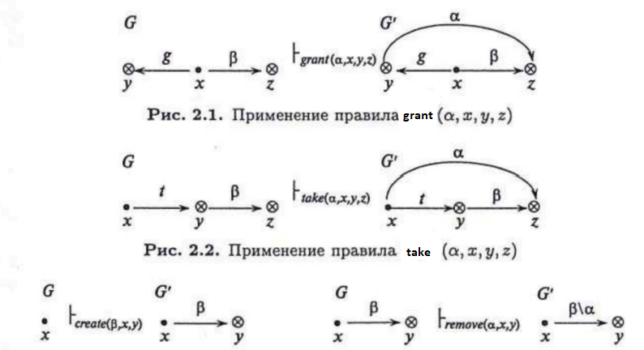

#### Вопрос 17

##### Реализация моделей безопасности КС. Модели на основе дискреционного разграничения доступа. Модель take-grant Классическая модель take-grant. Основные понятия и правила. Предикат «возможен доступ». Частный случай эквивалентных условий. Теорема 1(без док-ва)

**Модели на основе дискреционного разграничения доступа.**

Выделяют следующие модели с дискреционным доступом:

* Модель Харрисона-Руззо-Ульмана (ХРУ);
* Модель типизированных матриц доступа;
* Классическая модель Take-Grant;
* Расширенная модель Take-Grant.

**Модель take-grant Классическая модель take-grant. Основные понятия и правила.**

Классическая модель Take-Grant ориентирована на анализ путей распространения прав доступа в системах дискреционного управле­ния доступом.

Основными элементами модели  Take-Grant являются: 

$O$ — множество объектов;
$S\subseteq O$ — множество субъектов;
$R = \{r_1,r_2,\dots,r_m\} \cup \{t,g\}$ — множество видов прав доступа, 
где $t(take)$ — право брать права доступа, $g(grant)$ — право давать 
права доступа;
$G = (S, O,E)$ — конечный помеченный ориентированный без пе­тель граф доступов, описывающий  состояние системы. Элементы множеств $S$ и $O$ являются вершинами графа, которые будем обо­значать $\otimes$ — объекты (элементы множества $O \backslash S$ )и $\bullet$ — субъек­ты (элементы множества $S$) соответственно. Элементы множества  $E\subseteq O\times O\times R$ являются ребрами графа. Каждое ребро помечено непустым подмножеством множества видов прав доступа $R$.

Основная цель классической модели Take-Grant — определение и обоснование алгоритмически проверяемых условий проверки воз­можности утечки права доступа по исходному графу доступов, соот­ветствующего некоторому состоянию системы.

Порядок перехода системы модели Take- Grant из состояния в состояние определяется правилами преобразования графа доступов, которые в классической модели носят название *де-юре правил*. Пре­образование графа $G$ в граф $G'$ в результате выполнения правила $op$ обозначим через
$$
G\vdash_{op}G'
$$
В классической модели Take-Grant рассматриваются четыре де-юре правила преобразования графа, выполнение каждого из которых может быть инициировано только субъектом, являющимся активной компонентой системы (рис. 2.1-2.4):
*take* — брать права доступа; 
*grant* — давать права доступа;
*create* — создавать новый объект или субъект, при этом субъ­ект создатель может взять на созданный субъект любые права доступа (по умолчанию предполагается, что при выполнение правила *create* создается объект, случаи, когда создается субъект, оговари­ваются особо);
*remove* — удалять права доступа.

Начальные условия: 

| Правила                | Исходное состояние                                           | Результирующие состояние                                     |
| :--------------------- | :----------------------------------------------------------- | ------------------------------------------------------------ |
| take($\alpha,x,y,z$)   | x - субъект, y,z - объект, $(x,y,\{t\})\sub E$, $(y,z,\beta)\sub E$, $x \neq z$, $\alpha \sube \beta$ | добавляется $(x,z,\alpha)$ к *E*                             |
| grant($\alpha,x,y,z$)  | x - субъект, y,z - объект, $(x,y,\{g\})\sub E$, $(x,z,\beta)\sub E$, $y \neq z$, $\alpha \sube \beta$ | добавляется $(y,z,\alpha)$ к *E*                             |
| create($\alpha,x,y,z$) | x - субъект, y - не существует (ни об., ни суб.), $\beta \neq \empty$ | создается $y \in O$, если *y* - субъект, то создается $y \in S$, добавляется $(x, y, \beta)$ к *E* |
| remove($\alpha, x, y$) | x - субъект, y - объект, $(x, y, \beta) \sub E$, $\alpha \sube \beta$ | удаляется $(x, y, \alpha)$                                   |

**Предикат «возможен доступ».Частный случай эквивалентных условий. Теорема 1(без док-ва)**

Пусть $x,y\in O_o, x\neq y$ — различные объ­екты графа доступов $G_0 = (S_0,O_0, E_0),\alpha\subseteq R$. Определим предикат $can\_share(a, х,у, G_0)$, который будет истинным тогда и только тогда, когда существуют графы $G_1 = (S_1, O_1, Е_1),\dots,G_N = (S_N,O_N,E_N)$ и правила $op_1,\dots, op_N$, где $N\geq0$, такие, что $G_0\vdash_{op_1} G_1\vdash_{op_2} \dots\vdash_{on_N} G_N$ и $(x, у,\alpha)\subset E_N$.

(прим. "Теоремы 1" в Девянине нет, скорее всего имелась в виду следующая теорема)

**Определение.** Пусть $G=(S, S, E)$ - граф доступа, в котором все вершины являются субъектами. Говорят, что вершины графа доступов является *tg-связными*, когда, без учета направлений ребер, существует между ними существует путь такой, что каждое из ребер помечено *t(take)* и *g(grant)*.

**Теорема 2.5.** Пусть $G_0 = (S_0, S_0, E_0)$ — граф доступов, содер­жащий только вершины субъекты, $x,y\in S_0, x\neq y$. Тогда предикат $can\_share(a,x,y,G_0)$ истинен тогда и только тогда, когда выполня­ются условия 1 и 2.

​	*Условие 1.*   Существуют субъекты $s_1,\dots,s_m\in S_0:$
$$
(s_і,y,\gamma_i)\subset E_0,
$$
где $i = 1,\dots,m$ и  $а =\gamma_1 \cup\dots\cup\gamma_m.$

​	*Условие 2.*   Субъекты $x$ и $s_i$  являются tg-связными в графе $G_0$, где  $i =  1,\dots,m$.