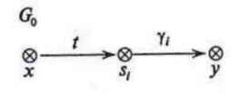

#### Вопрос 18

##### Реализация моделей безопасности КС. Модели на основе дискреционного разграничения доступа. Модель take-grant. Вопрос похищения прав доступа

Похищение прав доступа является примером случая, когда передача прав доступа к объекту осуществляется без содействия субъек­та изначально обладавшего передаваемыми правами, таким образом, не все субъекты системы кооперируют друг с другом.

**Определение 2.19.** Пусть $x,y\in O_0,x\neq y$ — различные объ­екты графа доступов $G_0 = (S_0,O_0,E_0), \alpha\subseteq R$. Определим преди­кат $can\_steal(\alpha, x,y,G_0)$, который будет истинным тогда и только то­гда, когда $(x,y,\alpha)\cap Е_0 = \varnothing$, существуют графы $G_1 = (S_1,O_1,E_1),\dots, Gn = (S_n,O_n,E_n)$ и правила $op_1,\dots, op_N$, где $N\geq 1$, такие, что $G_0\vdash_{op_1} G_1\vdash_{op_2} \dots\vdash_{op_N} G_N$ и $(x,y,\alpha)\subset E_N$, при этом, если существует $(s,y,\gamma)\subset E_0$, где $\gamma\subseteq\alpha$, то справедливо неравенство  $op_K\neq grant(\gamma,s,z,y),$ где $z\in O_{K-1}, K=1,\dots,N$.

**Теорема 2.7.** Пусть $G_0 = (S_0,O_0,E_0)$ — произвольный граф доступов, $x,y\in О_0, x\neq y$. Предикат $can\_steal(\alpha,x,y,G_0)$ истинен тогда и только тогда, когда выполняются условия 1-4.

​	*Условие  1.* $(х,у,\alpha)\cap Е_0=\varnothing$.

​	*Условие 2.*  Существуют объекты $s_1,\dots ,s_m\in O_0: (s_i,y,\gamma_i) \subset Е_0$ для $i  = 1,\dots,т$ и $\alpha =\gamma_1\cup\dots\cup\gamma_m$.

​	*Условие 3.*  Являются истинными предикаты $can\_share(\{t\},x,s_i,G_0)$, где $i=1,\dots,m$

​	*Условие 4.* Для $і = 1,\dots, m$ граф доступов $G_0$ не является графом вида, приведенного на рисунке ниже

