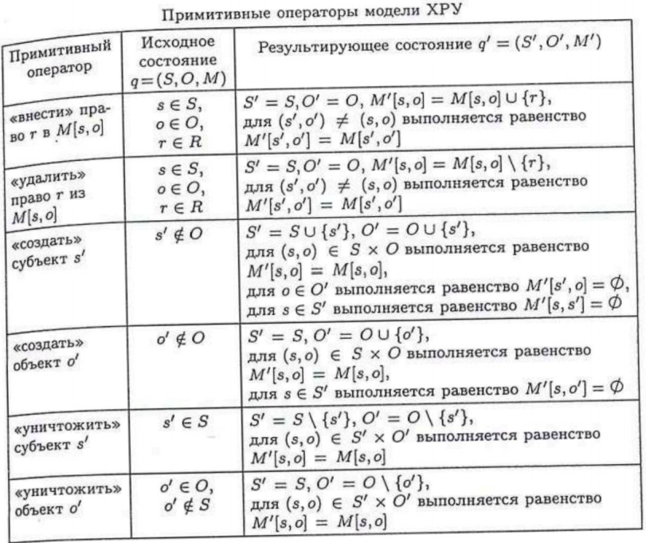

#### Вопрос 20

##### Реализация моделей безопасности КС. Модели на основе дискреционного разграничения доступа. Модель take-grant. Модель Харрисона-Руззо-Ульмана(ХРУ). Анализ безопасности систем ХРУ. Вопрос утечки прав доступа в конкретную ячейку

Модель Харрисона-Руззо-Ульмана (ХРУ) используется для анализа систем защиты, реализующих дискреционную полити­ку  управления доступом.

В модели ХРУ используются следующие обозначения:
$O$ — множество объектов системы (сущности-контейнеры в мо­дели ХРУ  не рассматриваются);
$S$ — множество субъектов системы $(S\subseteq O)$;
$R$ — множество видов прав доступа субъектов к объектам, на­ пример права на чтение (read), на запись (write), владения (own);
$M$ — матрица доступов, строки которой соответствуют субъек­там, а столбцы соответствуют объектам. $M[s,o]\subseteq R$ — права до­ступа субъекта $s$ к объекту $o$.

Функционирование системы рассматривается только с точки зре­ния изменений в матрице доступа. Возможные изменения опреде­ляются шестью видами примитивных операторов, представленных в таблице ниже

В результате выполнения примитивного оператора $\alpha$ осуществ­ляется переход из состояния $q = (S, O,M)$ в результирующее состоя­ние $q' = (S',O',M')$. Данный переход обозначим через $q\vdash_{\alpha} q'$.

Из примитивных операторов составляется конечное число ко­манд системы ХРУ. Каждая команда включает две части: 

1) усло­вия, при которых выполняется команда; 
2) последовательность при­митивных операторов.

**Анализ безопасности систем ХРУ. Вопрос утечки прав доступа в конкретную ячейку**

Как показывают результаты анализа модели ХРУ, задача построения алгоритма проверки безопасности КС не может быть решена в общем случае. Дадим определения.

*Определение 2.2.* Будем считать, что в состоянии $q$ системы ХРУ возможна утечка права доступа $r\in R$ в результате выпол­нения команды $c(x_i,\dots ,x_k)$ в случае, когда при переходе системы $q\vdash_{c(x_1,...,x_k)} q'$ выполняется примитивный оператор, вносящий право доступа $r$ в ячейку матрицы доступов $M$, до этого $r$ не содержавшую.

*Определение 2.3.* Начальное состояние $q_0$ системы ХРУ на­зывается безопасным относительно некоторого права доступа $r\in R$ в случае, когда невозможен переход системы в такое состояние $q$, в котором возможна утечка права $r$. Иными словами, начальное состо­яние $q_0$ системы ХРУ называется безопасным относительно некоторого права доступа $r$, когда невозможен переход системы в состояние, в котором право доступа $r$ появилось в ячейке матрицы доступов $M$, до этого $r$ не содержавшей.

*Теорема 2.1.* Существует алгоритм, проверяющий является ли начальное состояние произвольной монооперационной системы ХРУ безопасным относительно некоторого права доступа $r\in R$.

*Теорема 2.2.* Задача проверки безопасности произвольных систем  ХРУ алгоритмически неразрешима.

(прим. алгоритмы анализа безопасности рассматриваются в **Вопросе 21**)

**Единый ответ:**

Системы ХРУ называются монооперационными, когда каждая команда содержит только один примитивный оператор. Так вот. Существует алгоритм, проверяющий является ли начальное состояние безопасным относительного некоторого $r \in R$. Такой алгоритм имеет экспоненциольную сложность. Но в общем случае, такого алгоритма, имеющего конечное число шагов, не существует, т.е. *задача проверки безопасности произвольных систем алогритмически неразрешима*.