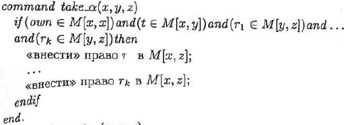
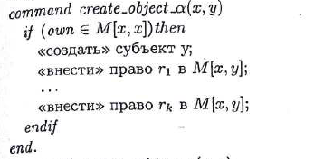

#### Вопрос 24

##### Реализация моделей безопасности КС. Модели на основе дискреционного разграничения доступа. Модель Харрисона-Руззо-Ульмана(ХРУ). Анализ безопасности систем ХРУ. Представление модели take-grant через систему ХРУ

*Представление с некоторыми неточностями*

Пусть состояние системы *Take-Grant* описывается графом $G=(S_{tg},O_{tg},E)$, а $R_{tg}$ - множество прав доступа системы *Take-Grant*.

Для системы ХРУ:
- $R=R_{tg} \cup \{own\}$ - множество прав доступа;
- $S=O=O_{tg}$ - множество субъектов и объектов системы ХРУ. Т.к. в *Take-Grant* объекты могут обладать правами, но не могут ими пользоваться;
- $M_{|S|\times |S|}$ - матрица доступов, где для $x,y\in O_{tg}$, если $(x,y,r)\in E$, то $r\in M[x,y]$, и для $s\in S_{tg}$ выполняется условие $own \in M[s,s]$ *(то есть own обозначает, что объект - это субъект)*;

Пусть $\alpha= \{r_1,...,r_k\} \subseteq R_{tg}$, тогда:

1. Команде $take(\alpha, x, y, z)$ соответствует:

2. Команде $grant(\alpha, x, y, z)$ соответствует:

3. Команде $create(\alpha, x, y)$ соответствует *(создаём объект)*:

4. Команде $create(\alpha, x, y)$ соответствует *(создаём субъект)*:

5. Команде $remove(\alpha, x, y)$ соответствует:

**Неточности**
1. При создании не проверяется наличие (для субъектов это легко проверяется);
2. Не проверяется отсутствие петель (в т.ч. не проверяется, что наши действия создают петлю);
3. При удалении прав в ХРУ объект/субъект не удаляется автоматически.