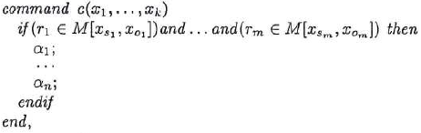

#### Вопрос 25

##### Реализация моделей безопасности КС. Модели на основе дискреционного разграничения доступа. Модель Харрисона-Руззо-Ульмана(ХРУ). Основные понятия, примитивные операторы и команды

**Элементы модели ХРУ:**

$O$ - множество объектов;

$S$ - множество субъектов, $S \subseteq O$;

$R$ - множество видов прав доступа;

$M$ - матрица доступа размером $|S|\times|O|$. Для $s \in S$, $o \in O$ верно $M[s;o] \subseteq R$.

Автоматная модель. Её функционирование сводится к изменению матрицы $M$. В ячейках записываются права доступа. Автомат, построенный в соответствии с положениями модели ХРУ называется *системой ХРУ*.

**Примитивные операторы** (используются в составе команд):

- "Внести" право $r \in R$ в $M[s;o]$;
- "Удалить" право $r \in R$ из $M[s;o]$;
- "Создать" субъект $s'$;
- "Создать" объект $o'$;
- "Удалить" субъект $s'$;
- "Удалить" объект $o'$.

**Базовые правила в модели ХРУ**

Из примитивных операторов составляются команды, каждая из которых состоит из двух частей:
 1) Условие, при котором выполняется команда;
 2) Последовательность примитивных операторов.

**Вид команды ХРУ:**

*Некоторые замечания*

- $x_i \in O$ - все встречающиеся объекты и субъекты должны быть указаны;
- $r_1, ..., r_m \in R$ - права доступа;
- $\alpha_1,...,\alpha_n$ - последовательность примитивных операторов;
- Наличие условия в теле команды не является обязательным.

При выполнении команды *$c(x_1,...x_k)$* система осуществляет переход из состояния $q$ в новое состояние $q'$. Такой переход обозначается так:

При этом если одно из условий команды не выполнено, то $q'=q$, то есть никакой из примитивных операторов не выполняется.

**Примеры создания команд:**

