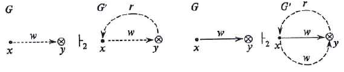
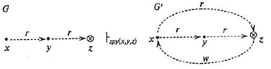
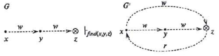
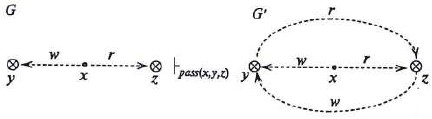

#### Вопрос 26

##### Реализация моделей безопасности КС. Модели на основе дискреционного разграничения доступа. Расширенная модель take-grant. Де-факто и де-юре правила. Предикат «возможна запись». Теорема 4 (без док-ва)

Расширенная модель *Take-Grant* строится на основе классической модели.

**Основные элементы:**

- $O$ - множество объектов;
- $S$ - множество субъектов;
- $R= \{r_1,...r_m\} \cup \{t,g\} \cup \{r,w\}$ - множество видов прав доступа и видов информационных потоков, где $r(read)$ - право на чтение или информационный поток на чтение, $w(write)$ - право на запись или информационный поток на запись;
- $G=(S,O,E \cup F)$ - граф доступов и информационныз потоков (ориентированный, без петель), описывающий состояние системы. Элементы множества $E \subseteq O \times O \times R$ - "реальные" рёбра графа, соответствующие правам доступа, обозначаются сплошными линиями. Элементы множества $F \subseteq O \times O \times \{r,w\}$ - "мнимые" рёбра графа, соответствующие информационным потокам, обозначаются пунктирными линиями. Возникают в результате имеющихся в системе прав доступов.

Порядок перехода системы в расширенной модели *Take-Grant* из состояния в состояние определяется де-юре и де-факто правилами преобразования графа доступов и информационных потоков.

**Де-юре правила**

Определение де-юре правил $take, grant, create, remove$ совпадает с определением этих правил в классической модели. Де-юре правила применяются только к "реальным" рёбрам (элементам множества $E$).

**Де-факто правила**

Де-факто правила применяются к "реальным" или "мнимым" рёбрам (элементам множества $E \cup F$), помеченным $r$ или $w$. Результатом применения де-факто правил является добавление новых "мнимых" рёбер во множество $F$.

Введём де-факто правила:

1. Безымянное (вспомогательное)

(Субъект получает возможность записи информации, осуществляя доступ $r$ к объекту)

2. Безымянное (вспомогательное)

(Субъект получает возможность чтения информации, осуществляя доступ $w$ к объекту)

3. $Post(x,y,z)$

(Субъект $x$ получает возможность чтения информации от другого субъекта $z$, осуществляя доступ $r$ к объекту $y$, к которому субъект $z$ осуществляет доступ $w$, а субъект $z$, в свою очередь, получает возможность записи своей информации в субъект $x$)

4. $Spy(x,y,z)$

(Субъект $x$ получает возможность чтения информации из объекта $z$, осуществляя доступ $r$ к субъекту $y$, который в свою очередь, осуществляет доступ $r$ к объекту $z$, при этом также у субъекта $x$ возникает возможность записи к себе информации из объекта $z$)

5. $Find(x,y,z)$

(Субъект $x$ получает возможность чтения информации из объекта $z$, осуществляя доступ $w$ к субъекту $y$, который в свою очередь, осуществляет доступ $w$ к объекту $z$, при этом также у субъекта $x$ возникает возможность записи к себе информации из объекта $z$)

6. $Pass(x,y,z)$

(При осуществлении субъектом $y$ доступа $r$ к объекту $z$ возникает возможность внесения из него информации в другой объект $x$, к которому субъект $y$ осуществляет доступ $w$, и, кроме того, возникает возможность получения информации в объекте $x$ из объекта $z$)

**Предикат «возможна запись»**

Пусть $x,y \in O_0$, $x\ne y$, - различные объекты графа доступов и информационных потоков $G_0 = (S_0,O_0,E_0 \cup F_0)$. Определим предикат *"возможна запись"*$(x,y,G_0)$ или *can_write*$(x,y,G_0)$, который будет истинным тогда и только тогда, когда существуют графы $G_1 = (S_1,O_1,E_1 \cup F_1), ..., G_N = (S_N,O_N,E_N \cup F_N)$ и де-юре и де-факто правила $op_1,...,op_N$ такие, что $G_0 \vdash_{op_1} G_1 \vdash_{op_2} \dotsb \vdash_{op_N} G_N$ и $(x,y,w) \in F_N$.

**Теорема 4**

