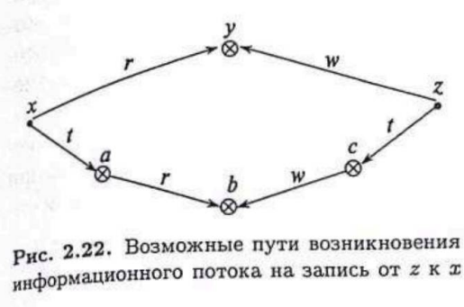

#### Вопрос №27

##### Реализация моделей безопасности КС. Модели на основе дискреционного разграничения доступа. Расширенная модель take-grant. Построение замыкания графа доступов и информационных потоков. Вопрос «стоимости» или вероятности использования путей для передачи прав доступа или реализации информационных потоков

**Определение:** Пусть  - граф доступов и информационных потоков такой, что для каждого субъекта $s\in S$ существует объект $o\in O$ такой, что выполняется условие $(s,o,(t,g,r,w))\subset E$. Тогда замыканием (или де-факто замыканием) графа $G$ называется граф доступов и информационных потоков $G^*=(S,O,E^*\cup F^*)$, полученный из $G$ применением последовательности правил take, grant и де-факто правил. При этом применение этих правил к $G^*$ не приводит к появлению новых ребер.

**Алгоритм построения замыкания графа доступов состоит их трех этапов:**

1. Построение tg-замыкания.
2. Построение де-юре-замыкания.
3. Построение замыкания.

1. **Алгоритм построения tg-замыкания графа доступов и информационных потоков:**
   1. Для каждого $s\in S$ выполнить правило $create((t,g,r,w), s, o)$; при этом создаваемые объекты занести в множество $O$, создаваемые ребра занести в множество вершин.
   2. Инициализировать: $L=((x,y,\alpha)\in E,\alpha\in(t,g))$ - список ребер графа доступов и информационных потоков и $N=\varnothing$ - множество вершин.
   3. Выбрать из списка $L$ первое ребро $(x,y,\alpha)$. Занести $x$ и $y$ во множество $N$. Удалить ребро $(x,y,\alpha)$ из списка $L$.
   4. Для всех вершин $z\in N$ проверить возможность применения правил take или grant на троке вершин $x,y,z$  с использованием ребра $(x,y,\alpha)$, выбранного в шаге 3.  Если в результате  применения правил take или grant появляются новые ребра вида $(a,b,\beta)$, где $(a,b)\subset (x,y,z)$ и $\beta\in (t,g)$, занести их в конце списка $L$ и множество $E$.
   5. Пока список $L$ не пуст, перейти на шаг 3.
   6. Доп. сведения: вычислительная сложность алгоритма пропорциональная $|O|^3$.

2. **Алгоритм построения де-юре-замыкания графа доступов и информационных потоков:**
   1. Выполнить алгоритм построения tg-замыкания.
   2. Для каждой пары ребер вида $(x,y,t),(y,z,\alpha)\in E^{tg}$, где $x\in S$, применить правило $take(\alpha,x,y,z)$ и, если полученное ребро $(x,z,\alpha)\notin E^{tg}$, то занести его во множество $E^{tg}$.
   3. Для каждой пары ребер вида $(x,y,g),(x,z,\alpha)\in E^{tg}$, где $x\in S$, применить правило $grant(\alpha,x,y,z)$ и, если полученное ребро $(y,z,\alpha)\notin E^{tg}$, то занести его во множество $E^{tg}$.
   4. Для каждой пары ребер вида $(x,y,t),(y,z,\alpha)\in E^{tg}$, где $x\in S$, применить правило $take(\alpha,x,y,z)$ и, если полученное ребро $(x,z,\alpha)\notin E^{tg}$, то занести его во множество $E^{tg}$.
   5. Доп. сведения: вычислительная сложность алгоритма пропорциональная $|O|^3$.

3. **Алгоритм построения де-факто-замыкания графа доступов и информационных потоков:**
   1. Выполнить алгоритм построения де-юре-замыкания.
   2. Для всех ребер $(x,y,\alpha)\in E^{де-юре}\cup F$, где $x\in S, \alpha\in (w,r)$, применить первые два де-факто правила. Если будут получены новые ребра, то занести их во множество $F$.
   3. Инициализировать:$L=((x,y,\alpha)\in E^{де-юре}\cup F: \alpha\in (w,r))$ - список ребер графа доступов и информационных потоков и $N=\varnothing$ - множество вершин.
   4. Выбрать из списка $L$ первое ребро $(x,y,\alpha)$. Занести $x,y$ во множество $N$. Удалить ребро $(x,y,\alpha)$ из списка $L$.
   5. Для всех вершин $z\in N$ проверить возможность применения де-факто правил на тройке вершин $x,y,z$ с использованием ребра $(х,у,\alpha)$. Если в результате применения де-факто правил spy, find, post, pass появляются новые ребра вида $(a, b,\beta)$, где $(а, b)\subset (х, у, z)$ и $\beta\in (r,w)$, то занести их в конец списка $L$ и множество $F$.
   6. Пока список $L$ не пуст, перейти на шаг 4.
   7. Доп. сведения: вычислительная сложность алгоритма пропорциональная $|O|^3$.

**Анализ путей передачи прав доступа и создания информационнх потоков**

Допустим, факт нежелательной передачи прав или информации уже состоялся. Каков наиболее вероятный путь его осуществлдения? В классической модели Take-Grant не дается прямого ответа на этот вопрос. Можно говорить, что есть возможность передачи прав доступа или возникновения информационного потока, но нельзя определить, какой из путей при этом использовался.

Рассмотрим подходы к решению задачи определения возможных путей передачи прав доступа или возникновения информационных потоков. 

Предположим, что чем больше узлов на пути между вершинами, по которому произошла передача прав доступа или возник информационный поток, тем меньше вероятность использования этого пути. 

Интуитивно ясно, что наиболее вероятный путь передачи информации от субъекта *z* к субъекту *х* лежит через объект *у*. В то же время нарушитель для большей скрытности может специально использовать более длинный путь через *а*, *b*, *с*. Особенно, когда предположить, что информация в объекте у контролируется администратором безопасности системы,

Рассмотрим другой пример. Какой из двух путей возникновения информационного потока более вероятный?

Путь, представленный на рисунке(в), реализуется за счет активных действий субъекта *х*, заинтересованного в возникновении информационного потока. По этой причине наиболее вероятным, как правило, будет именно этот путь.

Таким образом, в расширенную модель Take-Grant можно включить понятие **вероятности или стоимости пути передачи прав доступа или информации**. Путям меньшей стоимости соответствует наивысшая вероятность, и их надо исследовать в первую очередь. Есть основных подхода к определению стоимости путей.

Первый подход основан на присваивании стоимости ребрам графа доступов, находящимся на пути передачи прав доступа или возникновения информационного потока. В этом случае стоимость ребра определяется в зависимости от прав доступа, которыми оно помечено, а стоимость пути есть сумма стоимостей пройденных ребер.

Второй подход основан на присваивании стоимости каждому используемому де-юре или де-факто правилу. Стоимость правила при этом может быть выбрана, исходя из условий функционирования системы Take-Grant и может: 

- являтся константой

- зависеть от специфики правила
- зависеть от числа правил и состава участников при применении правила
- зависеть от степени требуемого взаимодействия субъектов

Стоимость пути в этом случае определяется как сумма стоимостей примененных правил.