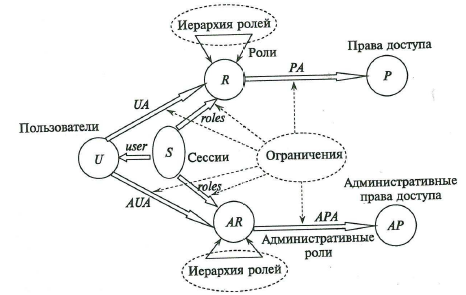

#### Вопрос 28

##### Реализация моделей безопасности КС. Модель ролевого разграничения и управления доступом. Модель административного ролевого управления доступом

В базовой модели ролевого управления доступом предполагается, что множества U,R,P и функции РА, UA не изменяются с течением времени, или существует единственная роль — офицер безопасности, которая предоставляет возможность изменять эти множества и функции. В реальных КС, в которых одновременно могут работать сотни и тысячи пользователей, а структура ролей и прав доступа может быть очень сложной, задача администрирования является чрезвычайно важной. Для ее решения рассматривается построенная на основе базовой модели модель администрирования ролевого управления доступом.

В дополнение к используемым элементам базовой модели *(Подробно рассмотрено в вопросе 29)* в модели админимтрирования ролевого управления доступом рассматриваются следующие элементы:

- $AR$ - множество административных ролей $(AR\cap R = \varnothing)$;

- $AP$ - множество административных прав доступа $(AP\cap P = \varnothing)$;

- $APA: AR\rightarrow 2^{AP}$ - функция, задающая для каждой административной роли множество административных прав доступа. (При этом для каждого права доступа $p\in AP$ существует роль $r \in AR$ такая, что $p \in APA(r)$);

- $AUA: U\rightarrow 2^{AR}$ - функция, задающая для каждого пользователя множество административных ролей, на которые он может быть авторизован;

*Переопределяется функция roles:*
- $roles: S \rightarrow 2^R \cup 2^{AR}$ - функция, задающая для пользователя множество ролей, на которые он авторизован в данной сессии. (При этом для каждой сессии $s \in S$ выполняется условие $roles(s) \subseteq UA(user(s)) \cup AUA(user(s))$).

*Определение.* **Иерархией административных ролей** в модели РРД называется заданное на множестве ролей $AR$ отношение частичного порядка "$\leq$". При этом для $u \in U$, если $r,r' \in AR, r \in AUA(u), r' \leq r$, то $r' \in AUA(u)$.

**Структура элементов модели администрирования РРД**

