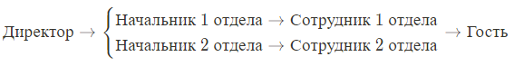

#### Вопрос 29

##### Реализация моделей безопасности КС. Модель ролевого разграничения и управления доступом. Основные понятия и определения

В основе лежит модель дискреционного разграничения доступа. В дальнейшем на основе ролевой модели была реализована мандатная.

Основное отличие от рассматривавшихся ранее моделей состоит в том, что права даются пользователям только через управление ролями.

**Основные элементы модели:**

- $U$ - множество пользователей;
- $R$ - множество ролей;
- $P$ - множество прав доступа (в РРД право доступа - пара (вид доступа; объект));
- $S$ - множество сессий пользователей.

**Функции:**

- $PA:R \rightarrow 2^P$ - функция прав доступа ролей. Определяет для каждой роли множество прав доступа; при этом для каждого права доступа $p\in P$ существует роль $r \in R$ такая, что $p \in PA(r)$;
- $UA: U \rightarrow 2^R$ - функция авторизованных ролей пользователей. Определяет для каждого пользователя множество ролей, на которые он может быть авторизован;
- $user: S \rightarrow U$ - функция сессий пользователя. Определяет для каждой сессии пользователя, от имени которого она активизирована. Сессия (сеанс) - один вход пользователя в систему до его выхода. Пользователя в системе представляют его сессии. Сессия может быть активирована только пользователем;
- $roles: S \rightarrow 2^R$ - функция ролей сессий пользователя. Определяет для пользователя множество ролей, на которые он авторизован в данной сессии, при этом для каждой сессии $s \in S$ выполняется условие $roles(s) \subseteq UA(user(s))$.

**Определение**. *Иерархией ролей* в базовой модели РРД называется заданное на $R$ отношение частичного порядка "$\le$". При этом для любого пользователя $u \in U$, если роли $r,r'\in R$, $r\in UA(u)$ и $r' \le r$, то $r' \in UA(u)$.

То есть наряду с данной ролью пользователь должен быть авторизован на все роли, в иерархии её меньше.

*Замечание*. Отношение частичного порядка "$\le$" не обязательно задаёт на нём решетку.

*Пример иерархии ролей*

